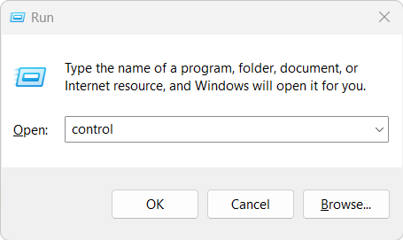
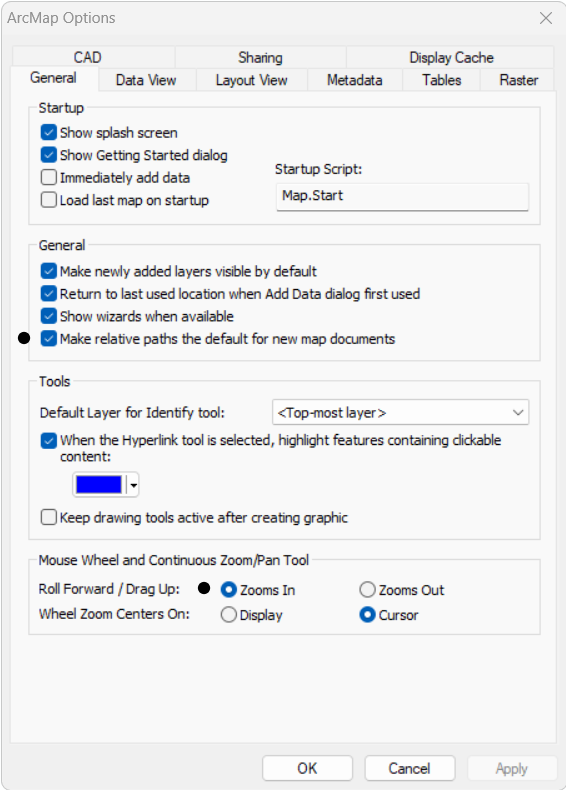
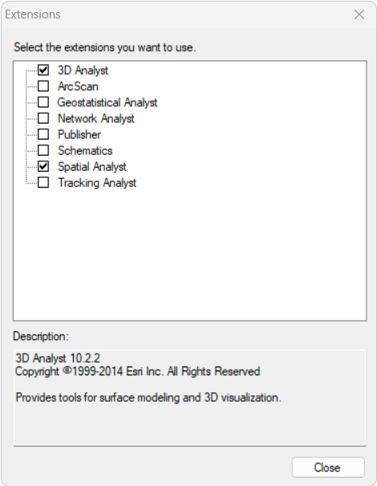
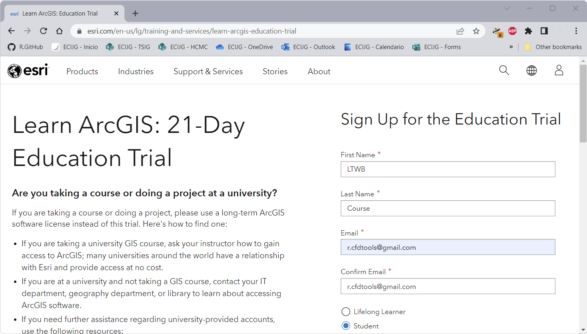
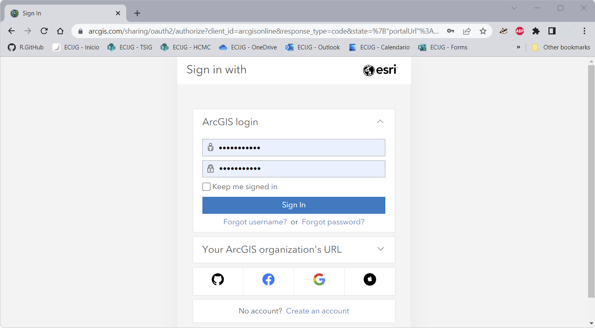
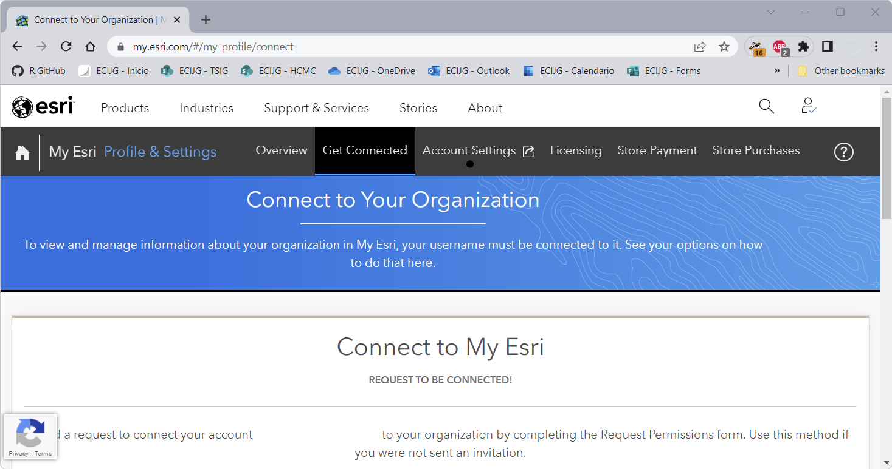
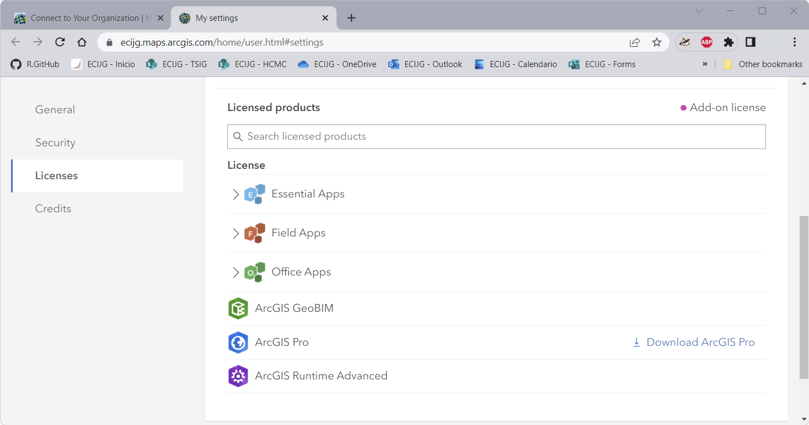
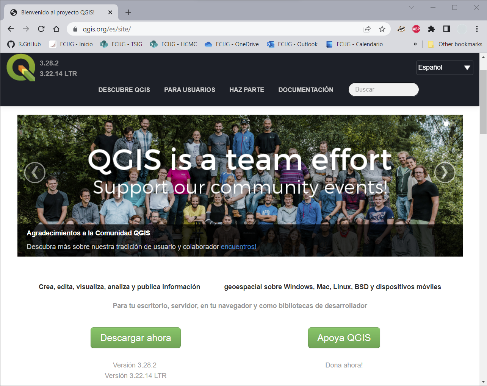
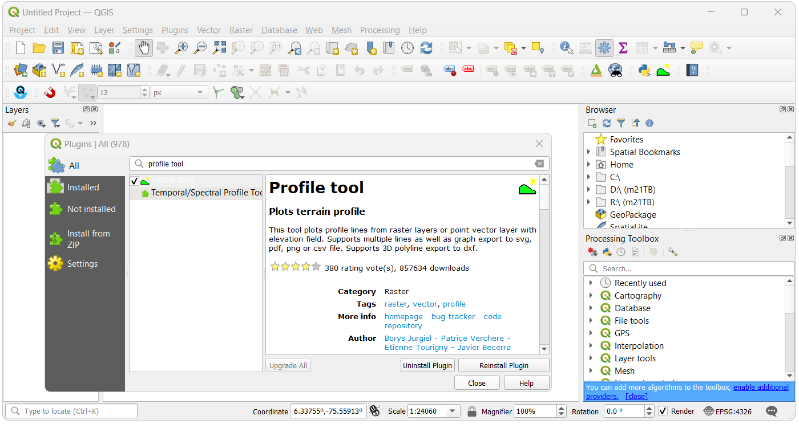

## Requerimientos
Keywords: `Requirements` `ArcGIS-for-Desktop` `ArcGIS-Pro` `QGIS` `HEC-HMS` `HEC-GeoHMS` `Python`

  
Iconografía de referencia en https://github.com/rcfdtools/R.LTWB/blob/main/.icons/Readme.md  

En esta actividad se listan los requerimientos académicos y computacionales generales para el desarrollo de las diferentes actividades del curso, se define y crea la estructura de directorios y se realiza la instalación y configuración de las principales herramientas requeridas.

  
   Balance hidrológico de largo plazo. Long-term water balance <b>Universidad Escuela Colombiana de Ingeniería Julio Garavito</b> William Ricardo Aguilar Piña Profesor del Centro de Estudios Hidráulicos william.aguilar@escuelaing.edu.co 

  Playlist: https://www.youtube.com/playlist?list=PLneiG4vC_8YupZFL2DtUEdcgtXyWT7Apt  

### Objetivos

* Instalar y configurar las herramientas computacionales requeridas para el desarrollo del caso de estudio.
* Establecer los requisitos académicos mínimos y listar algunos recursos complementarios para su nivelación.

### Herramientas computacionales requeridas

* [ArcGIS Pro 2+](https://pro.arcgis.com/en/pro-app/latest/get-started/download-arcgis-pro.htm)
* [ArcGIS for Desktop 10+](https://desktop.arcgis.com/es/desktop/) (recomendado 10.2.2)
* [QGIS 3+](https://qgis.org/)
* [Cygwin terminal for Windows](https://www.cygwin.com/) para la descarga por consola de los modelos digitales de elevación
* [HEC-HMS 4.9+](https://www.hec.usace.army.mil/software/hec-hms/) 
* [HEC-GeoHMS 10.2](https://www.hec.usace.army.mil/software/hec-geohms/downloads.aspx) for ArcGIS for Desktop 10.2.2
* [Microsoft Excel from Office 64 bits](https://aka.ms/office-install)
* [Notepad++](https://notepad-plus-plus.org) como editor de código complementario
* [Python 3+ y extensiones](https://www.python.org/) indicadas en esta actividad
* [PyCharm Community](https://www.jetbrains.com/pycharm/) como entorno de desarrollo y publicación en GitHub del caso de estudio propio asignado a estudiantes bajo esquema de certificación (opcional)

> Requerimientos específicos, tales como librerías, complementos y sus versiones han sido indicadas en cada actividad del curso.

### Equipo de cómputo

* Sistema operativo: Microsoft Windows 10 o superior.
* Memoria RAM: 8GB mínimo, óptimo 16 o superior.
* Procesador: Intel Core i5 o superior (serie H o superior recomendado), AMD Ryzen (serie X recomendado).
* Almacenamiento: 150 GB libres en disco (unidad de estado sólido m.2 recomendada).
* Monitor: FHD 1920x1080p (recomendado 2 monitores).
* Video: 2 GB independiente (tarjeta aceleradora 4 GB o superior recomendada).

> El procesamiento de los modelos digitales de elevación - DEM y mapas de variables climatológicas y de balance, requiere de al menos el espacio indicado en disco.

### Servicios y plataformas

* Cuenta de usuario en [Eathdata](../../Section02/UserCreation) de la NASA.
* Cuenta de usuario [Esri](https://www.esri.com/en-us/home) para la descarga e instalación de la versión académica de prueba de ArcGIS Pro.

### Requisitos académicos

* Conocimientos básicos en sistemas de información geográfica - SIG
* Conocimientos básicos en hidrología
* Conocimientos básicos de programación usando Python

### Estructura de directorios

En la siguiente tabla encontrará la estructura y descripción general de las carpetas a utilizar durante el desarrollo de las actividades del curso, relacionadas con el caso de estudio general y el caso asignado bajo la modalidad de curso certificado.

| Directorio                               | Descripción                                                                                                                                                           | Subdirectorios                                                            | Formato                                                          |
|------------------------------------------|-----------------------------------------------------------------------------------------------------------------------------------------------------------------------|---------------------------------------------------------------------------|------------------------------------------------------------------|
| [.datasets](../../.datasets)             | Tablas y series de datos base y generados                                                                                                                             | CHIRPS, ENSOONI, IDEAM, IDEAM_Agg, IDEAM_EDA, IDEAM_Impute, IDEAM_Outlier | .xls, .xlsx, .dbf, .csv, .png, .md, .zip                         |
| [.dem](../../.dem)                       | Grillas base y grillas producidas de los modelos digitales de elevación                                                                                               | ALOS, ASTER, SRTM                                                         | .tif, .rar                                                       |
| [.gdb](../../.gdb)                       | GDB descargada del Instituto Geográfico Agustín Codazzi - IGAC de Colombia - Suramérica                                                                               | N/A                                                                       | .gdb                                                             |
| [.grid](../../.grid)                     | Grillas en formato GeoTIFF producidas en la sección 4 y 5 de este curso, relacionadas con el análisis espacial de variables climatológicas y mapas de isorendimientos | N/A                                                                       | .tif, .rar                                                       |
| [.icons](../../.icons)                   | Iconografía general de este repositorio                                                                                                                               | N/A                                                                       | .png, .cdr, .glb, .svg                                           |
| [.map](../../.map)                       | Mapas de documento y proyectos geográficos creados en aplicaciones SIG                                                                                                | ArcGISPro, ArcGISProSection03, ArcGISProSection04, ArcGISProSection05     | .mxd, .sxd, .aprx, .qgz, .zip                                    |
| [.projectionfile](../../.projectionfile) | Archivos independientes de proyección de coordenadas en formato .prj aplicables a Colombia - Suramérica                                                               | N/A                                                                       | .prj                                                             |
| [.refs](../../.refs)                     | Documentos y artículos de uso libre descargados y citados en la documentación o en las referencias particulares de las diferentes actividades                         | GitHubRefs                                                                | .pdf, .zip                                                       |
| [.shp](../../.shp)                       | Vectores base y vectores producidos en formato Shapefile (.shp)                                                                                                       | N/A                                                                       | .shp, .zip                                                       |
| [.src](../../.src)                       | Scripts independientes de uso general en lenguaje Python y Shell script                                                                                               | N/A                                                                       | .py, .sh, .zip                                                   |
| [.temp](../../.temp)                     | Archivos ejemplo y archivos temporales generados en procesos intermedios                                                                                              | N/A                                                                       | .xlsx, .md                                                       |
| [HECGeoHMS](../../HECGeoHMS)             | _/Layers_, contiene los archivos generados durante el proceso de preprocesamiento hidrológico de los modelos digitales de elevación - DEM                             | Layers                                                                    | .mxd, .tif, .rar                                                 |
| [HECHMS](../../HECHMS)                   | Archivos del modelo prototipo hidrológico HEC-HMS, utilizados para el reacondicionamiento del modelo digital de elevación ASTER GDEM                                  | maps                                                                      | .basin, .sqlite, .access, ,dss, .hms, .log, .out, .terrain, .xml |

> Las carpetas con el prefijo `Section` corresponden a las secciones del curso, dentro de las cuales se encuentran las actividades o clases.

### Configuración básica del sistema operativo

Para la correcta ejecución de las herramientas computacionales a utilizar durante el desarrollo de las actividades del curso, es recomendable realizar los siguientes ajustes en Microsoft Windows.

1. En el escritorio de Microsoft Windows, oprima la combinación de teclas <kbd>Windows</kbd>+<kbd>R</kbd> para abrir la ventana de ejecución de comandos e ingrese _Control_. 

2. En el _Panel de Control_ de clic en la opción _View by:_ y seleccione _Large Icons_, luego de clic en la opción _Region_. Verifique y establezca el formato de fecha como `d/M/yyyy` y hora como `HH:mm`.

3. En _Región_ de clic en el botón _Configuración adicional..._

4. En _Configuración adicional..._ establezca la siguiente configuración y de clic en el botón _Apply_ y _Ok_

* Separador decimal: punto
* Símbolo de separación de miles: coma
* Separador de listas: coma

> La definición de separador de lista como _coma_, le permitirá trabajar fácilmente con bases de datos almacenadas en archivos de texto separado por comas .csv, tales como los archivos de series de datos hidroclimatológicas obtenidas del IDEAM - Colombia.

5. Una vez establecida la configuración regional, abra el Explorador de Windows y en el menú _View / Show_, seleccione la opción _File name extensions_ que le permitirá visualizar las extensiones de todos los archivos. Esta opción es especialmente útil al buscar archivos específicos que tienen el mismo nombre y diferentes extesiones, tales como los archivos de formas Shapefile que utilizan nativamente las extensiones .shp, shx, .dbf y .prj.

> Opcionalmente, puede activar la visualización de archivos ocultos que le permitirá eliminar archivos temporales no visibles regularmente a usuarios.

### Instalación y configuración de ArcGIS for Desktop

Para el desarrollo de varias de las actividades del curso, utilizaremos la versión 10.2.2 de ArcGIS for Desktop, que permite ejecutar correctamente todas las herramientas disponibles en la extensión HEC-GeoHMS, especialmente las herramientas de reacondicionamiento de modelos de terreno para la incrustación de las celdas correspondientes a líneas de drenaje. 

> Si bien, las versiones recientes de HEC-HMS permiten realizar el reacondicionamiento de terreno, el tiempo computacional de ejecución para modelos digitales de terreno de gran extensión y alta resolución (como los modelos ALOS PALSAR o los LIDAR) puede ser excesivamente alto debido a su motor de ejecución.
> 
> Actualmente, ESRI no permite a usuarios independientes, la descarga y ejecución de licencias académicas de 21 días para el paquete ArcGIS for Desktop.
> 
> Para el cargue de archivos de Microsoft Excel en formato .xlsx dentro de ArcGIS for Desktop, se requiere del [Driver de Microsoft Access Database Engine](https://www.microsoft.com/en-us/download/confirmation.aspx?id=54920).

Para la instalación de esta herramienta, es requerida una licencia comercial activa que permita la descarga, instalación y ejecución de la versión Desktop. Para más información, consulte al administrador de licencias de su campus universitario.

**Configuración preliminar de ArcGIS for Desktop**

1. En ArcMap, desactive las opciones de geoprocesamiento en segundo plano. Ir al menú _Geoprocessing - Options_ y, desactive la casilla _Background Processing_.

> Debido a que los procesos de reacondicionamiento y procesamiento de modelos digitales de elevación - DEM, requieren de al menos 8GB para su ejecución, la desactivación de procesos en segundo plano previene el volcado de los procesos existentes en la memoria RAM de su equipo.

2. En ArcMap, configure las rutas relativas entre mapas y archivos de datos. Configure la rueda del apuntador o mouse para que al desplazar hacia arriba se haga un acercamiento al mapa. 

> Rutas relativas le permitirán cambiar la localización del mapa y sus datos a memorias USB u otras localizaciones en su equipo local sin perder la conexión entre ellos. En el menú _Customize_ seleccionar _ArcMap Options_ y en la pestaña _General_, realizar la configuración recomendada.

3. Activar o desactivar extensiones en ArcGIS for Desktop. Las extensiones de ArcMAP requieren de una licencia adicional y son grupos de herramientas especializadas que permiten ejecutar tareas, por ejemplo, de análisis espacial, análisis 3D o geoestadística. En ArcMAP, ir al menú _Customize_ y seleccionar la opción _Extensions_. Para este curso son requeridas las extensiones 3D Analyst y Spatial Analyst.

> Para el cargue de archivos de Microsoft Excel en formato .xlsx dentro de ArcGIS for Desktop, se requiere del [Driver de Microsoft Access Database Engine](https://www.microsoft.com/en-us/download/confirmation.aspx?id=54920).

### Instalación de ArcGIS Pro

> ArcGIS Pro 3.0.0 requiere de [.NET Desktop Runtime 6.0.6](https://dotnet.microsoft.com/en-us/download/dotnet/6.0) para su instalación.
> 
> Algunas de las actividades para el procesarimiento de modelos de terreno requieren de [Arc Hydro Tools](http://downloads.esri.com/archydro/archydro/setup/Pro/) para ArcGIS Pro.

1. Ingrese al portal https://www.esri.com/en-us/arcgis/products/arcgis-pro/trial#students, seleccione la opción _Free Trial_ que le permitirá obtener una licencia de prueba por 21 días y realice el registro de usuario a través de la opción _Sing up for the trial_.

2. Rellene el formulario de registro de usuario y siga las instrucciones en pantalla.

3. Con su cuenta de usuario, ingrese al portal de Esri.

4. Con su cuenta de usuario, ingrese al enlace de descargas de My Esri https://my.esri.com/#/downloads y de clic en la opción _Account Settings_.

5. En _Account Settings_, visualice a la izquierda las opciones de licencias disponibles, de clic en el enlace _Download ArcGIS Pro_.

6. Seleccione y descargue la versión más reciente disponible.

7. Ejecute la instalación y siga las instrucciones en pantalla o las siguientes instrucciones detalladas https://pro.arcgis.com/en/pro-app/latest/get-started/install-and-sign-in-to-arcgis-pro.htm.

> Algunas versiones de ArcGIS Pro requieren de la instalación previa de [.NET Desktop Runtime 6.0.6](https://dotnet.microsoft.com/en-us/download/dotnet/6.0)
> 
> La apertura de proyectos existentes, puede ser realizada correctamente si su sistema operativo dispone del [Driver de Microsoft Access Database Engine](https://www.microsoft.com/en-us/download/confirmation.aspx?id=54920). Cuando la apertura de un proyecto de ArcGIS Pro presenta demoras excesivas se debe a que no se han podido resolver los permisos de lectura sobre los datos o que no se dispone de los drivers necesarios para la apertura de archivos provenientes de Microsoft Excel.

### Instalación de QGIS

Desde el portal https://qgis.org/ descargue la última versión disponible de QGIS, p.ej la 3.28.2 (enero 2023). Ejecute el instalador y siga las instrucciones en pantalla.

Luego de terminada la instalación, abra QGIS, ingrese al menú _Plugins_, seleccione la opción _Manage and Install Plugins..._ e instale los siguientes complementos:

* [Profile tool](https://plugins.qgis.org/plugins/profiletool/): visualizador de perfiles a partir de modelos digitales de elevación.
* [QGis2threejs](https://plugins.qgis.org/plugins/Qgis2threejs/): visualizador 3D.
* [HCMGIS](https://plugins.qgis.org/plugins/HCMGIS/): visualización de mapas base y generación de líneas centrales en polígonos de cuerpos de agua alargados como ríos anchos.

> Algunas de las actividades de este curso han sido desarrolladas utilizando la versión 3.26 de QGIS. Se recomienda instalar y ejecutar con la última versión disponible.

### Python y librerías requeridas

Desde el portal https://www.python.org/, descargue e instale la última versión disponible de Python. 

Al realizar las instalaciones de ArcGIS y QGIS, automáticamente es instalado Python como intérprete de comandos, por ejemplo:

* En ArcGIS for Desktop (p.e, 10.2.2), la versión integrada de Python es 2.7.5 y por defecto se instala en Microsoft Windows en el directorio C:\Python27.
* En ArcGIS Pro (p.e, 2.9.0), la versión integrada de Python es 3.7.11, por defecto se instala en C:\Program Files\ArcGIS\Pro\bin\Python\envs\arcgispro-py3 y por clonación en el directorio de usuario (p.e, Admin) en C:\Users\Admin\AppData\Local\ESRI\conda\envs\arcgispro-py3-clone.
* En QGIS (p.e, 3.22.1), la versión integrada de Python es la 3.9.5, por defecto se instalan en Microsoft Windows en el directorio de archivos de programa localizado en C:\Program Files\QGIS 3.10\apps cuando se trata de versiones de 64 bits.

Para el desarrollo de este curso, son requeridas las siguientes librerías de Python:

* [numpy](https://numpy.org/)
* [scipy](https://scipy.org/)
* [pandas](https://pandas.pydata.org/)
* [matplotlib](https://matplotlib.org/)
* [rasterio](https://rasterio.readthedocs.io/en/latest/)
* [requests](https://pypi.org/project/requests/)
* [tabulate](https://pypi.org/project/tabulate/)
* [missingno](https://pypi.org/project/missingno/)
* [scikit-learn](https://scikit-learn.org/stable/)

> Para facilitar el proceso de instalación, en la raíz del repositorio cree un archivo de texto con el nombre _requirements.txt_ e incluya las librerías indicadas. 

Para la instalación detallada de las extensiones, siga las instrucciones disponibles en:

* https://github.com/rcfdtools/R.TeachingResearchGuide/tree/main/Section02/Python
* https://github.com/rcfdtools/R.GISPython/tree/main/InstallPackageGraph

Para la instalación de las demás herramientas requeridas, de clic en los enlaces disponibles en esta actividad en el literal _["Herramientas computacionales requeridas"](#herramientas-computacionales-requeridas)_

### Referencias

* https://www.esri.com/content/dam/esrisites/sitecore-archive/Files/Pdfs/library/brochures/pdfs/arcgisextbro.pdf
* [ArcGIS Pro tarda mucho tiempo en abrir mi proyecto](https://github.com/rcfdtools/R.LTWB/discussions/13):lady_beetle:

### Control de versiones

| Versión    | Descripción                                                                                    | Autor                                      | Horas |
|------------|:-----------------------------------------------------------------------------------------------|--------------------------------------------|:-----:|
| 2023.01.19 | Guión, audio, video, edición y publicación.                                                    | [rcfdtools](https://github.com/rcfdtools)  |   3   |
| 2022.12.28 | Instalación y configuración básica de herramientas requeridas. Requerimientos computacionales. | [rcfdtools](https://github.com/rcfdtools)  |   3   |
| 2022.12.27 | Estructura de directorios.                                                                     | [rcfdtools](https://github.com/rcfdtools)  |   3   |
| 2022.07.13 | Versión inicial con lista preliminar de requerimientos.                                        | [rcfdtools](https://github.com/rcfdtools)  |  0.5  |

_R.LTWB es de uso libre para fines académicos, conoce nuestra licencia, cláusulas, condiciones de uso y como referenciar los contenidos publicados en este repositorio, dando [clic aquí](https://github.com/rcfdtools/R.LTWB/wiki/License)._

_¡Encontraste útil este repositorio!, apoya su difusión marcando este repositorio con una ⭐ o síguenos dando clic en el botón Follow de [rcfdtools](https://github.com/rcfdtools) en GitHub._

| [Anterior](../WhatIsLTWB) | [:house: Inicio](../../Readme.md) | [:beginner: Ayuda / Colabora](https://github.com/rcfdtools/R.LTWB/discussions/39) | [Siguiente](../CaseStudy) |
|---------------------------|-----------------------------------|-----------------------------------------------------------------------------------|---------------------------|

##

 Este curso guía ha sido desarrollado con el apoyo de la Escuela Colombiana de Ingeniería - Julio Garavito. Encuentra más contenidos en https://github.com/uescuelaing  
