##  Acumulación de Flujo - Flow Accumulation - FAC
Keywords: `FAC-DEM` `Flow-accumulation` `Flow-direction` `Spatial-Analyst-Tools` `Arc-Hydro-Tools` `Display-XY-Data` `Extract-Multi-Values-to-Points`

  
   Balance hidrológico de largo plazo. Long-term water balance <b>Universidad Escuela Colombiana de Ingeniería Julio Garavito</b> William Ricardo Aguilar Piña Profesor del Centro de Estudios Hidráulicos william.aguilar@escuelaing.edu.co 

 

Esta grilla representa para una celda dada, el número de celdas acumuladas aguas arriba de dicha celda. El área de drenaje en cualquier celda puede calcularse multiplicando el valor de acumulación por el área de cada celda.

  Playlist: https://www.youtube.com/playlist?list=PLneiG4vC_8YupZFL2DtUEdcgtXyWT7Apt  

### Objetivos

* Crear y validar el mapa de acumulación de celdas.
* Calcular el número de celdas y el área de aportación en diferentes localizaciones de muestreo y para diferentes modelos digitales de elevación DEM.

### Requerimientos

* [ArcGIS for Desktop 10+](https://desktop.arcgis.com/es/desktop/)
* [ArcGIS Pro 2+](https://pro.arcgis.com/en/pro-app/latest/get-started/download-arcgis-pro.htm) (opcional)
* [QGIS 3+](https://qgis.org/) (opcional)
* [Grillas de direcciones de Flujo – Flow Direction – FDR. ](../../HECGeoHMS/Layers)[:mortar_board:Aprender.](../FdrDEM)

> El libro de cálculo [FacDEM.xlsx](FacDEM.xlsx) de Microsoft Excel disponible en esta actividad, contiene un ejemplo de cálculo y conversión de áreas a partir de la resolución específica de una grilla DEM y el número de celdas acumuladas. 

  

### Diagrama general de procesos

El siguiente diagrama representa los procesos generales requeridos para el desarrollo de esta actividad.

  
Convenciones generales en diagramas: clases de entidad en azul, dataset en gris oscuro, grillas en color verde, geo-procesos en rojo, procesos automáticos o semiautomáticos en guiones rojos y procesos manuales en amarillo. Líneas conectoras con guiones corresponden a procedimientos opcionales.  

### Procedimiento general

La acumulación de flujo o de celdas puede ser realizada con Spatial Analyst Tools de ArcGIS for Desktop, HEC-GeoHMS sobre ArcGIS 10.2.2 a través de Arc Hydro Tools, Spatial Analyst de ArcGIS Pro, Arc Hydro Tools sobre ArcGIS Pro, QGIS, HEC-HMS a través del menú GIS y otras herramientas y librerías.

#### Acumulación de flujo con HEC-GeoHMS sobre ArcGIS for Desktop

1. En ArcGIS for Desktop, abra el mapa _D:\R.LTWB\HECGeoHMS\HECGeoHMS.mxd_ creado en la actividad de [reacondicionamiento de modelos digitales de elevación](../AgreeDEM) y modificado en la clase de [direcciones de flujo](../FdrDEM) que contiene las grillas FDR. En caso de que este generando un mapa nuevo, cargue directamente las grillas FDR contenidas en el directorio _[D:\R.LTWB\HECGeoHMS\Layers](../../HECGeoHMS/Layers)_.

2. En la barra de herramientas _HEC-GeoHMS_, vaya al menú _Preprocessing_, seleccione la opción _Flow Accumulation_ y cree la grilla de acumulación de flujo en formato GeoTIFF para los 3 modelos digitales de direcciones de flujo y asigne los nombres ASTERFac.tif, SRTMFac.tif y ALOSFac.tif en la ruta D:\R.LTWB\HECGeoHMS\Layers\. Simbolice por visualización ajustada o _Stretched_ con una rampa de colores múltiple que contenga un color blanco o claro al inicio y el tipo _Histogram Equalize_.

Parámetros de entrada para acumulaciones de flujo ASTER

Parámetros para representación  
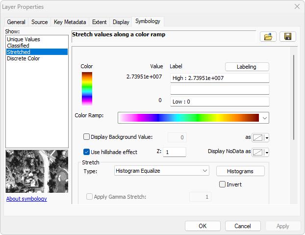

Resultados, ventana de ejecución grilla ASTER (dt: 05'5")
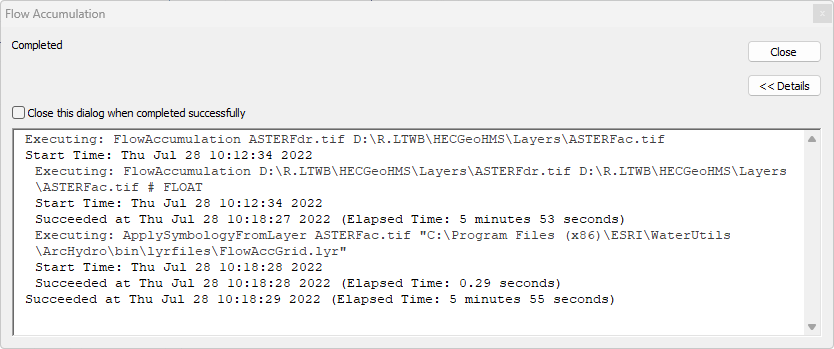
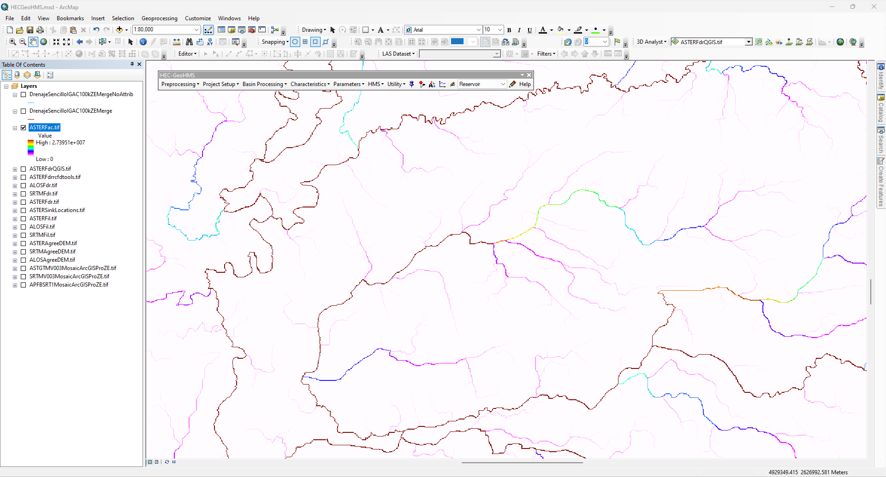

Resultados, ventana de ejecución grilla SRTM (dt: 06'03")
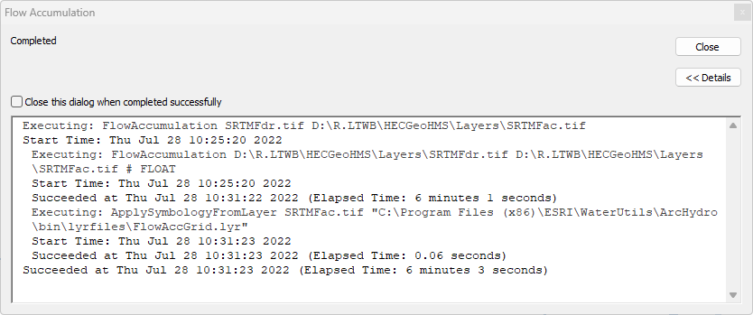
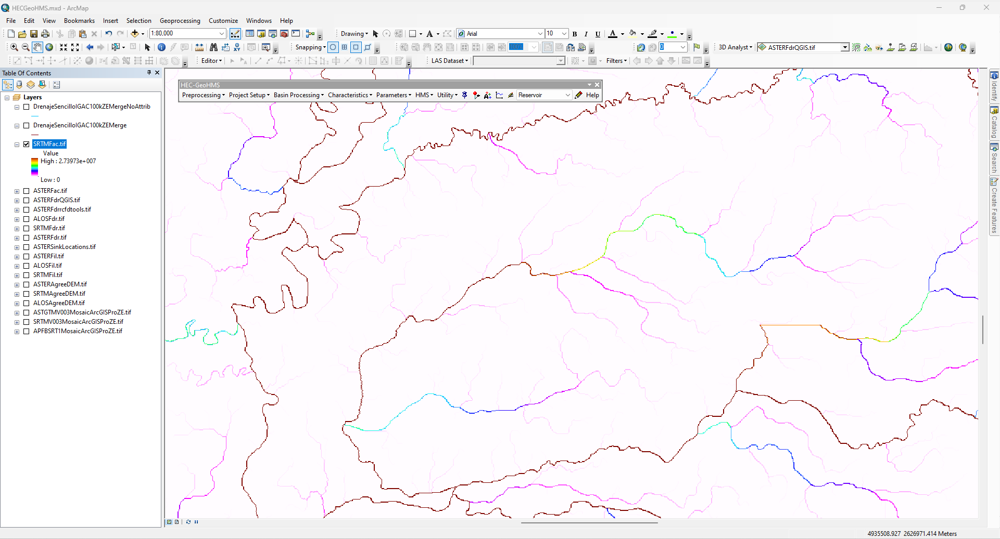

Resultados, ventana de ejecución grilla ALOS (dt: 42'13")

> Para saber si las grillas FAC han sido creadas correctamente, en la simbología de representación verifique que el máximo número de celdas acumuladas de los modelos digitales de elevación ASTER (27,395,096 celdas) y SRTM (27,397,288 celdas) sea similar debido a que su resolución es aproximadamente la misma y corresponde a celdas de 30.68464585 x 30.68464585 metros. Para los modelos ALOS, el número máximo de celdas acumuladas es mayor (133,955,792) debido a que su resolución es de 12.5 x 12.5 metros.   

|    Grilla    | Descargar :open_file_folder:                                                                                                                                             |
|:------------:|:-------------------------------------------------------------------------------------------------------------------------------------------------------------------------|
| ASTERFac.tif | [.rar](../../HECGeoHMS/Layers/ASTERFac.rar)                                                                                                                              |
| SRTMFac.tif  | [.rar](../../HECGeoHMS/Layers/SRTMFac.rar)                                                                                                                               |
| ALOSFac.tif  | [part1.rar, ](../../HECGeoHMS/Layers/ALOSFac.part01.rar)[part2.rar, ](../../HECGeoHMS/Layers/ALOSFac.part02.rar)[part3.rar, ](../../HECGeoHMS/Layers/ALOSFac.part03.rar) |

3. Busque e identifique la localización de las celdas con el mayor número de celdas acumuladas, active la red de drenaje _[DrenajeSencilloIGAC100kZEMerge.shp](../../.shp/DrenajeSencilloIGAC100kZEMerge.zip)_, rotule por el campo `NOMBRE_GEO` e identifique visualmente los drenajes principales obtenidos. En la simbología de representación de la grilla _ASTERFac.tif_, simbolice en 2 rangos manuales clasificados asignando como valor de corte el 5% del máximo valor acumulado, de esta forma podrá visualizar e identificar fácilmente varios de los drenajes con máximas acumulaciones, tales como el Río Cesar, Río Sicarare y Río Calenturitas, entre otros.

Parámetros para representación  
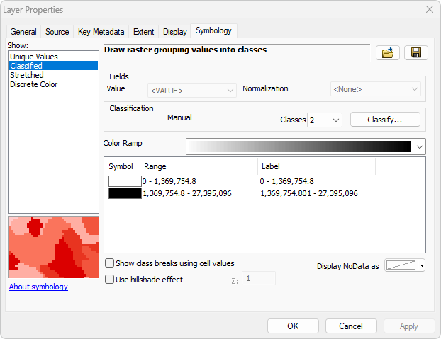  
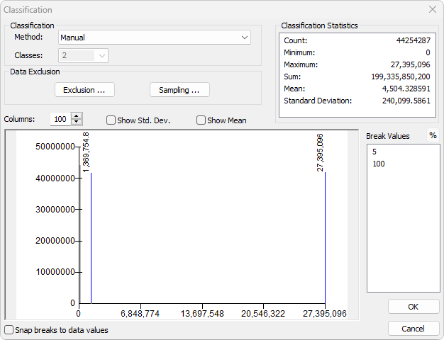
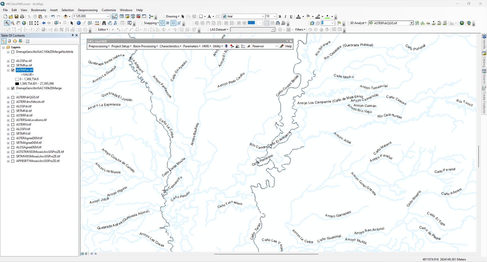

4. Para los 10 puntos de muestra indicados en la siguiente tabla y sobre el pixel o celda más próximo a un cauce, calcule el total de celdas acumuladas a partir de la grilla de acumulación ASTER 

| Punto ASTER | Longitud°  | Latitud° | CX, m         | CY, m         | Cauce                  |
|:-----------:|------------|----------|---------------|---------------|:-----------------------|
|      1      | -73.495997 | 9.739959 | 4,945,619.369 | 2,634,320.170 | Arroyo El Zorro        | 
|      2      | -73.629875 | 9.640873 | 4,930,920.356 | 2,623,393.212 | Río Calenturitas       | 
|      3      | -73.652359 | 9.544518 | 4,928,434.259 | 2,612,748.342 | Arroyo Paraluz         | 
|      4      | -73.650659 | 9.542860 | 4,928,620.410 | 2,612,564.806 | Arroyo Garrapata       | 
|      5      | -73.539101 | 9.533601 | 4,940,857.437 | 2,611,520.364 | Arroyo San Antonio     | 
|      6      | -73.577029 | 9.520474 | 4,936,693.99  | 2,610,076.265 | Arroyo Muñoz           | 
|      7      | -73.615767 | 9.727540 | 4,932,485.021 | 2,632,969.119 | Río Sicarare           | 
|      8      | -73.619967 | 9.273051 | 4,931,934.757 | 2,582,738.857 | Arroyo San Pedro       | 
|      9      | -73.627105 | 9.199749 | 4,931,136.826 | 2,574,638.888 | Quebrada Guadal        | 
|     10      | -73.660001 | 9.154681 | 4,927,515.195 | 2,569,664.402 | Arroyo Quiebradientes  | 

Copie y pegue los valores de la tabla anterior en un libro de Microsoft Excel, nombre la hoja como _TablaMuestra_ y el libro como _[FacDEMTablaMuestra.xlsx](../../.datasets/FacDEMTablaMuestra.xlsx)_ en la carpeta _[D:\R.LTWB\\.datasets](../../.datasets)_. Renombre las columnas de atributos como se muestra en la siguiente ilustración.

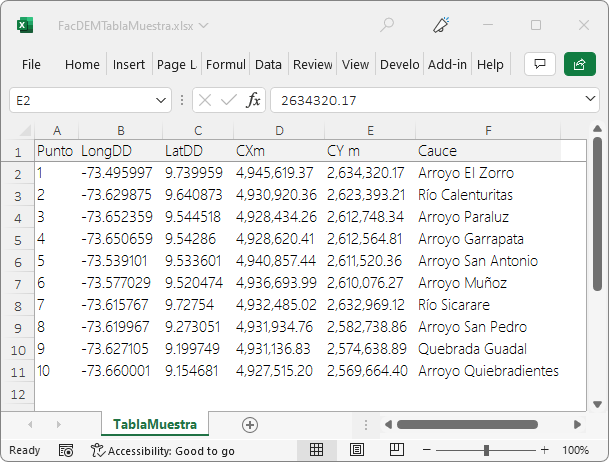

En ArcGIS, cargue la hoja _TablaMuestra_ del libro de Microsoft Excel y dando clic derecho en la tabla, seleccione la opción _Display XY Data_ seleccionado en `X Field` el campo de atributos `CXm` y en `Y Field` el campo de atributos `CYm`. El sistema de proyección definido para el mapa es _MAGNA_Colombia_CTM12_.

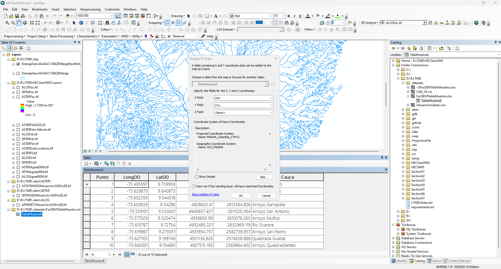  
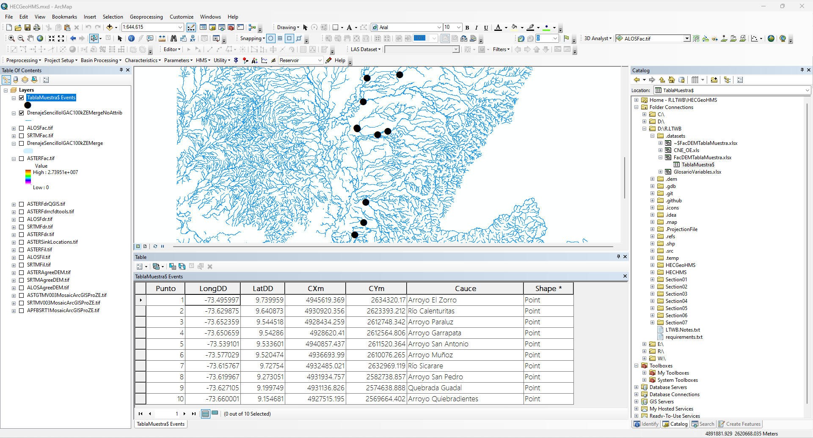

Exporte la capa de eventos a una capa geográfica en formato Shapefile dentro de la carpeta _[D:\R.LTWB\\.shp](../../.shp)_ y nombre como _[FacDEMTablaMuestra.shp](../../.shp/FacDEMTablaMuestra.zip)_. Clic derecho en la capa de eventos, _Data / Export Data_.

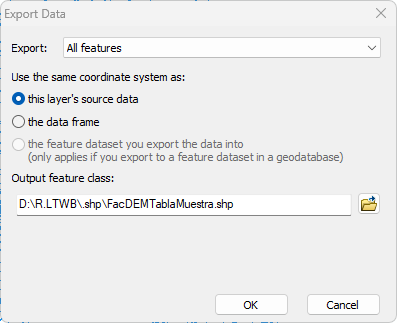

Utilizando la herramienta _ArcToolBox / Spatial Analyst Tools / Extraction / Extract Multi Values to Points_, obtenga el total de celdas acumuladas a partir del mapa _ASTERFac.tif_. En la tabla de atributos de la capa de puntos _[FacDEMTablaMuestra.shp](../../.shp/FacDEMTablaMuestra.zip)_ encontrará una nueva columna de atributos con el total de celdas acumuladas.

> La herramienta _Extract Multi Values to Points_ permite obtener simultáneamente los valores de acumulación para diferentes grillas sobre una misma capa de puntos, sin embargo, este proceso no puede ser realizado debido a que los puntos de muestreo solo son válidos para las posiciones de las celdas del modelo ASTER. Se recomienda verificar cada posición definida y su correspondencia con las demás grillas, podrá observar que no en todos los casos corresponden a las mismas localizaciones específicas sobre la red de drenaje principal.

En la tabla de atributos de la capa _[FacDEMTablaMuestra.shp](../../.shp/FacDEMTablaMuestra.zip)_, verifique los valores registrados en la columna _ASTERFac_ y ordene ascendentemente. Para las localizaciones de muestra, el cauce con menor acumulación corresponde al _Arroyo Garrapata_ con 27562 celdas y el cauce con la mayor acumulación al _Río Calenturitas_ con 1328240 celdas.

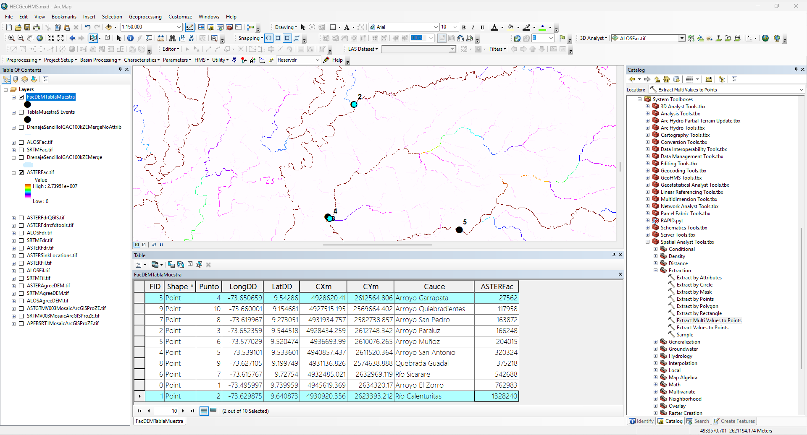

5. A partir de la tabla de puntos de muestreo y los valores de celdas acumuladas, calcule el área de aportación en km² y rotule cada nodo indicando el número del punto, nombre de la corriente, total de celdas acumuladas y área de aportación.

Desde las propiedades de la tabla de atributos de _FacDEMTablaMuestra.shp_, cree un campo de atributos numérico doble y nombre como _Akm2_.

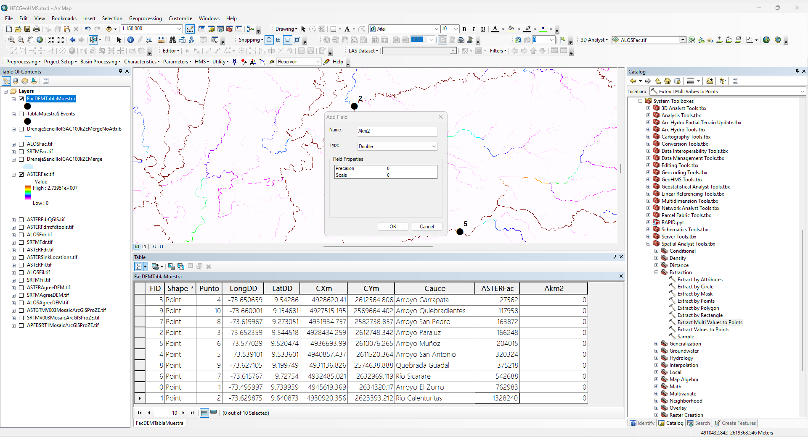

Desde la cabecera de la columna de atributos _Akm2_ y seleccionado la opción _Field Calculator_, calcule el área de aportación utilizando la expresión VB Script `[ASTERFac] * 30.68464585 * 30.68464585 / 1000000` donde 30.68464585 corresponde al tamaño de cada celda y 1000000 corresponde al valor de conversión de m² a km².

> Este cálculo puede también ser realizado con la expresión Python `!ASTERFac! * 30.68464585 * 30.68464585 / 1000000`

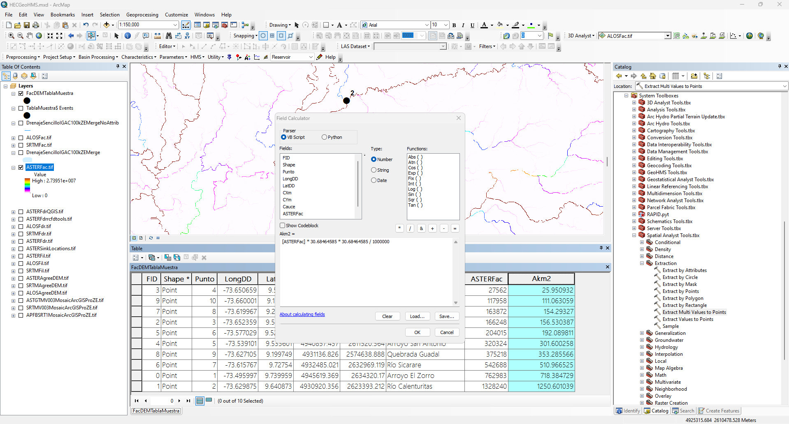

Rotule con la expresión VB Script `[Punto] &" - "& [Cauce] &VBNewline& "FAC: " & [ASTERFac] &VBNewline& "A, km²: "  & Round( [Akm2] ,2)`

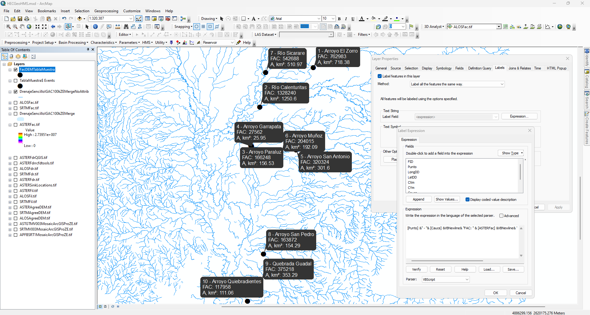

> **Actividad complementaria**: realice el procedimiento de lectura de celdas en puntos de muestreo y calcule las áreas acumuladas utilizando las grillas de acumulación SRTM y ALOS. Para esta actividad es necesario crear 2 hojas adicionales en el libro de Microsoft Excel y modificar las coordenadas específicas para cada grilla de acumulación.

#### Acumulaciones de flujo - FAC con otras herramientas

| Herramienta                                                                                                                                | Procedimiento                                                                                                                                                                                                                                                                                                                                                                                                                                                                                                                                                       |
|--------------------------------------------------------------------------------------------------------------------------------------------|---------------------------------------------------------------------------------------------------------------------------------------------------------------------------------------------------------------------------------------------------------------------------------------------------------------------------------------------------------------------------------------------------------------------------------------------------------------------------------------------------------------------------------------------------------------------|
| [ArcGIS for Desktop / Spatial Analyst Tools](https://desktop.arcgis.com/en/arcmap/latest/tools/spatial-analyst-toolbox/flow-direction.htm) | En el ArcToolBox, busque la caja de herramientas _Spatial Analyst Tools / Hydrology_ y seleccione la herramienta _Flow Accumulation_. Seleccione la grilla de entrada y asigne un nombre a la grilla de salida. Esta herramienta además permite mediante la opción _Imput weight raster_, incluir una grilla de pesos a ser acumulados y definir el tipo de datos de salida Float o Integer para la grilla resultante.                                                                                                                                              |
| [ArcGIS 10.2.2 / Arc Hydro Tools](http://downloads.esri.com/archydro/archydro/Setup/)                                                      | El procedimiento es el mismo presentado en esta actividad a través de HEC-GeoHMS debido a que esta herramienta utiliza Arc Hydro Tools.                                                                                                                                                                                                                                                                                                                                                                                                                             |
| [ArcGIS Pro / Spatial Analyst](https://pro.arcgis.com/en/pro-app/latest/help/analysis/raster-functions/flow-direction-raster-function.htm) | En el panel _Geoprocessing_, busque la caja de herramientas _Spatial Analyst Tools / Hydrology_ y seleccione la herramienta _Flow Accumulation_.  Seleccione la grilla de entrada y asigne un nombre a la grilla de salida. Esta herramienta además permite mediante la opción _Imput weight raster_, incluir una grilla de pesos a ser acumulados y definir el tipo de datos de salida Float o Integer para la grilla resultante. Al igual que la herramienta FIL, se puede seleccionar el algoritmo que define el tipo de direcciones a procesar (D8, MFD, DINF). |
| [ArcGIS Pro / Arc Hydro Tools Pro](http://downloads.esri.com/archydro/archydro/setup/Pro/)                                                 | En el panel _Geoprocessing_, busque la caja de herramientas _Arc Hydro Tools Pro / Terrain Preprocessing_ y seleccione la herramienta _Flow Accumulation_. Seleccione la grilla de entrada y asigne un nombre a la grilla de salida.                                                                                                                                                                                                                                                                                                                                |
| [HEC-HMS](https://www.hec.usace.army.mil/confluence/hmsdocs/hmsum/4.9/geographic-information/gis-menu)                                     | En el panel lateral seleccione en _Basin Models_ el modelo de cuenca creado, luego en el menú _GIS_ seleccione la opción _Preprocessing Drainage_. Este procedimiento crea automáticamente las grillas de direcciones y acumulaciones de flujo.                                                                                                                                                                                                                                                                                                                     |
| [QGIS 3](https://acolita.com/direccion-del-drenaje-en-qgis-3/)                                                                             | En el _Processing Toolbox_ busque el grupo de herramientas _SAGA / Terrain Analysis_ y ejecute _Fill Sinks (Wang & Lui)_ que además de rellenas las depresiones permite generar el mapa de direcciones de flujo y el mapa de acumulación.                                                                                                                                                                                                                                                                                                                           |

Los métodos para estimar el tipo de dirección de flujo en ArcGIS Pro son:

| Método | Descripción                                                                                                                                                                                                                                                                                                                                                                             |
|--------|:----------------------------------------------------------------------------------------------------------------------------------------------------------------------------------------------------------------------------------------------------------------------------------------------------------------------------------------------------------------------------------------|
| D8     | The D8 flow option models flow direction from each pixel to its steepest downslope neighbor. All of the flow is directed to this steepest neighbor. The output of the D8 direction type is an integer raster whose values range from 1 to 255.                                                                                                                                          |
| MFD    | The Multiple Flow Direction (MFD) algorithm, described by Qin (2007), partitions flow from a pixel to all downslope neighbors. A flow-partition exponent is created from an adaptive approach based on local terrain conditions and is used to determine the fraction of flow draining to each downslope neighbor.                                                                      |
| DINF   | The D-Infinity (DINF) flow method, described by Tarboton (1997), determines flow direction as the steepest downward slope on eight triangular facets formed in a 3x3 pixel window centered on the pixel of interest. Flow direction output is a floating point raster represented as a single angle in degrees, progressing counterclockwise from 0 (due east) to 360 (again due east). |

> La herramienta _Spatial Analyst Tools / Hydrology / Flow Accumulation_ será utilizada en la sección 5 de este curso para la realización del balance hidrológico de largo plazo distribuido debido a que permite incluir una grilla de pesos que corresponderá al potencial de escurrimiento obtenido de la diferencia entre la precipitación y la evaporación.

En este momento dispone de grillas de acumulación de flujo para obtener las celdas de los drenajes sobre los diferentes modelos digitales de elevación.

### Actividades complementarias:pencil2:

En la siguiente tabla se listan las actividades complementarias que deben ser desarrolladas y documentadas por el estudiante en un único archivo de Adobe Acrobat .pdf. El documento debe incluir portada (mostrar nombre completo, código y enlace a su cuenta de GitHub), numeración de páginas, tabla de contenido, lista de tablas, lista de ilustraciones, introducción, objetivo general, capítulos por cada ítem solicitado, conclusiones y referencias bibliográficas.

| Actividad | Alcance                                                                                                                                                                                                                                                                                                                                                                                               |
|:---------:|:------------------------------------------------------------------------------------------------------------------------------------------------------------------------------------------------------------------------------------------------------------------------------------------------------------------------------------------------------------------------------------------------------|
|     1     | Realice el procedimiento presentado en esta clase en ArcGIS for Desktop, ArcGIS Pro y QGIS.                                                                                                                                                                                                                                                                                                           |
|     2     | Para 10 puntos de muestreo, obtenga el total de celdas acumuladas de los modelos de ASTER GDEM, SRTM, ALOS PALSAR, calcule las áreas de aportación y compare los resultados obtenidos. Presente un análisis descriptivo indicando las diferencias encontradas y sus posibles causas. Al menos unos de los puntos debe corresponder con el punto de salida de la zona o subzona hidrográfica asignada. |
|     3     | En ArcGIS Pro, acumule la grilla Fil obtenida a partir del DEM ASTER utilizando los métodos D8, MDF y DINF y compare los resultados obtenidos en 10 puntos de confluencia diferentes.                                                                                                                                                                                                                    |

> La localización de Los puntos de muestreo de su caso de estudio son de libre elección, se recomienda evaluar puntos de descarga de cuencas principales o de cuencas con embalses hasta el punto de descarga al cauce principal receptor de toda la cuenca. 

### Compatibilidad

* Se recomienda desarrollar la acumulación de celdas con el mismo grupo de herramientas donde desarrollo el reacondicionamiento, p. ej. si el AgreeDEM fué generado directamente con Arc Hydro Tools Pro de ArcGIS Pro, obtenga las acumulaciones con las mismas herramientas _Terrain Processing_.  
 

### Referencias

* https://pro.arcgis.com/en/pro-app/latest/tool-reference/spatial-analyst/flow-accumulation.htm
* https://desktop.arcgis.com/en/arcmap/latest/tools/spatial-analyst-toolbox/flow-accumulation.htm
* https://saga-gis.sourceforge.io/saga_tool_doc/2.2.1/ta_preprocessor_4.html

### Control de versiones

| Versión    | Descripción                                                                                                                                                     | Autor                                      | Horas |
|------------|:----------------------------------------------------------------------------------------------------------------------------------------------------------------|--------------------------------------------|:-----:|
| 2023.02.01 | Guión, audio, video, edición y publicación.                                                                                                                     | [rcfdtools](https://github.com/rcfdtools)  |  1.5  |
| 2022.07.28 | Versión inicial con acumulaciones de flujo para DEM ASTER, SRTM y ALOS. Puntos de muestreo para lectura de valores acumulados y cálculo de áreas de aportación. | [rcfdtools](https://github.com/rcfdtools)  |   7   |

##

_R.LTWB es de uso libre para fines académicos, conoce nuestra licencia, cláusulas, condiciones de uso y como referenciar los contenidos publicados en este repositorio, dando [clic aquí](https://github.com/rcfdtools/R.LTWB/wiki/License)._

_¡Encontraste útil este repositorio!, apoya su difusión marcando este repositorio con una ⭐ o síguenos dando clic en el botón Follow de [rcfdtools](https://github.com/rcfdtools) en GitHub._

| [Anterior](../FdrDEM) | [:house: Inicio](../../Readme.md) | [:beginner: Ayuda / Colabora](https://github.com/rcfdtools/R.LTWB/discussions/11) | [Siguiente](../StrDEM) |
|-----------------------|-----------------------------------|-----------------------------------------------------------------------------------|------------------------|

##

 Este curso guía ha sido desarrollado con el apoyo de la Escuela Colombiana de Ingeniería - Julio Garavito. Encuentra más contenidos en https://github.com/uescuelaing  
