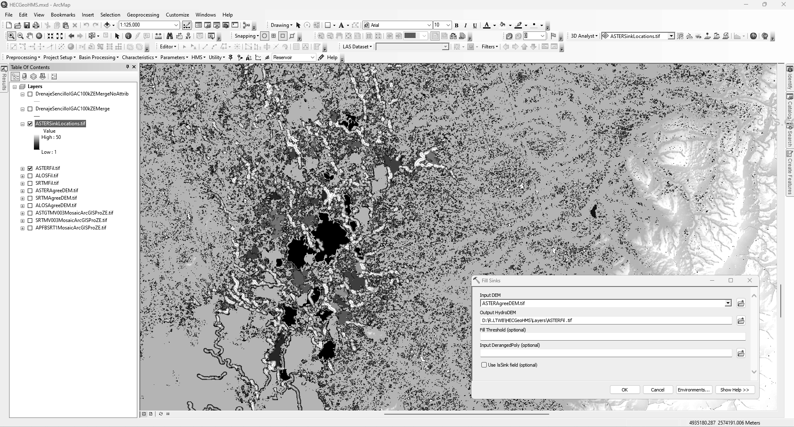
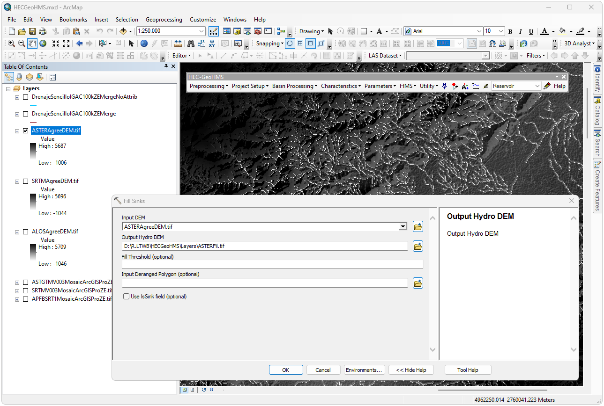
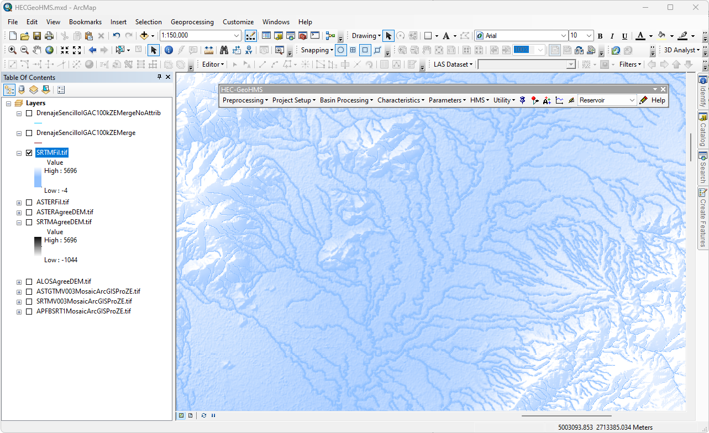
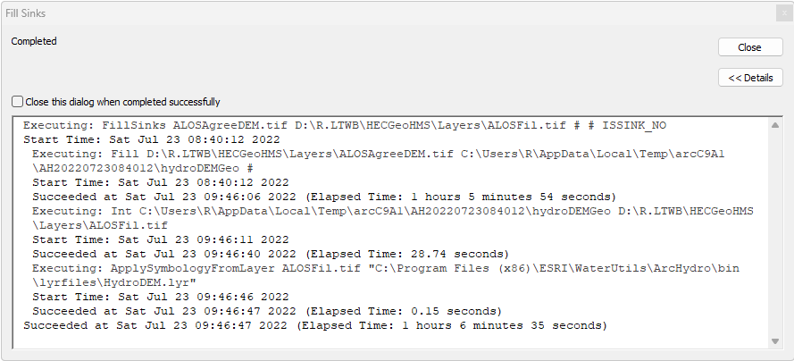
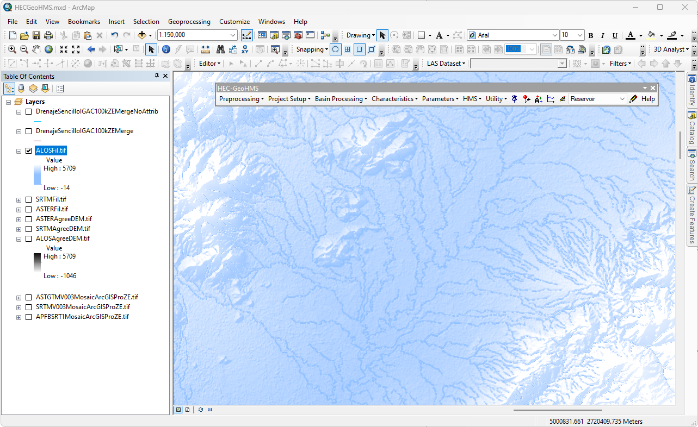
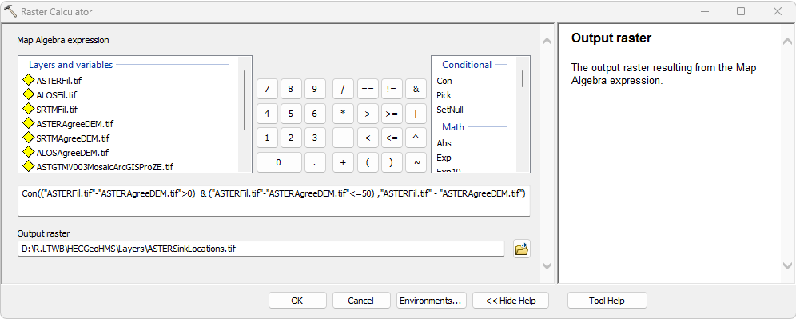
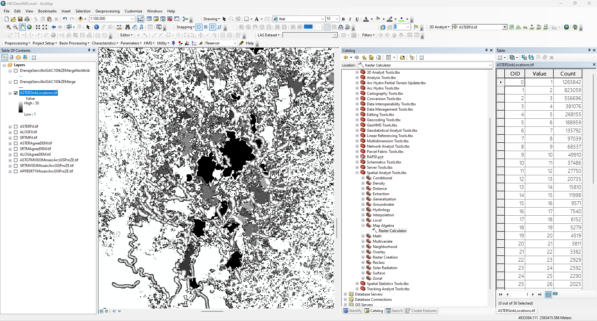
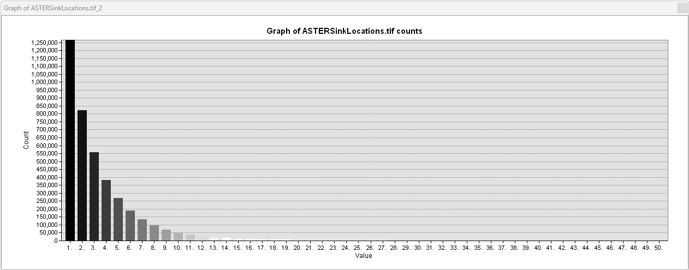
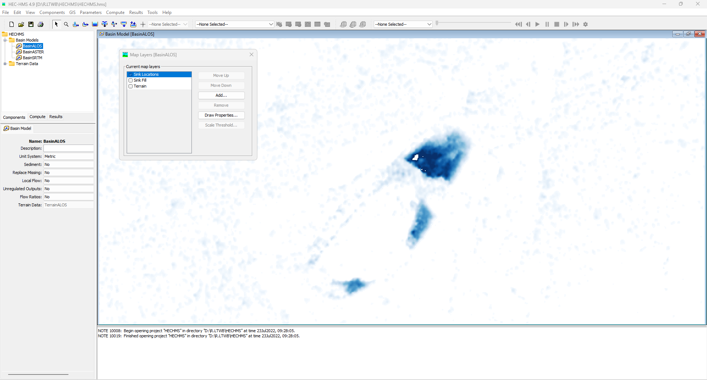

##  Relleno de sumideros o depresiones en modelos digitales de elevación – Fill Sinks – FIL
Keywords: `Fill-DEM` `AgreeDEM` `Map-Algebra` `Raster-Calculator` `Spatial-Analyst-Tools` `Arc-Hydro-Tools`

  
   <b>Balance hidrológico de largo plazo para estimación de caudales medios usando SIG</b>  <b>Universidad Escuela Colombiana de Ingeniería Julio Garavito</b> William Ricardo Aguilar Piña Profesor del Centro de Estudios Hidráulicos william.aguilar@escuelaing.edu.co 

 

Cuando una celda se encuentra rodeada por celdas de mayor elevación, la escorrentía es retenida y no fluye. El relleno de sumideros eleva estas celdas utilizando como referencia los valores en altura de las celdas circundantes, garantizando que las celdas de la superficie del terreno drenen hacia una localización más baja.

Los modelos digitales de elevación obtenidos a partir de información satelital, contienen información relacionada con la superficie terrestre (Digital Surface model – DSM, cubiertas de construcciones, línea superior del canopy en vegetación) y no a las elevaciones más bajas en el terreno. Es por ello que al ejecutar el procedimiento de relleno de sumideros se pueden identificar múltiples localizaciones y áreas que pueden producir encharcamiento interrumpiendo el drenaje continuo a largo plazo.

  Playlist: https://www.youtube.com/playlist?list=PLneiG4vC_8YupZFL2DtUEdcgtXyWT7Apt  

### Objetivos

* Rellenar los sumideros del modelo digital de elevación reacondicionado para garantizar que la escorrentía de todo el modelo hidrológico fluya hacia los puntos de control más aguas abajo.
* Identificar, cuantificar y graficar sumideros a través de la diferencia de elevaciones del DEM rellenado y DEM original.
* Conocer diferentes herramientas para relleno de sumideros.
* Visualizar y comparar perfiles de modelos digitales de elevación con y sin relleno de sumideros.

### Requerimientos

* [ArcGIS for Desktop 10+](https://desktop.arcgis.com/es/desktop/)
* [ArcGIS Pro 2+](https://pro.arcgis.com/en/pro-app/latest/get-started/download-arcgis-pro.htm) (opcional)
* [QGIS 3+](https://qgis.org/) (opcional)
* [Grillas DEM ASTER GDEM 30m, SRTM 30m y ALOS PALSAR 12.5m reacondicionadas. ](../../HECGeoHMS/Layers)[:mortar_board:Aprender.](../AgreeDEM)

### Diagrama general de procesos

El siguiente diagrama representa los procesos generales requeridos para el desarrollo de esta actividad.

  
Convenciones generales en diagramas: clases de entidad en azul, dataset en gris oscuro, grillas en color verde, geo-procesos en rojo, procesos automáticos o semiautomáticos en guiones rojos y procesos manuales en amarillo. Líneas conectoras con guiones corresponden a procedimientos opcionales.  

### Procedimiento general

El relleno de sumideros puede ser realizado con Spatial Analyst Tools de ArcGIS for Desktop, HEC-GeoHMS sobre ArcGIS 10.2.2 a través de Arc Hydro Tools, Spatial Analyst de ArcGIS Pro, Arc Hydro Tools sobre ArcGIS Pro, QGIS, HEC-HMS a través del menú GIS y otras herramientas y librerías.

#### Reacondicionamiento de modelos digitales de elevación DEM con HEC-GeoHMS sobre ArcGIS for Desktop

1. En ArcGIS for Desktop, abra el mapa _D:\R.LTWB\HECGeoHMS\HECGeoHMS.mxd_ creado en la actividad de [reacondicionamiento de modelos digitales de elevación](../AgreeDEM) que contiene las grillas DEM reacondicionadas. En caso de que este generando un mapa nuevo, cargue directamente las grillas contenidas en el directorio _[D:\R.LTWB\HECGeoHMS\Layers](../../HECGeoHMS/Layers)_.

2. En la barra de herramientas _HEC-GeoHMS_, vaya al menú _Preprocessing_, seleccione la opción _Fill Sinks_ y cree la grilla de relleno de sumideros en formato GeoTIFF para los 3 modelos digitales de elevación reacondicionados y asigne los nombres ASTERFil.tif, SRTMFil.tif y ALOSFil.tif en la ruta _D:\R.LTWB\HECGeoHMS\Layers\_

> En esta herramienta puede establecer el límite de relleno con la opción _Fill Threshold_ y delimitar la zona a ser rellenada con la selección de un polígono mediante _Input Deranged Polygon Feature Class_.

Parámetros de entrada para relleno de sumideros de grilla reacondicionada ASTER

Resultados, ventana de ejecución grilla ASTER (dt: 03'34")

Resultados, ventana de ejecución grilla SRTM (dt: 03'33")

Resultados, ventana de ejecución grilla ALOS (dt: 01h06'35")

| MDE reacondicionado | Cota mínima, m | Cota máxima, m  | Relleno de sumideros | Cota mínima, m | Cota máxima, m |                                                                  Descargar FIL :open_file_folder:                                                                   |
|:-------------------:|:--------------:|:---------------:|:--------------------:|:--------------:|:--------------:|:-------------------------------------------------------------------------------------------------------------------------------------------------------------------:|
|  ASTERAgreeDEM.tif  |     -1006      |      5687       |     ASTERFil.tif     |       0        |      5687      |                                                             [.rar](../../HECGeoHMS/Layers/ASTERFil.rar)                                                             |
|  SRTMAgreeDEM.tif   |     -1044      |      5696       |     SRTMFil.tif      |       -4       |      5696      |                                                             [.rar](../../HECGeoHMS/Layers/SRTMFil.rar)                                                              |
|  ALOSAgreeDEM.tif   |     -1046      |      5709       |     ALOSFil.tif      |       0        |      5687      | [part1.rar](../../HECGeoHMS/Layers/ALOSFil.part1.rar), [part2.rar](../../HECGeoHMS/Layers/ALOSFil.part2.rar), [part3.rar](../../HECGeoHMS/Layers/ALOSFil.part3.rar) |

| Los valores de cotas mínimas pueden variar dependiendo de la versión de ArcGIS, la versión de HEC-GeoHMS o la herramienta utilizada para el relleno.

3. Utilizando algebra de mapas, calcule la diferencia entre el mapa de relleno de sumideros y el mapa reacondicionado para conocer la localización específica de las zonas rellenadas entre 1 y 50 metros. Ejecute _ArcToolBox / Spatial Analyst Tools / Map Algebra / Raster Calculator_ e ingrese la expresión `Con(("ASTERFil.tif"-"ASTERAgreeDEM.tif">0)  & ("ASTERFil.tif"-"ASTERAgreeDEM.tif"<=50) ,"ASTERFil.tif" - "ASTERAgreeDEM.tif")`, guarde la grilla resultante como _D:\R.LTWB\HECGeoHMS\Layers\ASTERSinkLocations.tif_ 

4. Visualice la tabla de atributos de la grilla [ASTERSinkLocations.tif](../../HECGeoHMS/Layers/ASTERSinkLocations.rar) que contiene valores discretos contables de 1 a 50 metros de diferencia de elevación y cree una gráfica de barras desde el menú _View / Graphs / Create Graph_. 

Como puede observar en la gráfica y en la tabla de atributos, se han rellenado p. ej. 1.265.842 celdas 1 metro por encima de su elevación original, 823.059 celdas 2 metros por encima su elevación original y al sumar el total de celdas rellenadas hasta una diferencia de 50 metros se cuentan 4.020.911 celdas.

> Opcional: repita este procedimiento para los modelos digitales de elevación SRTM y ALOS.

5. Utilizando la barra de herramienta 3D Analyst, cree y visualice perfiles de terreno con y sin relleno de sumideros.

#### Reacondicionamiento de modelos digitales de elevación DEM con otras herramientas

| Herramienta                                                                                                                      | Procedimiento                                                                                                                                                                                                                                                                                                                                                     |
|----------------------------------------------------------------------------------------------------------------------------------|-------------------------------------------------------------------------------------------------------------------------------------------------------------------------------------------------------------------------------------------------------------------------------------------------------------------------------------------------------------------|
| [ArcGIS for Desktop / Spatial Analyst Tools](https://desktop.arcgis.com/en/arcmap/latest/tools/spatial-analyst-toolbox/fill.htm) | En el ArcToolBox, busque la caja de herramientas _Spatial Analyst Tools / Hydrology_ y seleccione la herramienta _Fill_. Seleccione la grilla de entrada, asigne un nombre de la grilla de salida y opcionalmente ingrese el valor _Z limit_ correspondiente a la máxima diferencia de elevación entre la celda de terreno y la celda rellenada.                  |
| [ArcGIS 10.2.2 / Arc Hydro Tools](http://downloads.esri.com/archydro/archydro/Setup/)                                            | El procedimiento es el mismo presentado en esta actividad a través de HEC-GeoHMS debido a que esta herramienta utiliza Arc Hydro Tools.                                                                                                                                                                                                                           |
| [ArcGIS Pro / Spatial Analyst](https://pro.arcgis.com/en/pro-app/latest/tool-reference/spatial-analyst/fill.htm)                 | En el panel _Geoprocessing_, busque la caja de herramientas _Spatial Analyst Tools / Hydrology_ y seleccione la herramienta _Fill_. Seleccione la grilla de entrada, asigne un nombre de la grilla de salida y opcionalmente ingrese el valor _Z limit_ correspondiente a la máxima diferencia de elevación entre la celda de terreno y la celda rellenada.       |
| [ArcGIS Pro / Arc Hydro Tools Pro](http://downloads.esri.com/archydro/archydro/setup/Pro/)                                       | En el panel _Geoprocessing_, busque la caja de herramientas _Arc Hydro Tools Pro / Terrain Preprocessing_ y seleccione la herramienta _Fill Sinks_. En esta herramienta puede establecer el límite de relleno con la opción _Fill Threshold_ y delimitar la zona a ser rellenada con la selección de un polígono mediante _Input Deranged Polygon Feature Class_. |
| [HEC-HMS](https://www.hec.usace.army.mil/confluence/hmsdocs/hmsum/4.9/geographic-information/gis-menu)                           | En el panel lateral seleccione en _Basin Models_ el modelo de cuenca creado, luego en el menú _GIS_ seleccione la opción _Preprocessing Sinks_. Luego de la ejecución, HEC-HMS genera automáticamente dos grillas de resultados, la primera con el DEM rellenado y la segunda con las localizaciones y profundidades específicas de las zonas rellenadas.         |
| [QGIS](https://saga-gis.sourceforge.io/saga_tool_doc/2.1.4/ta_preprocessor_3.html)                                               | En el _Processing Toolbox_ busque el grupo de herramientas _SAGA / Terrain Analysis_ y ejecute cualquiera de los 3 métodos disponibles: _Fill Sinks (Planchon/Darboux, 2001), Fill Sinks (Wang & Lui) o Fill Sinks XXL (Wang & Lui)_                                                                                                                              |

HEC-HMS grilla de resultados con localización de sumideros

En este momento, dispone de grillas de relleno de sumideros para marcación de direcciones de flujo.

### Actividades complementarias:pencil2:

En la siguiente tabla se listan las actividades complementarias que deben ser desarrolladas y documentadas por el estudiante en un único archivo de Adobe Acrobat .pdf. El documento debe incluir portada (mostrar nombre completo, código y enlace a su cuenta de GitHub), numeración de páginas, tabla de contenido, lista de tablas, lista de ilustraciones, introducción, objetivo general, capítulos por cada ítem solicitado, conclusiones y referencias bibliográficas.

| Actividad | Alcance                                                                                                                                                                                                                                                                     |
|:---------:|:----------------------------------------------------------------------------------------------------------------------------------------------------------------------------------------------------------------------------------------------------------------------------|
|     1     | Realice el procedimiento presentado en esta clase en ArcGIS for Desktop, ArcGIS Pro y QGIS.                                                                                                                                                                                 |
|     2     | Utilizando diferentes herramientas, cree mapas de relleno de sumideros a partir de la grilla reacondicionada ASTER GDEM y a través de un análisis de diferencias de elevación obtenido con la calculadora ráster, compare, analice y explique las diferencias encontradas. |
|     3     | Investigue y documente otras herramientas, librerías, complementos o plug-in desde los que se pueda realizar el relleno de sumideros.                                                                                                                                       |

### Compatibilidad

* Se recomienda desarrollar el relleno de sumideros - Fil con el mismo grupo de herramientas donde desarrollo el reacondicionamiento, p. ej. si el AgreeDEM fue generado directamente con Arc Hydro Tools Pro de ArcGIS Pro, ejecute el relleno con las mismas herramientas _Terrain Processing_.

### Referencias

* https://desktop.arcgis.com/en/arcmap/latest/tools/spatial-analyst-toolbox/fill.htm
* https://pro.arcgis.com/en/pro-app/latest/tool-reference/spatial-analyst/fill.htm
* https://desktop.arcgis.com/en/arcmap/latest/tools/spatial-analyst-toolbox/conditional-evaluation-with-con.htm
* https://desktop.arcgis.com/en/arcmap/latest/extensions/spatial-analyst/map-algebra/what-is-map-algebra.htm
* https://saga-gis.sourceforge.io/saga_tool_doc/2.2.1/ta_preprocessor_4.html

### Control de versiones

| Versión    | Descripción                                                                                                                                                                   | Autor                                      | Horas |
|------------|:------------------------------------------------------------------------------------------------------------------------------------------------------------------------------|--------------------------------------------|:-----:|
| 2023.01.31 | Guión, audio, video, edición y publicación.                                                                                                                                   | [rcfdtools](https://github.com/rcfdtools)  |  1.5  |
| 2022.07.23 | Versión inicial con relleno de sumideros para DEM ASTER, SRTM y ALOS. Cálculo de diferencias de elevación para identificación de zonas rellenadas, visualización de perfiles. | [rcfdtools](https://github.com/rcfdtools)  |   5   |

##

_R.LTWB es de uso libre para fines académicos, conoce nuestra licencia, cláusulas, condiciones de uso y como referenciar los contenidos publicados en este repositorio, dando [clic aquí](https://github.com/rcfdtools/R.LTWB/wiki/License)._

_¡Encontraste útil este repositorio!, apoya su difusión marcando este repositorio con una ⭐ o síguenos dando clic en el botón Follow de [rcfdtools](https://github.com/rcfdtools) en GitHub._

| [Anterior](../AgreeDEM) | [:house: Inicio](../../Readme.md) | [:beginner: Ayuda / Colabora](https://github.com/rcfdtools/R.LTWB/discussions/9) | [Siguiente](../FdrDEM) |
|-------------------------|-----------------------------------|----------------------------------------------------------------------------------|------------------------|

##

 Este curso guía ha sido desarrollado con el apoyo de la Escuela Colombiana de Ingeniería - Julio Garavito. Encuentra más contenidos en https://github.com/uescuelaing  
