## Demarcación de drenajes – Stream Definition - STR y localización de nodos característicos
Keywords: `STR DEM` `Stream definition` `FAC DEM` `Flow accumulation` `Arc Hydro Tools` `Extract Multi Values to Points` `Raster to Polyline` `Add Field` `Geometry Calculator` `Delete Identical` `Raster Calculator`

A partir de las grillas de acumulación de flujo, se pueden identificar las celdas que hacen parte de la red de drenaje principal. Para ello se especifica el área de aportación p. ej. de 1 o 4 km² o el número equivalente de celdas en función de su resolución, considerando que a menor área de aportación, mayor será el número de corrientes obtenidas. El procedimiento general para la definición de drenajes incluye la creación de una grilla binarizada con celdas a las que se les asigna 1 como valor de pixel. Es importante tener en cuenta que algunos de los tramos obtenidos, corresponderán a áreas de aportación inferiores al valor de aportación definido, específicamente en cuencas intermedias o cuencas de tránsito entre dos puntos de unión próximos.

### Objetivos

* Marcar las celdas o píxeles correspondientes a cada cuenca de drenaje para un área de aportación determinada.
* Convertir el mapa binarizado en un red de drenaje vectorizada.
* Obtener los puntos de inicio y confluencia característicos de toda la red obtenida.
* Eliminar nodos duplicados.
* Para cada punto característico obtener el total de celdas acumuladas y calcular las áreas de aportación. 

### Requerimientos

* [ArcGIS for Desktop 10+](https://desktop.arcgis.com/es/desktop/)
* [ArcGIS Pro 2+](https://pro.arcgis.com/en/pro-app/latest/get-started/download-arcgis-pro.htm) (opcional)
* [QGIS 3+](https://qgis.org/) (opcional)
* [Grillas de acumulaciones de Flujo – Flow Accumulation – FAC. ](../../HECGeoHMS/Layers)[:mortar_board:Aprender.](../FacDEM)

> El libro de cálculo [StrDEM.xlsx](StrDEM.xlsx) de Microsoft Excel disponible en esta actividad, contiene un ejemplo del número de celdas requeridas y subcuencas obtenidas para diferentes áreas de aportación en función del área de una cuenca principal y la resolución específica de una grilla DEM. 

 
  

### Diagrama general de procesos

El siguiente diagrama representa los procesos generales requeridos para el desarrollo de esta actividad.

  
Convenciones generales en diagramas: clases de entidad en azul, dataset en gris oscuro, grillas en color verde, geo-procesos en rojo, procesos automáticos o semiautomáticos en guiones rojos y procesos manuales en amarillo. Líneas conectoras con guiones corresponden a procedimientos opcionales.  

### Procedimiento general

La demarcación de drenajes a partir de un área de aportación definida puede ser realizada con ArcGIS for Desktop y ArcGIS Pro a través de la calculadora ráster, HEC-GeoHMS sobre ArcGIS 10.2.2 a través de Arc Hydro Tools, Arc Hydro Tools sobre ArcGIS Pro, QGIS Raster Calculator y HEC-HMS a través del menú GIS.

#### Demarcación de drenajes con HEC-GeoHMS sobre ArcGIS for Desktop

1. En ArcGIS for Desktop, abra el mapa _D:\R.LTWB\HECGeoHMS\HECGeoHMS.mxd_ creado en la actividad de [reacondicionamiento de modelos digitales de elevación](../AgreeDEM) y modificado en la clase de [acumulaciones de flujo](../FacDEM) que contiene las grillas FAC. En caso de que este generando un mapa nuevo, cargue directamente las grillas FAC contenidas en el directorio _[D:\R.LTWB\HECGeoHMS\Layers](../../HECGeoHMS/Layers)_.

2. En la barra de herramientas _HEC-GeoHMS_, vaya al menú _Preprocessing_, seleccione la opción _Stream Definition_ y cree la grilla de marcación de drenajes en formato GeoTIFF para los 3 modelos digitales de acumulación y asigne los nombres [ASTERStr.tif](../../HECGeoHMS/Layers/ASTERStr.rar), [SRTMStr.tif](../../HECGeoHMS/Layers/SRTMStr.rar) y [ALOSStr.tif](../../HECGeoHMS/Layers/ALOSStr.rar) en la ruta _D:\R.LTWB\HECGeoHMS\Layers\_. Como criterio de área de aportación utilice p. ej. 1 km², que para los modelos ASTER y SRTM corresponderá a 1062 celdas de aportación debido a que su resolución es de 30.68464585 metros y para el modelo ALOS PALSAR, 6400 celdas de aportación, ya que su resolución es de 12.5 metros. Para la representación en pantalla, use como fondo la red de drenaje vectorial.

Parámetros de entrada para demarcación de drenajes ASTER

Resultados, ventana de ejecución grilla ASTER (dt: 00'05.82")
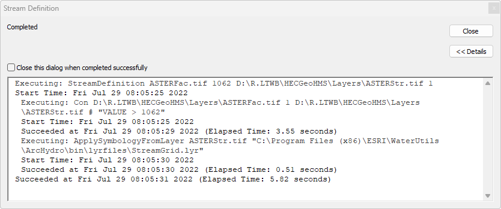
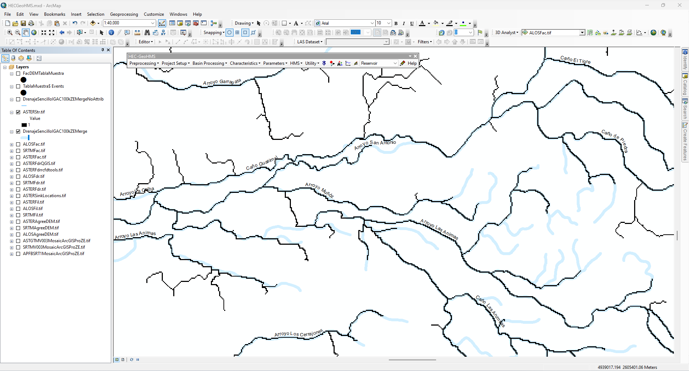

Resultados, ventana de ejecución grilla SRTM (dt: 00'05.72")

Resultados, ventana de ejecución grilla ALOS (dt: 42'24.63")
  
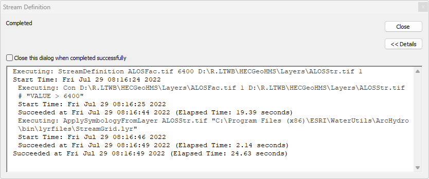

> Como puede observar en las ilustraciones, para las áreas de aportación definidas se han marcado múltiples celdas de drenaje en localizaciones similares a las de los vectores utilizados para el reacondicionamiento del terreno, excepto en algunas zonas donde existen bucles en la red de drenaje original con la que se realizó el reacondicionamiento del modelo digital de elevación. 

|    Grilla    |        Descargar :open_file_folder:         |
|:------------:|:-------------------------------------------:|
| ASTERStr.tif | [.rar](../../HECGeoHMS/Layers/ASTERStr.rar) |
| SRTMStr.tif  | [.rar](../../HECGeoHMS/Layers/SRTMStr.rar)  |
| ALOSStr.tif  | [.rar](../../HECGeoHMS/Layers/ALOSStr.rar)  |

> El procedimiento de identificación y marcación de las celdas que igualan o exceden el valor del área de aportación definido, puede ser realizado manualmente en cualquier herramienta GIS a través de la calculadora ráster, utilizando como entrada la grilla de acumulación y definiendo un condicional. Por ejemplo, para la grilla ASTER la expresión a usar es `Con("ASTERFac.tif">=1062,1)` donde 1062 corresponde al número de celdas necesarias para obtener un área de aportación de 1 km² para una grilla con resolución de 30.68464585 metros (1062 = 1000000 m² / (30.68464585m * 30.68464585m)).

3. Convierta las grillas de demarcación de drenajes a vectores con la herramienta _ArcToolBox / Conversion Tools / From Raster / Raster to Polyline_, nombre como _[ASTERStr.shp](../../.shp/asterstr.zip)_, _[SRTMStr.shp](../../.shp/srtmstr.zip)_ y _[ALOSStr.shp](../../.shp/alosstr.zip)_ en la carpeta _D:\R.LTWB\\.shp_. Desactive la casilla `Simplify polylines` para obtener líneas detalladas sobre cada celda horizontal, vertical y diagonal. Automáticamente, esta herramienta genera tramos de drenaje independientes manteniendo la correspondencia entre los puntos de unión de afluentes.

Parámetros de entrada para la conversión a polilíneas de grilla ASTER

Resultados, ventana de ejecución grilla ASTER (dt: 03'20")
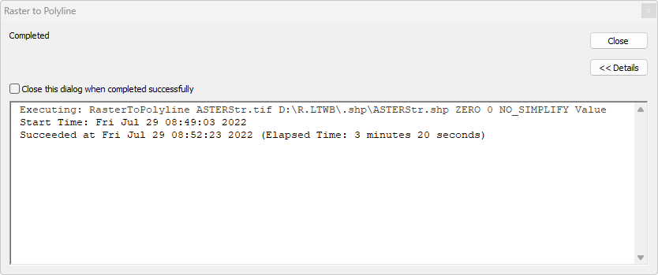
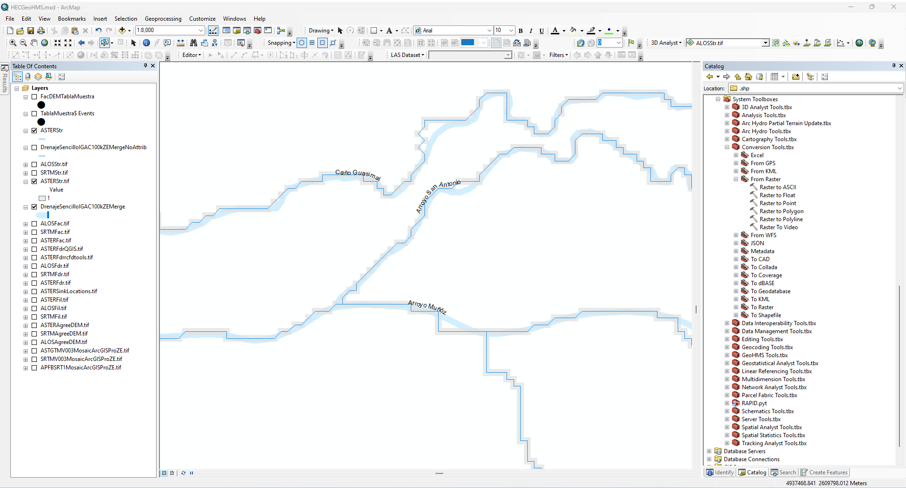

Resultados, ventana de ejecución grilla SRTM (dt: 04'39")
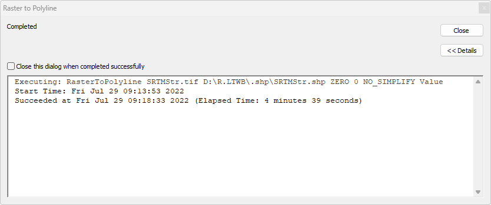
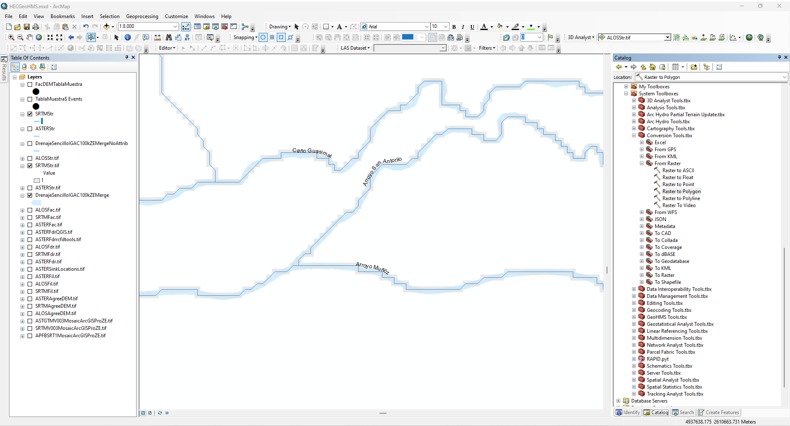

Resultados, ventana de ejecución grilla ALOS (dt: 06'52")

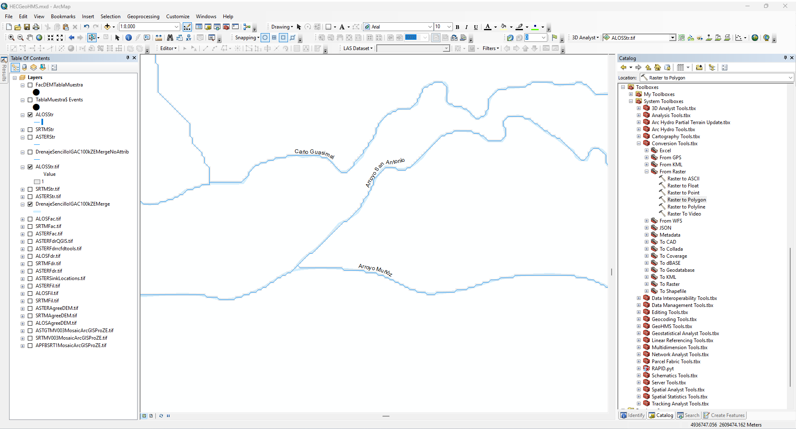

> A diferencia de las líneas de drenaje utilizadas para el reacondicionamiento del modelo de terreno a partir de la red de drenaje del IGAC, las líneas de drenaje obtenidas a partir de la marcación de celdas de terrreno, son localizadas a lo largo y en la diagonal de los píxeles, lo que permite obtener la localización exacta de los puntos de inicio, entrega y confluencia de toda la red, pero sobre las celdas específicas donde se realiza la acumulación principal del flujo.

4. Utilizando la herramienta _ArcToolBox / Data Management Tools / Features / Feature Vertices To Points_, obtenga los nodos inicio / fin de cada tramo de drenaje identificado, nombre como _[ASTERStrNode.shp](../../.shp/ASTERStrNode.zip)_, _[SRTMStrNode.shp](../../.shp/SRTMStrNode.zip)_ y _[ALOSStrNode.shp](../../.shp/ALOSStrNode.zip)_ en la carpeta _D:\R.LTWB\\.shp_. En `Point Type` seleccione `BOTH_ENDS` para obtener el punto inicial y final de cada línea de drenaje.

Parámetros de entrada para la obtención de nodos característicos en grilla ASTER

Resultados, ventana de ejecución grilla ASTER con 65554 nodos (dt: 00'29.82")

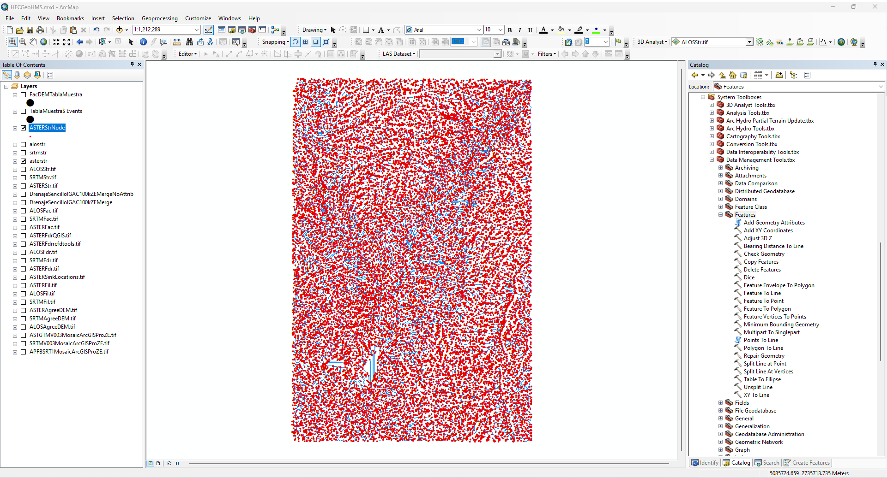

Resultados, ventana de ejecución grilla SRTM con 65688 nodos (dt: 00'18.80")
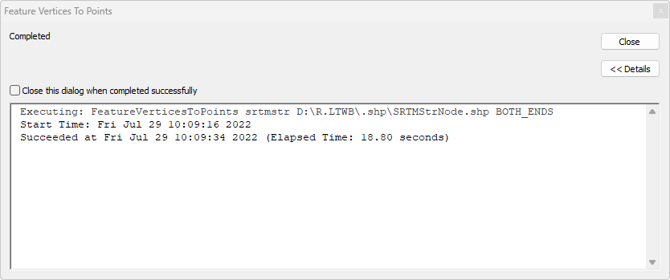

Resultados, ventana de ejecución grilla ALOS con 72210 nodos (dt: 00'35.67")

> Los nodos iniciales de cada tramo de drenaje son requeridos debido a que aguas arriba de estos nodos existen múltiples celdas que son acumuladas hasta el pixel o celda identificado a partir del cual se conforma la escorrentía para el área característica de aportación establecida. 
> 
> Debido a la alta densidad de la red de nodos, es posible que en escalas reducidas no se visualicen completamente los puntos en pantalla en ArcGIS for Desktop. Visualizar con ArcGIS Pro o con QGIS.
>
> Los nodos obtenidos en los puntos finales de los tramos de drenaje que confluyen en una misma localización estarán duplicados y en la misma localización obtendremos también un nodo adicional correspondiente al punto inicial del tramo aguas abajo de la unión. En las confluencias solo se requiere de 1 nodo para la lectura de los valores de celdas acumuladas y los posteriores procesos de lectura de caudal medio de largo plazo que desarrollaremos en este curso.

5. Para cada red de puntos característicos, elimine los nodos duplicados utilizando el siguiente procedimiento:

Abra la tabla de atributos de _ASTERStrNode.shp_ y agregue 2 campos de atributos numéricos dobles y nómbrelos como `CX`, `CY`.

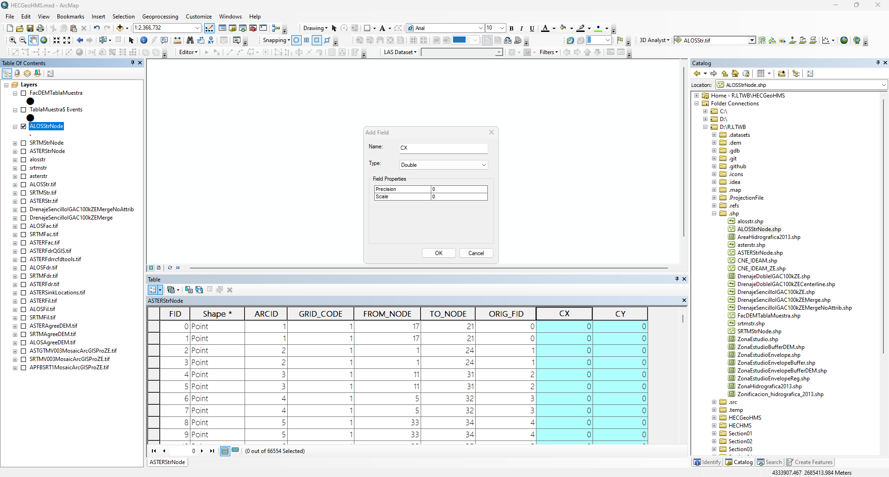

Desde las cabeceras de los campos de atributos `CX` y `CY`, calcule la geometría de los puntos y obtenga las propiedades `X Coordinate of Point` y `Y Coordinate of Point` a partir del _CRS MAGNA Colombia CMT12_.

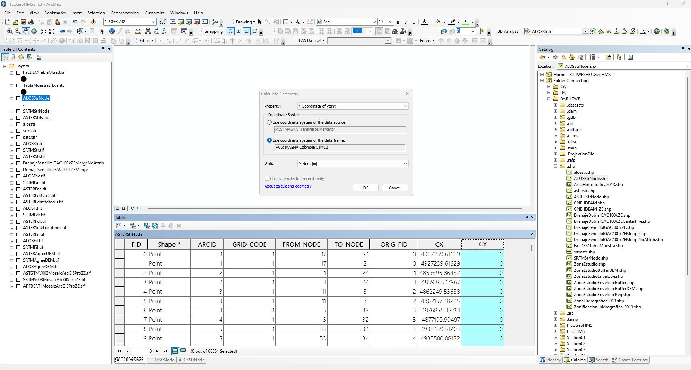

Utilizando la herramienta _ArcToolBox / Data Management Tools / General / Delete Identical_, elimine los nodos repetidos en cada una de las capas vectoriales generadas previamente. Este procedimiento realiza la eliminación sobre la misma capa a partir de los valores duplicados en los campos `CX` y `CY`.

  
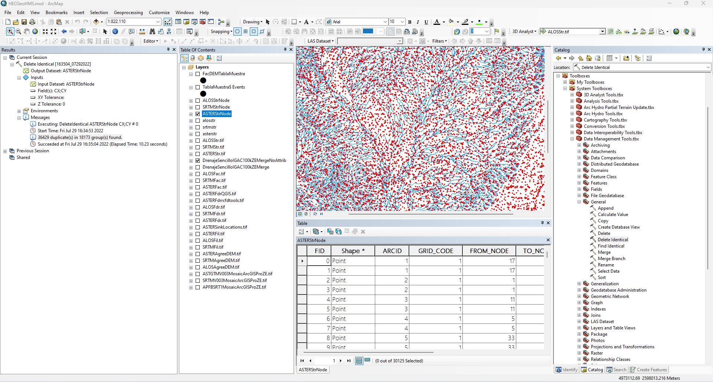

> En QGIS 3, el procedimiento de eliminación de elementos duplicados puede ser realizado con la herramienta _Processing Toolbox / Vector general / Delete duplicate geometries_, es más simple que en ArcGIS debido a que todos aquellos elementos que espacialmente sean coincidentes en su geometría, son eliminados automáticamente, sin embargo, es necesario crear una nueva capa geográfica. El proceso de eliminación homologable a _Delete Identical_ de ArcGIS puede ser ejecutado en QGIS con la herramienta _Processing Toolbox / Vector general / Delete duplicates by attribute_.

Repita el procedimiento anterior para los puntos contenidos en SRTMStrNode.shp y ALOSStrNode.shp. Resultados obtenidos:  

|    Polilíneas Str :open_file_folder:    |          Nodos Str :open_file_folder:           | Total nodos | Total duplicados | Nodos finales |
|:---------------------------------------:|:-----------------------------------------------:|:-----------:|:----------------:|:-------------:|
| [ASTERStr.shp](../../.shp/asterstr.zip) | [ASTERStrNode.shp](../../.shp/ASTERStrNode.zip) |    65554    |      36429       |     30125     | 
|  [SRTMStr.shp](../../.shp/srtmstr.zip)  |  [SRTMStrNode.shp](../../.shp/SRTMStrNode.zip)  |    65688    |      36046       |     29622     | 
|  [ALOSStr.shp](../../.shp/alosstr.zip)  |  [ALOSStrNode.shp](../../.shp/ALOSStrNode.zip)  |    72210    |      40132       |     32078     | 

6. Utilizando la herramienta _ArcToolBox / Spatial Analyst Tools / Extraction / Extract Multi Values to Points_, obtenga el total de celdas acumuladas en capa de nodos _ASTERStrNode.shp_ a partir del mapa _ASTERFac.tif_. Luego de finalizada su ejecución, en la tabla de atributos de la capa de puntos _ASTERStrNode.shp_ encontrará una nueva columna de atributos con el total de celdas acumuladas denominada `ASTERFac`. Ordene descendentemente el campo `ASTERFac` y seleccione y visualice los 10 nodos con mayores acumulaciones, 

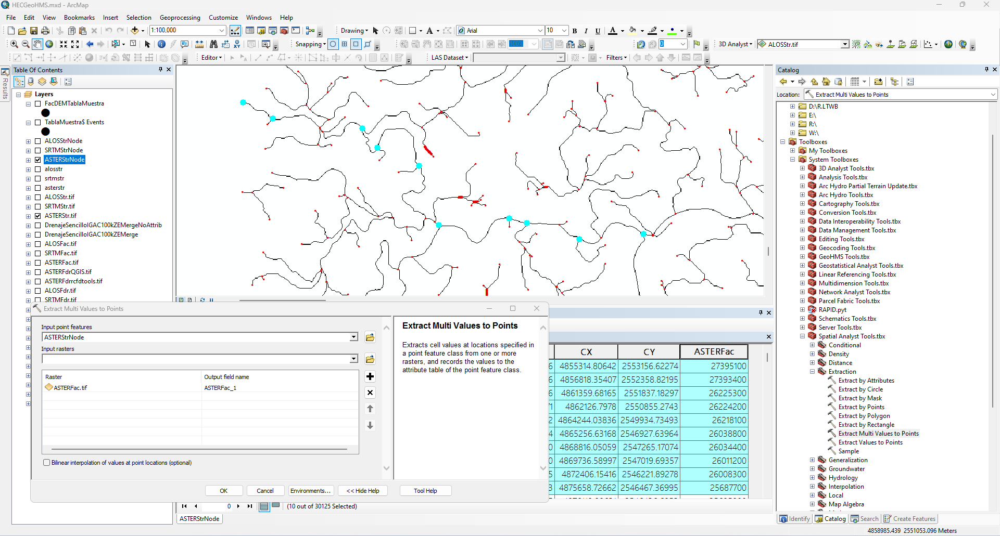

> La herramienta _Extract Multi Values to Points_ permite obtener simultáneamente los valores de acumulación para diferentes grillas sobre una misma capa de puntos, sin embargo, este proceso no puede ser realizado debido a que los puntos de muestreo solo son válidos para las posiciones de las celdas de cada capa de puntos. 

Repita el procedimiento anterior para los puntos contenidos en _SRTMStrNode.shp_ utilizando la grilla de acumulación _SRTMFac.tif_.

Repita el procedimiento anterior para los puntos contenidos en _ALOSStrNode.shp_ utilizando la grilla de acumulación _ALOSFac.tif_.

> Como observa en las 3 ilustraciones anteriores, la localización de los nodos con el mayor número de celdas acumuladas no corresponde a la misma zona geográfica debido a que las elevaciones en los 3 modelos DEM iniciales no son idénticas y también debido a los bucles presentes en la red de drenaje.

7. A partir de las tablas de puntos característicos de la red de drenaje y los valores de celdas acumuladas, calcule el área de aportación para cada nodo en km² y rotule cada punto indicando el total de celdas acumuladas y área de aportación.

Desde las propiedades de la tabla de atributos de _ASTERStrNode.shp, SRTMStrNode.shp y ALOSStrNode.shp_, cree un campo de atributos numérico doble y nombre como `Akm2`.

Desde la cabecera de la columna de atributos _Akm2_ y seleccionado la opción _Field Calculator_, calcule el área de aportación utilizando las expresiones VB Script:

* `[ASTERFac] * 30.68464585 * 30.68464585 / 1000000` donde 30.68464585 corresponde al tamaño de cada celda y 1000000 corresponde al valor de conversión de m² a km².
* `[SRTMFac] * 30.68464585 * 30.68464585 / 1000000` donde 30.68464585 corresponde al tamaño de cada celda y 1000000 corresponde al valor de conversión de m² a km².
* `[ALOSFac] * 12.5 * 12.5 / 1000000` donde 12.5 corresponde al tamaño de cada celda y 1000000 corresponde al valor de conversión de m² a km².
 
> Este cálculo puede también ser realizado con la expresión Python `!ASTERFac! * 30.68464585 * 30.68464585 / 1000000`

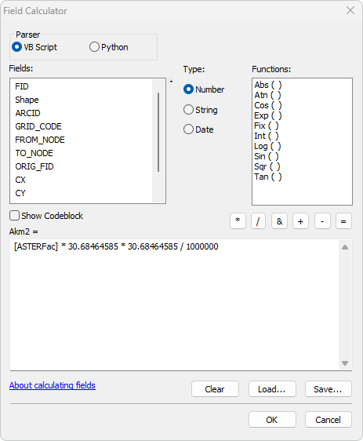

Rotule con las expresiones VB Script:

* `"FAC: " & [ASTERFac] &VBNewline& "A, km²: "  & Round( [Akm2] ,2)`
* `"FAC: " & [SRTMFac] &VBNewline& "A, km²: "  & Round( [Akm2] ,2)`
* `"FAC: " & [ALOSFac] &VBNewline& "A, km²: "  & Round( [Akm2] ,2)`

Áreas de aportación por nodo para acumulaciones ASTER

Áreas de aportación por nodo para acumulaciones SRTM
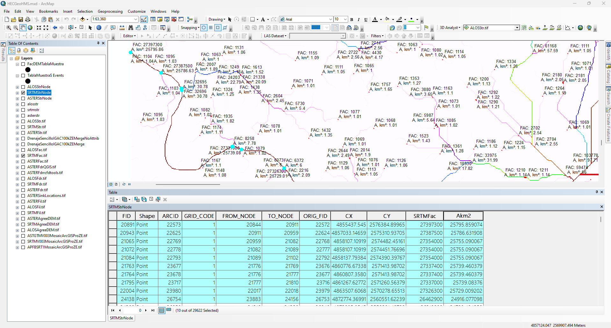

Áreas de aportación por nodo para acumulaciones ALOS
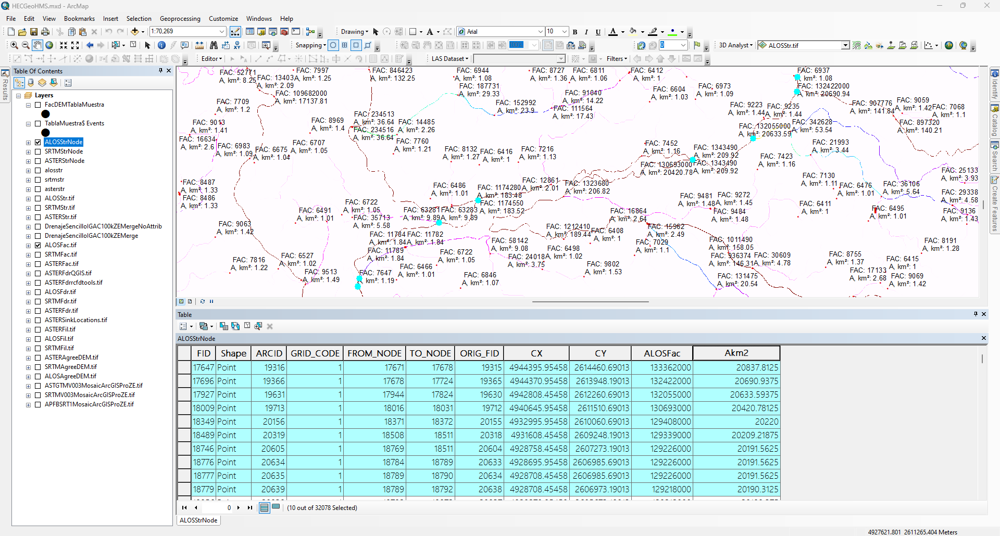

#### Demarcación de drenajes - SRT con otras herramientas

| Herramienta                                                                                                                                | Procedimiento                                                                                                                                                                                                                                                                                                               |
|--------------------------------------------------------------------------------------------------------------------------------------------|-----------------------------------------------------------------------------------------------------------------------------------------------------------------------------------------------------------------------------------------------------------------------------------------------------------------------------|
| [ArcGIS for Desktop / Spatial Analyst Tools](https://desktop.arcgis.com/en/arcmap/latest/tools/spatial-analyst-toolbox/flow-direction.htm) | En ArcToolBox, busque la caja de herramientas _Spatial Analyst Tools / Map Algebra_ y seleccione la herramienta _Raster Calculator_. Ingrese la expresión, p. ej. `Con("ASTERFac.tif">=1062,1)` para grillas ASTER con resolución de 30.68464585 metros y defina el nombre del archivo vectorizado de salida.               |
| [ArcGIS 10.2.2 / Arc Hydro Tools](http://downloads.esri.com/archydro/archydro/Setup/)                                                      | El procedimiento es el mismo presentado en esta actividad a través de HEC-GeoHMS debido a que esta herramienta utiliza Arc Hydro Tools.                                                                                                                                                                                     |
| [ArcGIS Pro / Spatial Analyst](https://pro.arcgis.com/en/pro-app/latest/help/analysis/raster-functions/flow-direction-raster-function.htm) | En el panel _Geoprocessing_, busque la caja de herramientas _Spatial Analyst Tools / Map Algebra_ y seleccione la herramienta _Raster Calculator_. Ingrese la expresión, p. ej. `Con("ASTERFac.tif">=1062,1)` para grillas ASTER con resolución de 30.68464585 metros y defina el nombre del archivo vectorizado de salida. |
| [ArcGIS Pro / Arc Hydro Tools Pro](http://downloads.esri.com/archydro/archydro/setup/Pro/)                                                 | En el panel _Geoprocessing_, busque la caja de herramientas _Arc Hydro Tools Pro / Terrain Preprocessing_ y seleccione la herramienta _Stream Definition_. Seleccione la grilla FAC de entrada, establezca el área de aportación o el número de celdas equivalentes y asigne un nombre a la grilla de salida.               |
| [HEC-HMS](https://www.hec.usace.army.mil/confluence/hmsdocs/hmsum/4.9/geographic-information/gis-menu)                                     | En el panel lateral seleccione en _Basin Models_ el modelo de cuenca creado, luego en el menú _GIS_ seleccione la opción _Identify Streams_ y defina el área de aportación.                                                                                                                                                 |
| [QGIS 3](https://acolita.com/direccion-del-drenaje-en-qgis-3/)                                                                             | En el _Processing Toolbox_ busque el grupo de herramientas _Raster Analysis _ y ejecute _Raster Calculator_ ingresando, p. ej. `if("ASTERFac@1" >= 1062, 1, 0)`.                                                                                                                                                            |

Ejemplo de raster calculator sobre QGIS  
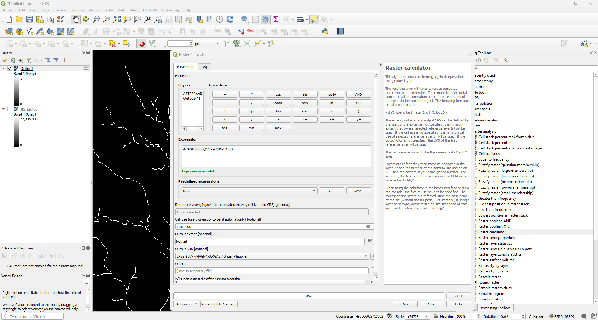

En este momento, dispone de grillas de demarcación de drenajes, líneas de drenajes y puntos característicos de la red con el total de celdas convergentes y las áreas de aportación para la posterior lectura de los valores de caudal medio y cálculo de isorendimientos. 

### Referencias

* https://docs.qgis.org/3.22/en/docs/user_manual/processing_algs/qgis/vectorgeneral.html
* https://desktop.arcgis.com/en/arcmap/10.4/tools/spatial-analyst-toolbox/identifying-stream-networks.htm
* https://pro.arcgis.com/en/pro-app/latest/tool-reference/spatial-analyst/identifying-stream-networks.htm
* https://docs.qgis.org/2.8/en/docs/user_manual/working_with_raster/raster_calculator.html

### Actividades complementarias:pencil2:

En la siguiente tabla se listan las actividades complementarias que deben ser desarrolladas y documentadas por el estudiante en un único archivo de Adobe Acrobat .pdf. El documento debe incluir portada (mostrar nombre completo, código y enlace a su cuenta de GitHub), numeración de páginas, tabla de contenido, lista de tablas, lista de ilustraciones, introducción, objetivo general, capítulos por cada ítem solicitado, conclusiones y referencias bibliográficas.

| Actividad | Alcance                                                                                                                                                                                                                                                                                                                                                                                                                 |
|:---------:|:------------------------------------------------------------------------------------------------------------------------------------------------------------------------------------------------------------------------------------------------------------------------------------------------------------------------------------------------------------------------------------------------------------------------|
|     1     | Realice el procedimiento presentado en esta clase en ArcGIS for Desktop, ArcGIS Pro y QGIS.                                                                                                                                                                                                                                                                                                                             |
|     2     | Investigue y documente cual es el área de aportación representativa para obtener tramos de drenaje en función del área total de una cuenca para diferentes tamaños de cuenca. Tenga en cuenta que p. ej., cuencas urbanas requieren de la definición de áreas de aportación menores para resolver la red de drenaje y cuencas rurales requieren de un área mayor en función del tipo de análisis hidrológico requerido. |

### Compatibilidad

* Se recomienda desarrollar la demarcación de celdas de drenaje con el mismo grupo de herramientas donde desarrollo el reacondicionamiento, p. ej. si la grilla de acumulación fué generada directamente con Arc Hydro Tools Pro de ArcGIS Pro, obtenga las celdas marcadas STR con las mismas herramientas.  
 

### Control de versiones

| Versión    | Descripción                                                                                                                                                                                                                                                                       | Autor                                      | Horas |
|------------|:----------------------------------------------------------------------------------------------------------------------------------------------------------------------------------------------------------------------------------------------------------------------------------|--------------------------------------------|:-----:|
| 2022.07.30 | Finalización documentación versión inicial. Procedimiento demarcación de drenajes - SRT con otras herramientas. Diagrama de procesos.                                                                                                                                             | [rcfdtools](https://github.com/rcfdtools)  |   2   |
| 2022.07.29 | Versión inicial demarcación de drenajes para áreas de aportación de 1km² para acumulaciones de flujo DEM ASTER, SRTM y ALOS. Conversión de celdas a vectores de drenaje y obtención de puntos característicos con lectura de valores acumulados y cálculo de áreas de aportación. | [rcfdtools](https://github.com/rcfdtools)  |   8   |

_R.LTWB es de uso libre para fines académicos, conoce nuestra licencia, cláusulas, condiciones de uso y como referenciar los contenidos publicados en este repositorio, dando [clic aquí](https://github.com/rcfdtools/R.LTWB/wiki/License)._

_¡Encontraste útil este repositorio!, apoya su difusión marcando este repositorio con una ⭐ o síguenos dando clic en el botón Follow de [rcfdtools](https://github.com/rcfdtools) en GitHub._

| [Anterior](../FacDEM) | [:house: Inicio](../../Readme.md) | [:beginner: Ayuda / Colabora](https://github.com/rcfdtools/R.LTWB/discussions/12) | [Siguiente](../../Section03) |
|-----------------------|-----------------------------------|-----------------------------------------------------------------------------------|------------------------------|
