## Agregación estadística para obtención de promedios multianuales compuestos y por fenómeno climatológico
Keywords: `Compuesto` `El-Niño` `La-Niña` `Neutro` `matplotlib` `pandas` `Statistical-aggregation`

<div align="center"></div> 

Luego de validadas y completadas las series, y de realizada la marcación de años por fenómeno climatológico, se efectúa el proceso de agregación estadística para obtener los valores promedio multianuales requeridos en cada estación por parámetro hidro-climatológico para su interpolación espacial.


### Objetivos

* Agregar estadísticamente los registros compuestos de cada estación para obtener los valores promedio multianuales requeridos para la creación de mapas continuos interpolados.
* Segmentar las series de datos por parámetro y por fenómeno climatológico (El Niño, La Niña y Neutro) y realizar su agregación a valores promedio multianuales.
* Graficar los registros agregados mensuales y anuales de cada parámetro para todas las estaciones del arreglo de datos.
* Graficar los valores agregados de promedio multianual para datos compuestos y por fenómeno.
* Obtener y graficar valores zonales para cada parámetro estudiado. 

> Una serie compuesta se refiere a que se incluyen todos los registros para la agregación estadística.


### Requerimientos

* [Python 3+](https://www.python.org/)
* [Pandas](https://pandas.pydata.org/docs/index.html) para Python
* [Tabulate](https://pypi.org/project/tabulate/) para Python, requerido para impresión de tablas en formato Markdown desde pandas.
* [Notepad++](https://notepad-plus-plus.org/), editor de texto y código.
* Tablas con series de datos discretos completados y extendidos (por imputación) de estaciones terrestres del IDEAM por parámetro hidroclimatológico. [:mortar_board:Aprender.](../Impute)
* Tablas de marcación de años por fenómeno climatológico (Niño, Nina y Neutro). [:mortar_board:Aprender.](../Agg)

> Para el desarrollo de esta actividad, no realizaremos la agregación de datos de evaporación potencial debido a que solo existe información diaria en una estación de la zona de estudio. Es posible que actualmente estos registros ya estén disponibles en el servicio [DHIME](https://dhime.ideam.gov.co/) del [IDEAM - Colombia](http://www.ideam.gov.co/) para su descarga.
> 
> Para la segmentación de series utilizaremos la tabla de marcación de años por fenómeno a partir de 5 eventos sucesivos.

### Procedimiento general

<div align="center">
<br><br>
<sub>Convenciones generales en diagramas: clases de entidad en azul, dataset en gris oscuro, grillas en color verde, geo-procesos en rojo, procesos automáticos o semiautomáticos en guiones rojos y procesos manuales en amarillo. Líneas conectoras con guiones corresponden a procedimientos opcionales.</sub><br><br>
</div>

1. Para realizar las agregaciones estadísticas, descargue el script [Agg.py](../../.src/Agg.py) y guárdelo en la carpeta local `D:\R.LTWB\.src` de su equipo.

**Funcionalidades del script**

* Agregación estadística de datos diarios a mensuales y anuales.
* Agregación estadística de datos mensuales a anuales.
* Segmentación y agregación de series por fenómeno climatológico.
* Agregación mensual multianual.
* Generación de gráficas de análisis.
* Generación de reporte detallado Markdown y tablas de valores agregados y desviaciones estándar en formato de texto separado por comas .csv.

Contenido del script

```
# -*- coding: UTF-8 -*-
# Name: Agg.py
# Description: statistical aggregations for hydro-climatological series
# Requirements: Python 3+, pandas, tabulate


# Libraries
from datetime import datetime
import sys
import pandas as pd
import matplotlib
import matplotlib.pyplot as plt
import tabulate  # required for print tables in Markdown using pandas


# General variables
station_file = 'Impute_MICE_Outlier_IQR_Cap_Pivot_PTPM_TT_M.csv'  # Current IDEAM records file
station_path = 'D:/R.LTWB/.datasets/IDEAM_Impute/'  # Current IDEAM records path, use ../.datasets/IDEAM_Impute/ for relative path
ENSOONI_file = 'ONI_Eval_Consecutive.csv'
ENSOONI_path = 'D:/R.LTWB/.datasets/ENSOONI/'
path = 'D:/R.LTWB/.datasets/IDEAM_Agg/'  # Your local output files path, use ../.datasets/IDEAM_Agg/ for relative path
file_log_name = path + 'Agg_' + station_file + '.md'
file_log = open(file_log_name, 'w+')   # w+ create the file if it doesn't exist
date_record_name = 'Fecha'  # IDEAM date field name for the record values
plot_colormap = 'Spectral'  # Color theme for plot graphics (E.g. autumn), https://matplotlib.org/stable/tutorials/colors/colormaps.html
fig_size = 5  # Height size for figures plot
show_plot = False
df_agg_full = pd.DataFrame(columns=['Station'])  # Integrated dataframe aggregations values
df_agg_std_full = pd.DataFrame(columns=['Station'])  # Integrated dataframe aggregations standard deviationss
df_agg_zonal = pd.DataFrame(columns=['Month'])  # Integrated dataframe zonal aggregations
daily_serie = False  # The stations series contain daily values
agg_func = 'Sum'  # Aggregation function, E.G. 'Sum' for total monthly rain or evaporation values, 'Mean' for average monthly flow or max and min temperature values, 'Max' for PMax24hr from total daily rain.
unit = 'Rain, mm'

# Function for print and show results in a file
def print_log(txt_print, on_screen=True, center_div=False):
    if on_screen:
        print(txt_print)
    if center_div:
        file_log.write('\n<div align="center">\n' + '\n')
    file_log.write(txt_print + '\n')
    if center_div:
        file_log.write('\n</div>\n' + '\n')

# Function for plot series
def plot_df(df, title='No assignment title', kind='line', plt_save_name='xxxxx', legend=False):
    match kind:
        case 'line':
            ax = df.plot(colormap=plot_colormap, legend=legend, alpha=1, figsize=(fig_size*2, fig_size+1), linewidth=0.65)
        case 'bar':
            ax = df.plot.bar(colormap=plot_colormap, legend=legend, stacked=True, figsize=(fig_size*3, fig_size*1.75), width=0.8)
            plt.xticks(rotation=90, size=8)
    plt.title(title)
    ax.set_ylabel(unit + '\n' + station_file + '\n' + ENSOONI_file)
    if show_plot: plt.show()
    plt_name = plt_save_name + '_' + station_file + '.png'
    plt.savefig(path + 'Graph/' + plt_name, dpi=150)
    print_log('\n' % ('Graph/' + plt_name), center_div=False)
    plt.close('all')

# Function for monthly to year aggregations
def monthly_to_yearly_agg_func(df1):
    match agg_func:
        case 'Sum':  # Typical for total monthly rain
            df_yearly_agg = df1.groupby(df1[date_record_name].dt.year).sum()
        case 'Mean':  # Typical for average monthly flow
            df_yearly_agg = df1.groupby(df1[date_record_name].dt.year).mean()
        case 'Max':  # Typical for PMax24hr from total daily rain
            df_yearly_agg = df1.groupby(df1[date_record_name].dt.year).max()
        case 'Min':  # Typical for average monthly flow
            df_yearly_agg = df1.groupby(df1[date_record_name].dt.year).min()
    return df_yearly_agg


# Open the IDEAM station pivot dataframe and show general information
df = pd.read_csv(station_path + station_file, low_memory=False, parse_dates=[date_record_name])


# Header
print_log('# Statistical aggregations for hydro-climatological composite series and yearly events Niño, Niña and Neutral')
print_log('\nFor further information about the NOAA - Oceanic Niño Index (ONI) classifier for climatological yearly events Niño, Niña and Neutral, check this activity https://github.com/rcfdtools/R.LTWB/tree/main/Section03/ENSOONI')
print_log('\n* Station records file: [%s](%s)' % (str(station_file), '../IDEAM_Impute/' + station_file) +
          '\n* ENSO-ONI year file: [%s](%s)' % (str(ENSOONI_file), '../ENSOONI/' + ENSOONI_file) +
          '\n* Stations: %d' % (df.shape[1] - 1) +
          '\n* Records: %d' % df.shape[0] +
          '\n* Daily serie: %s' % daily_serie +
          '\n* Aggregation function: %s' % agg_func +
          '\n* Execution date: ' + str(datetime.now()) +
          '\n* Python version: ' + str(sys.version) +
          '\n* Python path: ' + str(sys.path[0:5]) +
          '\n* matplotlib version: ' + str(matplotlib.__version__) +
          '\n* pandas version: ' + str(pd.__version__) +
          '\n* Instructions & script: https://github.com/rcfdtools/R.LTWB/tree/main/Section03/Agg'
          '\n* License: https://github.com/rcfdtools/R.LTWB/blob/main/LICENSE.md'
          '\n* Credits: r.cfdtools@gmail.com')


# Aggregations from daily to monthly values
if daily_serie:
    match agg_func:
        case 'Sum':  # Typical for total daily rain
            df = df.groupby([df[date_record_name].dt.year, df[date_record_name].dt.month]).sum()
        case 'Mean':  # Typical for average daily flow, daily temperature
            df = df.groupby([df[date_record_name].dt.year, df[date_record_name].dt.month]).mean()
    df.index.name = 'Group'
    df['Aux'] = df.index
    df[date_record_name] = df.Aux.str[0].astype(str) + '-' + df.Aux.str[1].astype(str) + '-01'
    df[date_record_name] = df[date_record_name].astype('datetime64[ns]')
    df = df.drop(['Aux'], axis=1)
    df = df.reset_index(drop=True)
    df.index.name = 'Id'
    df.insert(0, date_record_name, df.pop(date_record_name))
    df.to_csv(path + 'Agg_YM_' + station_file)  # YM means yearly and monthly


# Composite aggregations for monthly values
print_log('\n\n## Composite - Yearly values per station from monthly values (%s)\n' % agg_func)
if daily_serie:
    print_log('Daily values to year-month aggregation (%s) file: [%s](%s)\n' % (agg_func, 'Agg_YM_' + station_file, 'Agg_YM_' + station_file ))
df_yearly_agg = monthly_to_yearly_agg_func(df)
df_yearly_agg.index.name = 'Year'
print_log(df_yearly_agg.to_markdown())
plot_df(df_yearly_agg, title='Composite - Yearly values per station from monthly values (%s)\n' % agg_func, kind='line', plt_save_name='AggComposite_Yearly_%s' % agg_func)
print_log('\nComposite - Aggregation value per station from yearly aggregations (mean)\n')
df_agg = df_yearly_agg.mean()  # Results as list
df_agg.index.name = 'Station'
df_agg.name = 'AggComposite'
df_agg = df_agg.to_frame()  # List to frame
print_log(df_agg.T.to_markdown())
print_log('\nComposite - Aggregation value per station from yearly aggregations (std - standard deviation)\n')
df_agg_std = df_yearly_agg.std()  # Results as list
df_agg_std.index.name = 'Station'
df_agg_std.name = 'StdAggComposite'
df_agg_std = df_agg_std.to_frame()  # List to frame
print_log(df_agg_std.T.to_markdown())
plot_df(df_agg, title='Composite - Aggregation value per station from yearly aggregations (mean)\n', kind='bar', plt_save_name='AggComposite_Station_Mean')
print_log('\nComposite - Monthly values per station (mean)\n')
df_monthly_val = df.groupby(df[date_record_name].dt.month).mean()
df_monthly_val.index.name = 'Month'
print_log(df_monthly_val.to_markdown())
plot_df(df_monthly_val, title='Composite - Monthly values per station (mean)\n', kind='line', plt_save_name='AggComposite_Monthly_Mean')
print_log('\nComposite - Zonal monthly values (mean)\n', center_div=True)
df_monthly_zonal = df_monthly_val.mean(axis=1)
df_monthly_zonal.name = 'AggCompositeZonal'
df_monthly_zonal = df_monthly_zonal.to_frame()
print_log(df_monthly_zonal.to_markdown(), center_div=True)
df_agg_full = df_agg
df_agg_std_full = df_agg_std
df_agg_zonal = df_monthly_zonal


# Aggregation values with the ENSO-ONI year classifier
print_log('\n## ENSO-ONI Events - Yearly values per station from monthly values (%s)\n' % agg_func)
df_ensooni = pd.read_csv(ENSOONI_path + ENSOONI_file, low_memory=False, encoding='latin-1', index_col=False)
df_ensooni.index.name = 'Id'
enso_oni_regs = df_ensooni.shape[0]
#print_log(df_ensooni.to_markdown())
print_log('* Records in ENSO-ONI file: %d' % enso_oni_regs)
event_mark_unique = df_ensooni['EventMark'].unique()
print_log('* ENSO-ONI eventMark unique values: ' + str(event_mark_unique))
#for i in event_mark_unique:
for i in (-1, 1, 0):
    match int(i):
        case -1:
            ensooni_tag = 'Niña'
            agg_name = 'AggNina'
        case 0:
            ensooni_tag = 'Neutral'
            agg_name = 'AggNeutral'
        case 1:
            ensooni_tag = 'Niño'
            agg_name = 'AggNino'
    df_ensooni_eval = df_ensooni[df_ensooni['EventMark'] == i]
    print_log('\n### %s events analysis (%d years identified)\n' % (ensooni_tag, df_ensooni_eval.shape[0]))
    print_log(df_ensooni_eval.to_markdown(), center_div=True)
    df_ensooni_unique = df_ensooni_eval['YR'].unique()
    df_yearly_agg = monthly_to_yearly_agg_func(df[df[date_record_name].dt.year.isin(df_ensooni_unique)])
    df_yearly_agg.index.name = 'Year'
    print_log('\n%s - Table aggregations (%s)\n' % (ensooni_tag, agg_func))
    print_log(df_yearly_agg.to_markdown())
    plot_df(df_yearly_agg, title='%s - Yearly values per station from monthly values (%s)\n' % (ensooni_tag, agg_func), kind='line', plt_save_name='%s_Yearly_%s' % (agg_name,agg_func))
    print_log('\n%s - Aggregation value per station from yearly aggregations (mean)\n' % ensooni_tag)
    df_agg = df_yearly_agg.mean()  # Results as list
    df_agg.index.name = 'Station'
    df_agg.name = agg_name
    df_agg = df_agg.to_frame()  # List to frame
    print_log(df_agg.T.to_markdown())
    print_log('\n%s - Aggregation value per station from yearly aggregations (std - standard deviation)\n' % ensooni_tag)
    df_agg_std = df_yearly_agg.std()  # Results as list
    df_agg_std.index.name = 'Station'
    df_agg_std.name = 'Std' + agg_name
    df_agg_std = df_agg_std.to_frame()  # List to frame
    print_log(df_agg_std.T.to_markdown())
    plot_df(df_agg, title='%s - Aggregation value per station from yearly aggregations (mean)\n' % ensooni_tag, kind='bar', plt_save_name='%s_Station_Mean' % agg_name)
    print_log('\n%s - Monthly values per station (mean)\n' % ensooni_tag)
    df_monthly_filter = df[df[date_record_name].dt.year.isin(df_ensooni_unique)]
    df_monthly_val = df.groupby(df_monthly_filter[date_record_name].dt.month).mean()
    df_monthly_val.index.name = 'Month'
    print_log(df_monthly_val.to_markdown())
    plot_df(df_monthly_val, title='%s - Monthly values per station (mean)\n' % ensooni_tag, kind='line', plt_save_name='%s_Monthly_Mean' % agg_name)
    df_agg_full = pd.concat([df_agg_full, df_agg], axis=1)
    df_agg_std_full = pd.concat([df_agg_std_full, df_agg_std], axis=1)
    print_log('\n%s - Zonal monthly values (mean)\n' % ensooni_tag, center_div=True)
    df_monthly_zonal = df_monthly_val.mean(axis=1)
    df_monthly_zonal.name = agg_name + 'Zonal'
    df_monthly_zonal = df_monthly_zonal.to_frame()
    print_log(df_monthly_zonal.to_markdown(), center_div=True)
    df_agg_zonal = pd.concat([df_agg_zonal, df_monthly_zonal], axis=1)


# Yearly aggregation matrix
df_agg_full.to_csv(path + 'Agg_' + station_file)
df_agg_std_full.to_csv(path + 'Agg_Std_' + station_file)
print_log('\n\n## Yearly aggregation matrix values per station from yearly values (mean) and zonal monthly values (mean)\n')
print_log('\nYearly matrix values per station (required for spatial interpolations)<br>File: [%s](%s)\n' % ('Agg_' + station_file, 'Agg_' + station_file), center_div=True)
print_log(df_agg_full.to_markdown(), center_div=True)
print_log('\nYearly matrix standard deviations per station<br>File: [%s](%s)\n' % ('Agg_Std_' + station_file, 'Agg_Std_' + station_file), center_div=True)
print_log(df_agg_std_full.to_markdown(), center_div=True)
plot_df(df_agg_full, title='Aggregation value matrix stacked per station from yearly aggregations (mean)\n', kind='bar', plt_save_name='AggMatrix_Yearly_Mean', legend=True)
print_log('\nMonthly zonal values\n', center_div=True)
print_log(df_agg_zonal.to_markdown(), center_div=True)
plot_df(df_agg_zonal, title='Zonal aggregation values per month (mean)\n', kind='line', plt_save_name='AggZonal_Monthly_Mean', legend=True)
```

2. Cree una nueva carpeta en blanco con el nombre `IDEAM_Agg` en su directorio de proyecto local `D:\R.LTWB\.datasets`.

3. Desde el editor de texto [Notepad++](https://notepad-plus-plus.org/), abra el archivo [D:\R.LTWB\.src\Agg.py](../../.src/Agg.py), verifique y defina las siguientes variables por parámetro:

<div align="center">

| Parámetro / Datos (station_file)                                                                                                                                | daily_serie  | agg_func  | unit label                 |
|:----------------------------------------------------------------------------------------------------------------------------------------------------------------|:-------------|:----------|:---------------------------|
| Precipitación total mensual<br>[Impute_MICE_Outlier_IQR_Cap_Pivot_PTPM_TT_M.csv](../../.datasets/IDEAM_Impute/Impute_MICE_Outlier_IQR_Cap_Pivot_PTPM_TT_M.csv)  | False        | Sum       | Rain, mm                   |
| Temperatura mínima diaria<br>[Impute_MICE_Outlier_IQR_Cap_Pivot_TMN_CON.csv](../../.datasets/IDEAM_Impute/Impute_MICE_Outlier_IQR_Cap_Pivot_TMN_CON.csv)        | True         | Mean      | Min temperature, °C        |
| Temperatura máxima diaria<br>[Impute_MICE_Outlier_IQR_Cap_Pivot_TMX_CON.csv](../../.datasets/IDEAM_Impute/Impute_MICE_Outlier_IQR_Cap_Pivot_TMX_CON.csv)        | True         | Mean      | Max temperature, °C        |
| Caudal medio mensual<br>[Impute_MICE_Outlier_IQR_Cap_Pivot_Q_MEDIA_M.csv](../../.datasets/IDEAM_Impute/Impute_MICE_Outlier_IQR_Cap_Pivot_Q_MEDIA_M.csv)         | False        | Mean      | Flow, m³/s                 |
| Evaporación total diaria<br>[Outlier_IQR_Cap_Pivot_EV_TT_D.csv](../../.datasets/IDEAM_Outlier/Outlier_IQR_Cap_Pivot_EV_TT_D.csv)                                | False        | Sum       | Potential evaporation, mm  |

</div>

> Las variables `station_file`, `daily_serie`, `agg_func` y `unit` deben ser definidas dentro del script de análisis en Python para la agregación correcta de cada parámetro hidro-climatológico.
> 
> Por defecto, el directorio de archivos con registros por parámetro completados y extendidos por estación se encuentra en el directorio `D:/R.LTWB/.datasets/IDEAM_Impute/`. En caso de que requiera realizar este análisis sin datos completados o extendidos e incluso con las series de datos originales, modifique la variable `station_path` del script indicando la ruta correspondiente.
> 
> Con respecto a los datos para segmentación de series por fenómeno climatológico, utilizar `Agg_file = 'ONI_Eval_Consecutive.csv'` y `Agg_path = 'D:/R.LTWB/.datasets/Agg/'`, correspondientes al análisis ENSO-ONI utilizando eventos sucesivos.

Para este ejemplo, realizaremos las agregaciones de precipitación total mensual con `daily_serie = False`, `agg_func = 'Sum'` y `unit = 'Rain, mm'`. Las demás agregaciones indicadas para temperatura y caudal son requeridas y deben ser también realizadas.

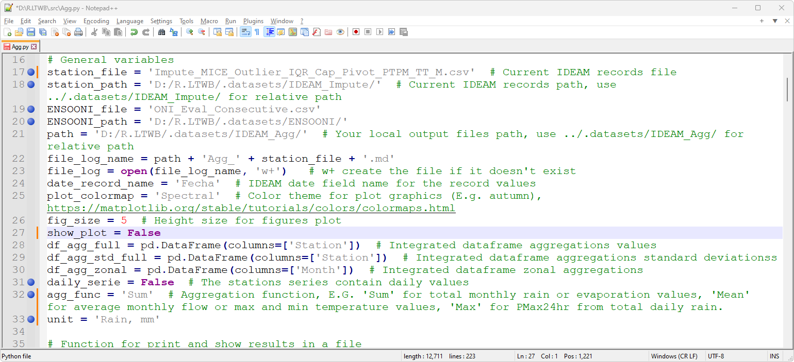

4. En Microsoft Windows, ejecute el _Command Prompt_ o _CMD_, ingrese `D:` y de <kbd>Enter</kbd> para cambiar a la unidad D:\ donde se encuentra el repositorio R.LTWB. Utilizando el comando `CD D:\R.LTWB\.datasets\IDEAM_Agg` ubíquese dentro de la carpeta IDEAM_Impute.


5. En él `CMD`, ejecute la instrucción `C:\Python3.10.5\python.exe "D:\R.LTWB\.src\Agg.py"` que realizará las segmentaciones y agregaciones compuestas y por fenómeno para el parámetro hidro-climatológico definido. Durante la ejecución, podrá observar que en la consola se presenta el detalle de los procesos ejecutados, además de la previsualización de diferentes tablas en formato Markdown.

> Para visualizar durante la ejecución las gráficas generales de análisis, establezca la variable `show_plot = True`.


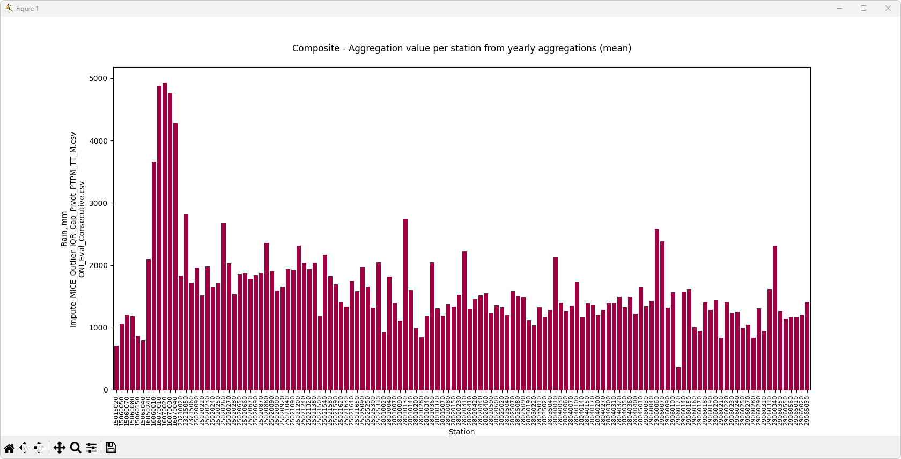
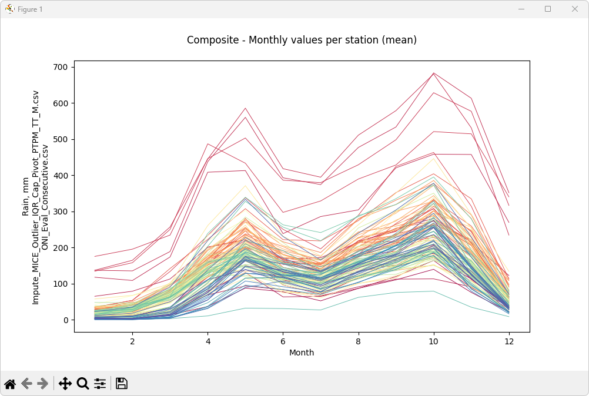


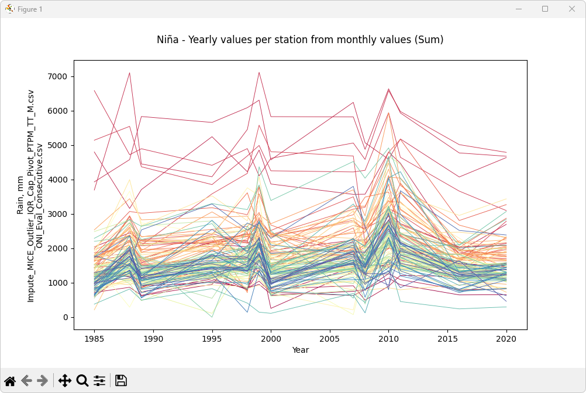
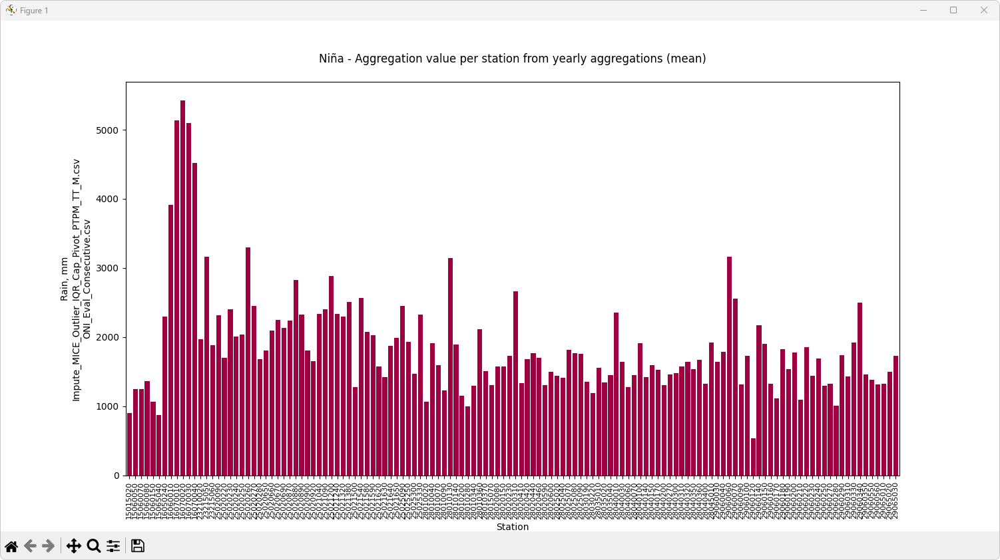
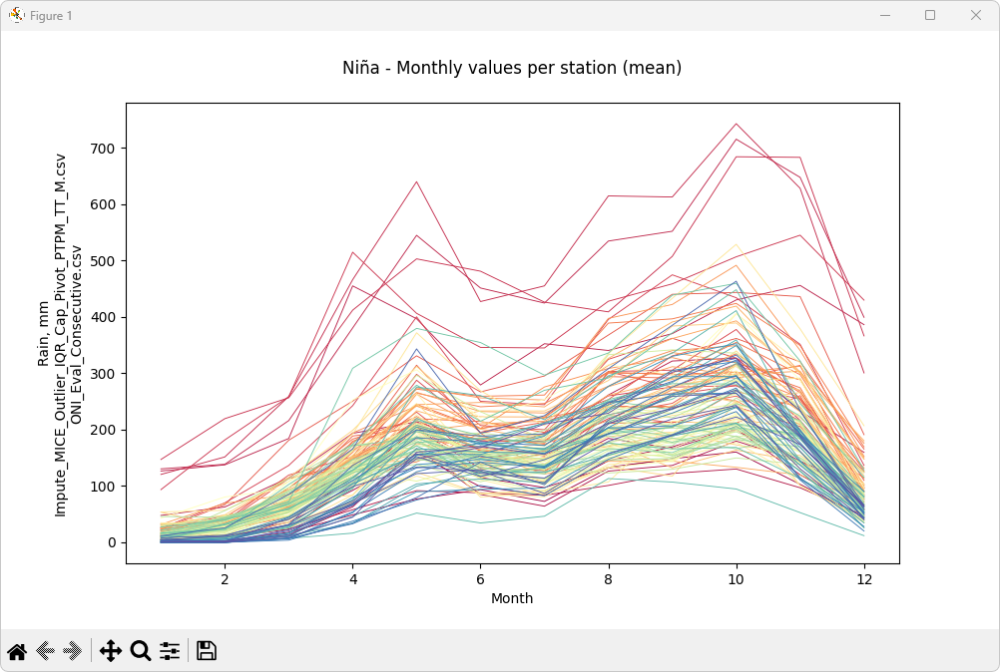
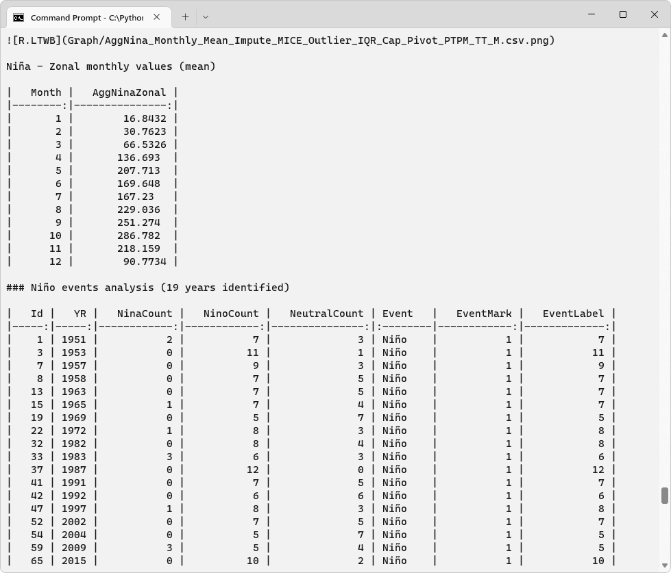


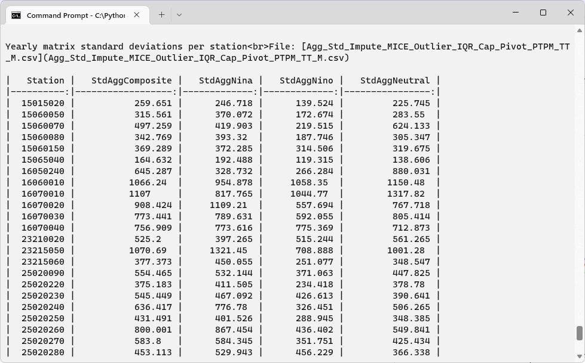
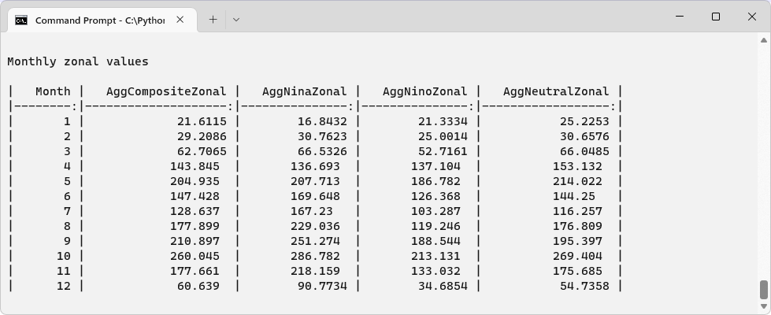


> Para la serie compuesta y para cada serie segmentada por fenómeno climatológico se generan diferentes tablas y gráficas de análisis.

Luego de la ejecución de todos los parámetros hidro-climatológicos en estudio, podrá observar que en la carpeta local `D:\R.LTWB\.datasets\IDEAM_Agg` se encuentran los archivos de resultados en formato .csv, diferentes gráficas de análisis y reportes Markdown.

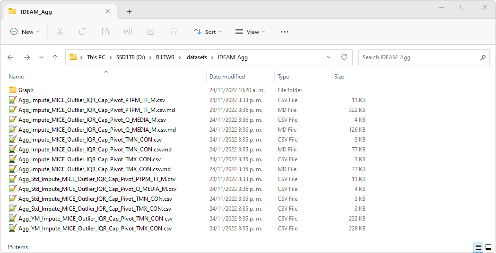


Una vez finalizado el proceso de ejecución, podrá sincronizar en la nube los resultados en su repositorio de proyectos de GitHub y podrá observar los reportes detallados en formato Markdown, p.ej., [Agg_Impute_MICE_Outlier_IQR_Cap_Pivot_PTPM_TT_M.csv.md](../../.datasets/IDEAM_Agg/Agg_Impute_MICE_Outlier_IQR_Cap_Pivot_PTPM_TT_M.csv.md).


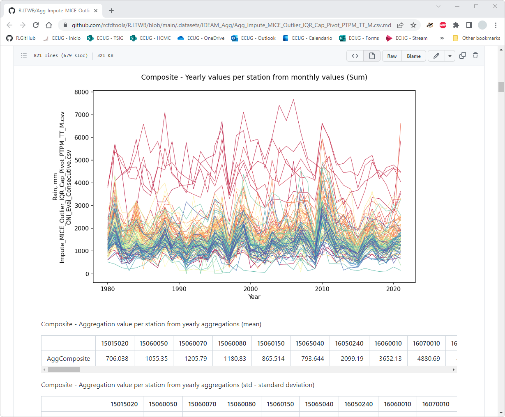


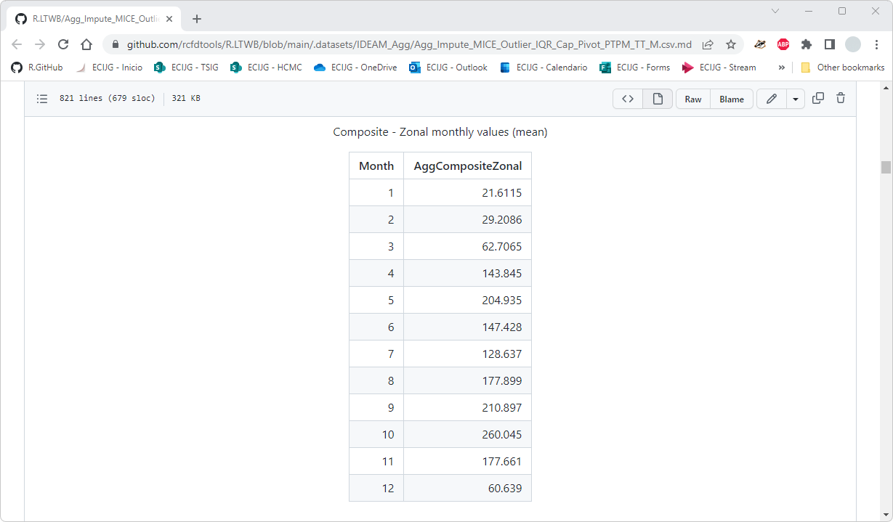


### Tablas de resultados y análisis generales

Durante el proceso de ejecución del script, se generaron automáticamente los siguientes archivos por parámetro:

<div align="center">

| Parámetro                   | Archivos :open_file_folder:                                                                                                                                                                                                                                                                                                                                                                                                                                                                                                                                                                                                    | 
|:----------------------------|:--------------------------------------------------------------------------------------------------------------------------------------------------------------------------------------------------------------------------------------------------------------------------------------------------------------------------------------------------------------------------------------------------------------------------------------------------------------------------------------------------------------------------------------------------------------------------------------------------------------|
| Precipitación total mensual | Reporte: [Agg_Impute_MICE_Outlier_IQR_Cap_Pivot_PTPM_TT_M.csv.md](../../.datasets/IDEAM_Agg/Agg_Impute_MICE_Outlier_IQR_Cap_Pivot_PTPM_TT_M.csv.md)<br>Tabla Agg: [Agg_Impute_MICE_Outlier_IQR_Cap_Pivot_PTPM_TT_M.csv](../../.datasets/IDEAM_Agg/Agg_Impute_MICE_Outlier_IQR_Cap_Pivot_PTPM_TT_M.csv)<br>Tabla Std: [Agg_Std_Impute_MICE_Outlier_IQR_Cap_Pivot_PTPM_TT_M.csv](../../.datasets/IDEAM_Agg/Agg_Std_Impute_MICE_Outlier_IQR_Cap_Pivot_PTPM_TT_M.csv)<br>                                                                                                                                         |
| Temperatura mínima diaria   | Reporte: [Agg_Impute_MICE_Outlier_IQR_Cap_Pivot_TMN_CON.csv.md](../../.datasets/IDEAM_Agg/Agg_Impute_MICE_Outlier_IQR_Cap_Pivot_TMN_CON.csv.md)<br>Tabla Agg: [Agg_Impute_MICE_Outlier_IQR_Cap_Pivot_TMN_CON.csv](../../.datasets/IDEAM_Agg/Agg_Impute_MICE_Outlier_IQR_Cap_Pivot_TMN_CON.csv)<br>Tabla Std: [Agg_Std_Impute_MICE_Outlier_IQR_Cap_Pivot_TMN_CON.csv](../../.datasets/IDEAM_Agg/Agg_Std_Impute_MICE_Outlier_IQR_Cap_Pivot_TMN_CON.csv)<br>Tabla Agg YM: [Agg_YM_Impute_MICE_Outlier_IQR_Cap_Pivot_TMN_CON.csv](../../.datasets/IDEAM_Agg/Agg_YM_Impute_MICE_Outlier_IQR_Cap_Pivot_TMN_CON.csv) |
| Temperatura máxima diaria   | Reporte: [Agg_Impute_MICE_Outlier_IQR_Cap_Pivot_TMX_CON.csv.md](../../.datasets/IDEAM_Agg/Agg_Impute_MICE_Outlier_IQR_Cap_Pivot_TMX_CON.csv.md)<br>Tabla Agg: [Agg_Impute_MICE_Outlier_IQR_Cap_Pivot_TMX_CON.csv](../../.datasets/IDEAM_Agg/Agg_Impute_MICE_Outlier_IQR_Cap_Pivot_TMX_CON.csv)<br>Tabla Std: [Agg_Std_Impute_MICE_Outlier_IQR_Cap_Pivot_TMX_CON.csv](../../.datasets/IDEAM_Agg/Agg_Std_Impute_MICE_Outlier_IQR_Cap_Pivot_TMX_CON.csv)<br>Tabla Agg YM: [Agg_YM_Impute_MICE_Outlier_IQR_Cap_Pivot_TMX_CON.csv](../../.datasets/IDEAM_Agg/Agg_YM_Impute_MICE_Outlier_IQR_Cap_Pivot_TMX_CON.csv) |
| Caudal medio mensual        | Reporte: [Agg_Impute_MICE_Outlier_IQR_Cap_Pivot_Q_MEDIA_M.csv.md](../../.datasets/IDEAM_Agg/Agg_Impute_MICE_Outlier_IQR_Cap_Pivot_Q_MEDIA_M.csv.md)<br>Tabla Agg: [Agg_Impute_MICE_Outlier_IQR_Cap_Pivot_Q_MEDIA_M.csv](../../.datasets/IDEAM_Agg/Agg_Impute_MICE_Outlier_IQR_Cap_Pivot_Q_MEDIA_M.csv)<br>Tabla Std: [Agg_Std_Impute_MICE_Outlier_IQR_Cap_Pivot_Q_MEDIA_M.csv](../../.datasets/IDEAM_Agg/Agg_Std_Impute_MICE_Outlier_IQR_Cap_Pivot_Q_MEDIA_M.csv)<br>                                                                                                                                         |

</div>

> Las tablas en formato .csv con prefijo `Agg_Impute` corresponden a agregación final de valores medios multianuales. Tablas con prefijo `Agg_Std` corresponden a valores de desviación estándar de los valores medios anuales. Tablas con prefijo `Agg_YM` contienen las agregaciones de valores diarios a valores mensuales.

Los archivos de resultados .csv generados por el script con el prefijo `Agg_Impute` utilizan la siguiente estructura:

<div align="center">

| Atributo     | Tipo    | Descripción                                                     |
|--------------|---------|-----------------------------------------------------------------|
| Station      | int64   | Código de la estación                                           |
| AggComposite | float64 | Valor promedio multianual de valores compuestos                 |
| AggNina      | float64 | Valor promedio multianual de eventos en año marcado como niña   |
| AggNino      | float64 | Valor promedio multianual de eventos en año marcado como niño   |
| AggNeutral   | float64 | Valor promedio multianual de eventos en año marcado como neutro |

</div>

> En la tabla anterior, el campo `Tipo` es asociado a los tipos obtenidos en el dataframe procesado por Pandas en Python. En el caso de las estaciones IDEAM, los códigos se interpretan como un valor entero.
> 
> La tabla de desviaciones estándar utiliza la misma estructura anterior y con el prefijo Std, p.ej., para valores compuestos, el nombre asociado es `StdAggComposite`.
> 
> La tabla de agregaciones diarias a valores mensuales sigue una estructura similar a la de los datos de entrada de las tablas de imputación, la primera columna contiene el índice de registro (valores de 0 a n), la segunda columna contiene la fecha asociada a cada dato discreto por estación y las demás columnas contienen los valores agregados en cada estación.

En este momento, dispone de reportes detallados de valores agregados y de tablas en formato de texto separado por comas `.csv` para realizar los posteriores procesos de interpolación espacial.


### Actividades complementarias:pencil2:

En la siguiente tabla se listan las actividades complementarias que deben ser desarrolladas y documentadas por el estudiante en un único archivo de Adobe Acrobat .pdf. El documento debe incluir portada (mostrar nombre completo, código y enlace a su cuenta de GitHub), numeración de páginas, tabla de contenido, lista de tablas, lista de ilustraciones, introducción, objetivo general, capítulos por cada ítem solicitado, conclusiones y referencias bibliográficas.

| Actividad | Alcance                                                                                                                                                                                                                                                                                                                                              |
|:---------:|:-----------------------------------------------------------------------------------------------------------------------------------------------------------------------------------------------------------------------------------------------------------------------------------------------------------------------------------------------------|
|     1     | Para los parámetros hidro-climatológicos presentados en esta actividad, realice el proceso de agregación utilizando los datos originalmente descargados del IDEAM (sin validación de valores atípicos y sin procesos de completado y extendido), compare los resultados obtenidos y presente un análisis descriptivo de las diferencias encontradas. |
|     2     | Utilizando el script Agg.py, realice el análisis de las variables definidas como actividad complementaria en la actividad de descarga de datos hidroclimatológicos, correspondientes a brillo solar, radiación solar, humedad del aire cerca al suelo y parámetros relacionados con viento y nubosidad.                                              | 
|     3     | Implemente en el script Agg.py, agregaciones a partir de datos horarios para cualquier tipo de parámetro hidroclimatológico. Tenga en cuenta que para datos de precipitación máxima díaria, primero debe sumar los valores horarios para obtener el valor total diario y luego deberá evaluar el máximo díario mensual.                              | 


### Referencias

* https://library.wmo.int/doc_num.php?explnum_id=4167
* https://library.wmo.int/index.php?lvl=notice_display&id=20130
* https://library.wmo.int/doc_num.php?explnum_id=9521
* https://library.wmo.int/doc_num.php?explnum_id=4549
* https://stackoverflow.com/questions/11391969/how-to-group-pandas-dataframe-entries-by-date-in-a-non-unique-column
* https://stackoverflow.com/questions/5283649/plot-smooth-line-with-pyplot
* https://www.geeksforgeeks.org/indexing-and-selecting-data-with-pandas/
* https://www.geeksforgeeks.org/pandas-find-unique-values-from-multiple-columns/
* https://www.geeksforgeeks.org/ways-to-filter-pandas-dataframe-by-column-values/
* https://www.geeksforgeeks.org/how-to-concatenate-two-or-more-pandas-dataframes/
* https://stackoverflow.com/questions/29550414/how-can-i-split-a-column-of-tuples-in-a-pandas-dataframe
* https://www.geeksforgeeks.org/convert-the-column-type-from-string-to-datetime-format-in-pandas-dataframe/
* https://www.geeksforgeeks.org/how-to-drop-one-or-multiple-columns-in-pandas-dataframe/
* https://www.geeksforgeeks.org/how-to-move-a-column-to-first-position-in-pandas-dataframe/


### Control de versiones

| Versión    | Descripción                                                                                                                                                                                                                                                                                             | Autor                                       | Horas |
|------------|:--------------------------------------------------------------------------------------------------------------------------------------------------------------------------------------------------------------------------------------------------------------------------------------------------------|---------------------------------------------|:-----:|
| 2022.11.30 | Finalización documentación. Ilustración cabecera y diagrama de procesos.                                                                                                                                                                                                                                | [rcfdtools](https://github.com/rcfdtools)   |   4   |
| 2022.11.24 | Optimización de script. Creación de matriz de valores de desviación estándar. Inclusión de agregaciones para valores máximos y mínimos. Generación de archivos .csv. Agregación de precipitación total mensual, caudal medio mensual, temperatura mínima y temperatura máxima. Inicio de documentación. | [rcfdtools](https://github.com/rcfdtools)   |  7.5  |
| 2022.11.23 | Optimización de script. Agregación a partir de datos diarios. Cabecera de reporte. Agregación zonal con tabla y gráficos.                                                                                                                                                                               | [rcfdtools](https://github.com/rcfdtools)   |   6   |
| 2022.11.22 | Optimización de script. Conversión de listas de resultados a dataframes. Integración de dataframes en matriz unica de resultados por estación. Agregaciones mensuales multianuales por fenómeno climatológico.                                                                                          | [rcfdtools](https://github.com/rcfdtools)   |   2   |
| 2022.11.21 | Script inicial con análisis de series compuestas. Agregación multianual. Segmentación de series por fenómeno climatológico. Agregaciones mensuales a anuales a partir de sumatoria y media. Gráficas de análisis.                                                                                       | [rcfdtools](https://github.com/rcfdtools)   |  6   |


_R.LTWB es de uso libre para fines académicos, conoce nuestra licencia, cláusulas, condiciones de uso y como referenciar los contenidos publicados en este repositorio, dando [clic aquí](https://github.com/rcfdtools/R.LTWB/wiki/License)._

_¡Encontraste útil este repositorio!, apoya su difusión marcando este repositorio con una ⭐ o síguenos dando clic en el botón Follow de [rcfdtools](https://github.com/rcfdtools) en GitHub._

| [Actividad anterior](../ENSOONI) | [Inicio](../../Readme.md) | [:beginner: Ayuda](https://github.com/rcfdtools/R.LTWB/discussions/27) | [Actividad siguiente](../../Section04) |
|----------------------------------|---------------------------|------------------------------------------------------------------------|----------------------------------------|
