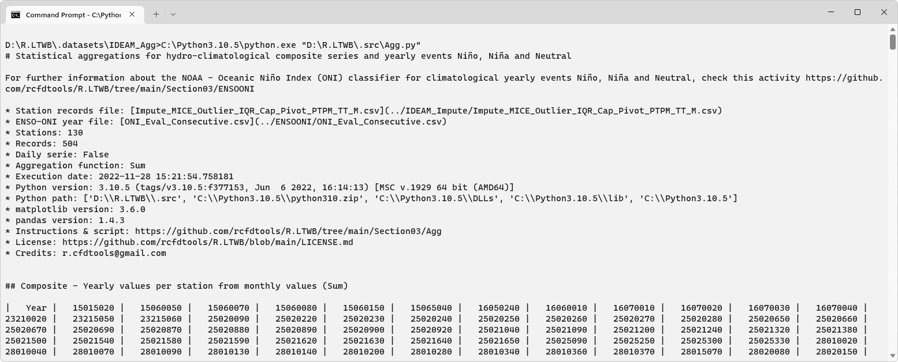
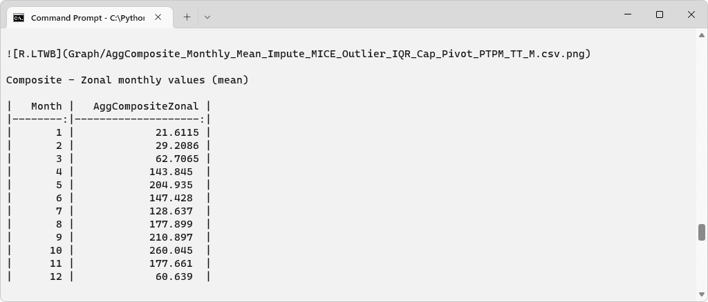
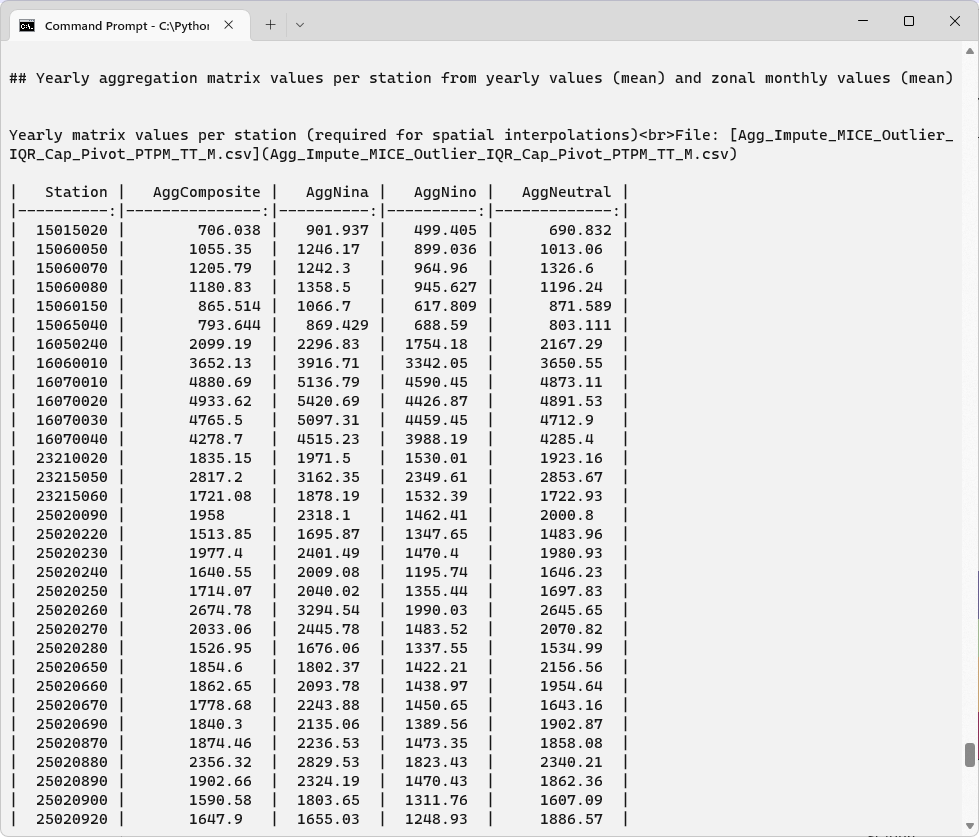
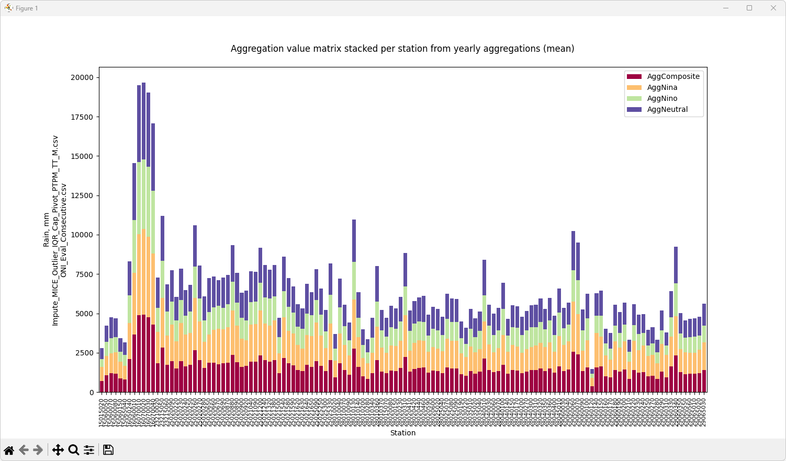
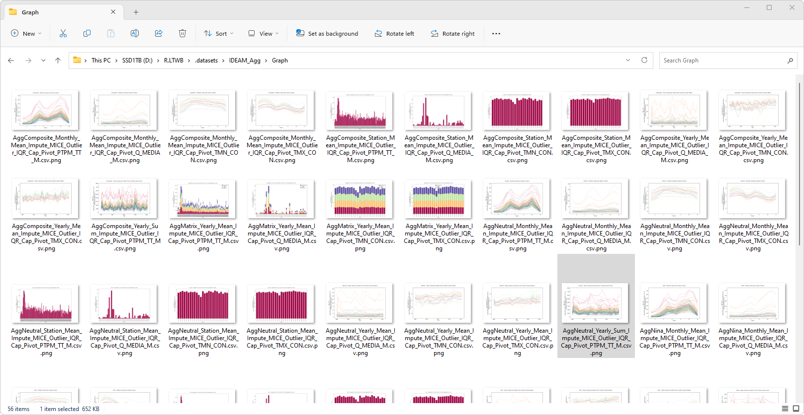
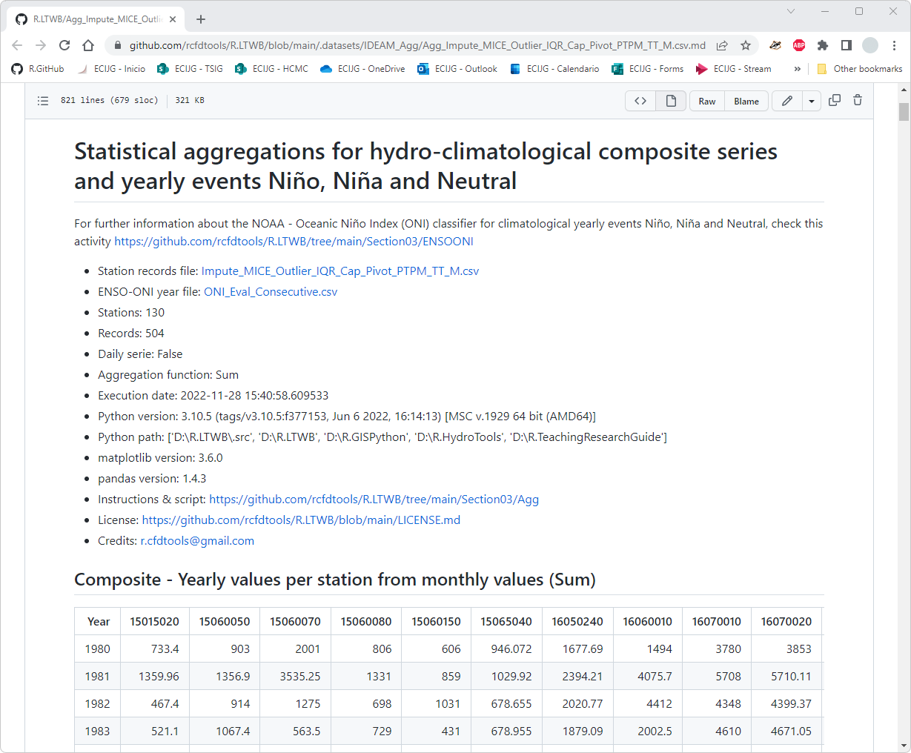
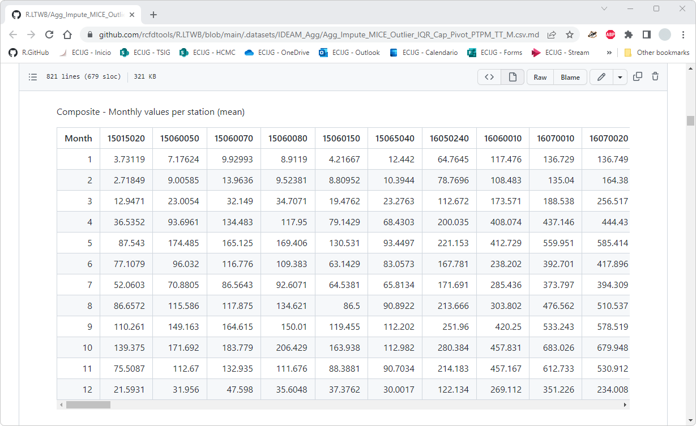
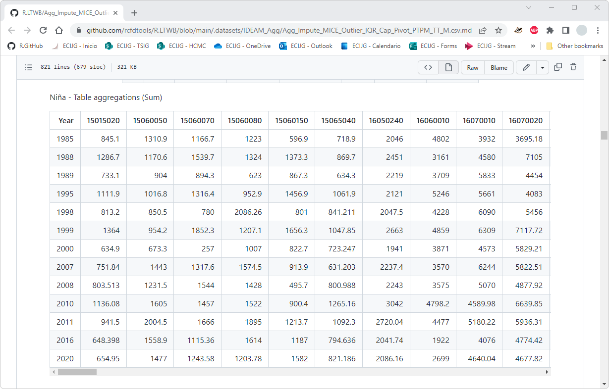
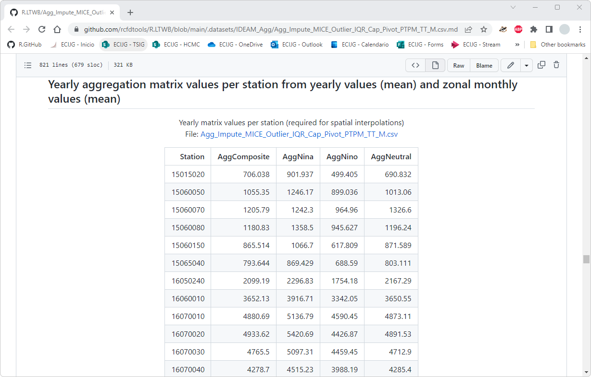
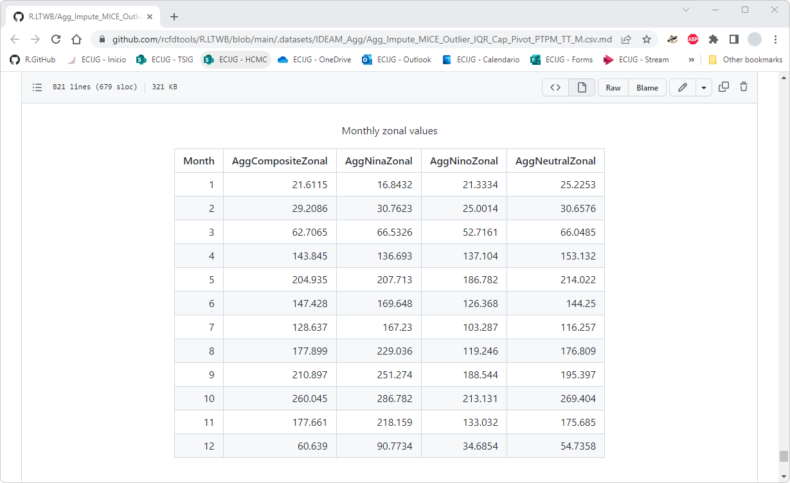

## Agregación estadística para obtención de promedios multianuales compuestos y por fenómeno climatológico
Keywords: `Compuesto` `El Niño` `La Niña` `Neutro` `matplotlib` `pandas` `Agregación-estadística`

<div align="center"></div> 

Luego de validadas y completadas las series, y de realizada la marcación de años por fenómeno climatológico, se efectúa el proceso de agregación estadística para obtener los valores promedio multianuales requeridos en cada estación por parámetro hidro-climatológico para su interpolación espacial.


### Objetivos

* Agregar estadísticamente los registros compuestos de cada estación para obtener los valores promedio multianuales requeridos para la creación de mapas continuos interpolados.
* Segmentar las series de datos por parámetro y por fenómeno climatológico (El Niño, La Niña y Neutro) y realizar su agregación a valores promedio multianuales.
* Graficar los registros agregados mensuales y anuales de cada parámetro para todas las estaciones del arreglo de datos.
* Graficar los valores agregados de promedio multianual para datos compuestos y por fenómeno.
* Obtener y graficar valores zonales para cada parámetro estudiado. 

> Una serie compuesta se refiere a que se incluyen todos los registros para la agregación estadística.


### Requerimientos

* [Python 3+](https://www.python.org/)
* [Pandas](https://pandas.pydata.org/docs/index.html) para Python
* [Tabulate](https://pypi.org/project/tabulate/) para Python, requerido para impresión de tablas en formato Markdown desde pandas.
* [Notepad++](https://notepad-plus-plus.org/), editor de texto y código.
* Tablas con series de datos discretos completados y extendidos (por imputación) de estaciones terrestres del IDEAM por parámetro hidroclimatológico. [:mortar_board:Aprender.](../Impute)
* Tablas de marcación de años por fenómeno climatológico (Niño, Nina y Neutro). [:mortar_board:Aprender.](../Agg)

> Para el desarrollo de esta actividad, no realizaremos la agregación de datos de evaporación potencial debido a que solo existe información diaria en una estación de la zona de estudio. Es posible que actualmente estos registros ya estén disponibles en el servicio [DHIME](https://dhime.ideam.gov.co/) del [IDEAM - Colombia](http://www.ideam.gov.co/) para su descarga.
> 
> Para la segmentación de series utilizaremos la tabla de marcación de años por fenómeno a partir de 5 eventos sucesivos.

### Procedimiento general

<div align="center">
<br><br>
<sub>Convenciones generales en diagramas: clases de entidad en azul, dataset en gris oscuro, grillas en color verde, geo-procesos en rojo, procesos automáticos o semiautomáticos en guiones rojos y procesos manuales en amarillo. Líneas conectoras con guiones corresponden a procedimientos opcionales.</sub><br><br>
</div>

1. Para realizar las agregaciones estadísticas, descargue el script [Agg.py](../../.src/Agg.py) y guárdelo en la carpeta local `D:\R.LTWB\.src` de su equipo.

**Funcionalidades del script**

* Agregación estadística de datos diarios a mensuales y anuales.
* Agregación estadística de datos mensuales a anuales.
* Segmentación y agregación de series por fenómeno climatológico.
* Agregación mensual multianual.
* Generación de gráficas de análisis.
* Generación de reporte detallado Markdown y tablas de valores agregados y desviaciones estándar en formato de texto separado por comas .csv.

Contenido del script

```
```

2. Cree una nueva carpeta en blanco con el nombre `IDEAM_Agg` en su directorio de proyecto local `D:\R.LTWB\.datasets`.

3. Desde el editor de texto [Notepad++](https://notepad-plus-plus.org/), abra el archivo [D:\R.LTWB\.src\Agg.py](../../.src/Agg.py), verifique y defina las siguientes variables por parámetro:

| Parámetro / Datos (station_file)                                                                                                                                | daily_serie  | agg_func  | unit label                 |
|:----------------------------------------------------------------------------------------------------------------------------------------------------------------|:-------------|:----------|:---------------------------|
| Precipitación total mensual<br>[Impute_MICE_Outlier_IQR_Cap_Pivot_PTPM_TT_M.csv](../../.datasets/IDEAM_Impute/Impute_MICE_Outlier_IQR_Cap_Pivot_PTPM_TT_M.csv)  | False        | Sum       | Rain, mm                   |
| Temperatura mínima diaria<br>[Impute_MICE_Outlier_IQR_Cap_Pivot_TMN_CON.csv](../../.datasets/IDEAM_Impute/Impute_MICE_Outlier_IQR_Cap_Pivot_TMN_CON.csv)        | True         | Mean      | Min temperature, °C        |
| Temperatura máxima diaria<br>[Impute_MICE_Outlier_IQR_Cap_Pivot_TMX_CON.csv](../../.datasets/IDEAM_Impute/Impute_MICE_Outlier_IQR_Cap_Pivot_TMX_CON.csv)        | True         | Mean      | Max temperature, °C        |
| Caudal medio mensual<br>[Impute_MICE_Outlier_IQR_Cap_Pivot_Q_MEDIA_M.csv](../../.datasets/IDEAM_Impute/Impute_MICE_Outlier_IQR_Cap_Pivot_Q_MEDIA_M.csv)         | False        | Mean      | Flow, m³/s                 |
| Evaporación total diaria<br>[Outlier_IQR_Cap_Pivot_EV_TT_D.csv](../../.datasets/IDEAM_Outlier/Outlier_IQR_Cap_Pivot_EV_TT_D.csv)                                | False        | Sum       | Potential evaporation, mm  |

> Las variables `station_file`, `daily_serie`, `agg_func` y `unit` deben ser definidas dentro del script de análisis en Python para la agregación correcta de cada parámetro hidro-climatológico.
> 
> Por defecto, el directorio de archivos con registros por parámetro completados y extendidos por estación se encuentra en el directorio `D:/R.LTWB/.datasets/IDEAM_Impute/`. En caso de que requiera realizar este análisis sin datos completados o extendidos e incluso con las series de datos originales, modifique la variable `station_path` del script indicando la ruta correspondiente.
> 
> Con respecto a los datos para segmentación de series por fenómeno climatológico, utilizar `Agg_file = 'ONI_Eval_Consecutive.csv'` y `Agg_path = 'D:/R.LTWB/.datasets/Agg/'`, correspondientes al análisis ENSO-ONI utilizando eventos sucesivos.

Para este ejemplo, realizaremos las agregaciones de precipitación total mensual con `daily_serie = False`, `agg_func = 'Sum'` y `unit = 'Rain, mm'`. Las demás agregaciones indicadas para temperatura y caudal son requeridas y deben ser también realizadas.


4. En Microsoft Windows, ejecute el _Command Prompt_ o _CMD_, ingrese `D:` y de <kbd>Enter</kbd> para cambiar a la unidad D:\ donde se encuentra el repositorio R.LTWB. Utilizando el comando `CD D:\R.LTWB\.datasets\IDEAM_Agg` ubíquese dentro de la carpeta IDEAM_Impute.


5. En él `CMD`, ejecute la instrucción `C:\Python3.10.5\python.exe "D:\R.LTWB\.src\Agg.py"` que realizará las segmentaciones y agregaciones compuestas y por fenómeno para el parámetro hidro-climatológico definido. Durante la ejecución, podrá observar que en la consola se presenta el detalle de los procesos ejecutados, además de la previsualización de diferentes tablas en formato Markdown.

> Para visualizar durante la ejecución las gráficas generales de análisis, establezca la variable `show_plot = True`.











> Para la serie compuesta y para cada serie segmentada por fenómeno climatológico se generan diferentes tablas y gráficas de análisis.

Luego de la ejecución de todos los parámetros hidro-climatológicos en estudio, podrá observar que en la carpeta local `D:\R.LTWB\.datasets\IDEAM_Agg` se encuentran los archivos de resultados en formato .csv, diferentes gráficas de análisis y reportes Markdown.




Una vez finalizado el proceso de ejecución, podrá sincronizar en la nube los resultados en su repositorio de proyectos de GitHub y podrá observar los reportes detallados en formato Markdown, p.ej., [Agg_Impute_MICE_Outlier_IQR_Cap_Pivot_PTPM_TT_M.csv.md](../../.datasets/IDEAM_Agg/Agg_Impute_MICE_Outlier_IQR_Cap_Pivot_PTPM_TT_M.csv.md).












### Tablas de resultados y análisis generales

Durante el proceso de ejecución del script, se generaron automáticamente los siguientes archivos por parámetro:

<div align="center">

| Parámetro                   | Archivos                                                                                                                                                                                                                                                                                                                                                                                                                                                                                                                                                                                                      | 
|:----------------------------|:--------------------------------------------------------------------------------------------------------------------------------------------------------------------------------------------------------------------------------------------------------------------------------------------------------------------------------------------------------------------------------------------------------------------------------------------------------------------------------------------------------------------------------------------------------------------------------------------------------------|
| Precipitación total mensual | Reporte: [Agg_Impute_MICE_Outlier_IQR_Cap_Pivot_PTPM_TT_M.csv.md](../../.datasets/IDEAM_Agg/Agg_Impute_MICE_Outlier_IQR_Cap_Pivot_PTPM_TT_M.csv.md)<br>Tabla Agg: [Agg_Impute_MICE_Outlier_IQR_Cap_Pivot_PTPM_TT_M.csv](../../.datasets/IDEAM_Agg/Agg_Impute_MICE_Outlier_IQR_Cap_Pivot_PTPM_TT_M.csv)<br>Tabla Std: [Agg_Std_Impute_MICE_Outlier_IQR_Cap_Pivot_PTPM_TT_M.csv](../../.datasets/IDEAM_Agg/Agg_Std_Impute_MICE_Outlier_IQR_Cap_Pivot_PTPM_TT_M.csv)<br>                                                                                                                                         |
| Temperatura mínima diaria   | Reporte: [Agg_Impute_MICE_Outlier_IQR_Cap_Pivot_TMN_CON.csv.md](../../.datasets/IDEAM_Agg/Agg_Impute_MICE_Outlier_IQR_Cap_Pivot_TMN_CON.csv.md)<br>Tabla Agg: [Agg_Impute_MICE_Outlier_IQR_Cap_Pivot_TMN_CON.csv](../../.datasets/IDEAM_Agg/Agg_Impute_MICE_Outlier_IQR_Cap_Pivot_TMN_CON.csv)<br>Tabla Std: [Agg_Std_Impute_MICE_Outlier_IQR_Cap_Pivot_TMN_CON.csv](../../.datasets/IDEAM_Agg/Agg_Std_Impute_MICE_Outlier_IQR_Cap_Pivot_TMN_CON.csv)<br>Tabla Agg YM: [Agg_YM_Impute_MICE_Outlier_IQR_Cap_Pivot_TMN_CON.csv](../../.datasets/IDEAM_Agg/Agg_YM_Impute_MICE_Outlier_IQR_Cap_Pivot_TMN_CON.csv) |
| Temperatura máxima diaria   | Reporte: [Agg_Impute_MICE_Outlier_IQR_Cap_Pivot_TMX_CON.csv.md](../../.datasets/IDEAM_Agg/Agg_Impute_MICE_Outlier_IQR_Cap_Pivot_TMX_CON.csv.md)<br>Tabla Agg: [Agg_Impute_MICE_Outlier_IQR_Cap_Pivot_TMX_CON.csv](../../.datasets/IDEAM_Agg/Agg_Impute_MICE_Outlier_IQR_Cap_Pivot_TMX_CON.csv)<br>Tabla Std: [Agg_Std_Impute_MICE_Outlier_IQR_Cap_Pivot_TMX_CON.csv](../../.datasets/IDEAM_Agg/Agg_Std_Impute_MICE_Outlier_IQR_Cap_Pivot_TMX_CON.csv)<br>Tabla Agg YM: [Agg_YM_Impute_MICE_Outlier_IQR_Cap_Pivot_TMX_CON.csv](../../.datasets/IDEAM_Agg/Agg_YM_Impute_MICE_Outlier_IQR_Cap_Pivot_TMX_CON.csv) |
| Caudal medio mensual        | Reporte: [Agg_Impute_MICE_Outlier_IQR_Cap_Pivot_Q_MEDIA_M.csv.md](../../.datasets/IDEAM_Agg/Agg_Impute_MICE_Outlier_IQR_Cap_Pivot_Q_MEDIA_M.csv.md)<br>Tabla Agg: [Agg_Impute_MICE_Outlier_IQR_Cap_Pivot_Q_MEDIA_M.csv](../../.datasets/IDEAM_Agg/Agg_Impute_MICE_Outlier_IQR_Cap_Pivot_Q_MEDIA_M.csv)<br>Tabla Std: [Agg_Std_Impute_MICE_Outlier_IQR_Cap_Pivot_Q_MEDIA_M.csv](../../.datasets/IDEAM_Agg/Agg_Std_Impute_MICE_Outlier_IQR_Cap_Pivot_Q_MEDIA_M.csv)<br>                                                                                                                                         |

</div>

> Las tablas en formato .csv con prefijo `Agg_Impute` corresponden a agregación final de valores medios multianuales. Tablas con prefijo `Agg_Std` corresponden a valores de desviación estándar de los valores medios anuales. Tablas con prefijo `Agg_YM` contienen las agregaciones de valores diarios a valores mensuales.

Los archivos de resultados .csv generados por el script con el prefijo `Agg_Impute` utilizan la siguiente estructura:

| Atributo     | Tipo    | Descripción                                                     |
|--------------|---------|-----------------------------------------------------------------|
| Station      | int64   | Código de la estación                                           |
| AggComposite | float64 | Valor promedio multianual de valores compuestos                 |
| AggNina      | float64 | Valor promedio multianual de eventos en año marcado como niña   |
| AggNino      | float64 | Valor promedio multianual de eventos en año marcado como niño   |
| AggNeutral   | float64 | Valor promedio multianual de eventos en año marcado como neutro |

> En la tabla anterior, el campo `Tipo` es asociado a los tipos obtenidos en el dataframe procesado por Pandas en Python. En el caso de las estaciones IDEAM, los códigos se interpretan como un valor entero.
> 
> La tabla de desviaciones estándar utiliza la misma estructura anterior y en los nombres de campo se ha incluido el prefijo Std, p.ej., para valores compuestos, el nombre asociado es `AggComposite`.
> 
> La tabla de agregaciones diarias a valores mensuales sigue la misma estructura de los datos de entrada de las tablas de imputación, la primera columna contiene el índice de registro (valores de 0 a n), la segunda columna contiene la fecha asociada a cada dato discreto por estación y las demás columnas contienen los valores agregados en cada estación.

En este momento, dispone de reportes detallados de valores agregados y de las tablas en formato de texto separado por comas `.csv` para realizar los posteriores procesos de interpolación espacial.


### Actividades complementarias:pencil2:

En la siguiente tabla se listan las actividades complementarias que deben ser desarrolladas y documentadas por el estudiante en un único archivo de Adobe Acrobat .pdf. El documento debe incluir portada (mostrar nombre completo, código y enlace a su cuenta de GitHub), numeración de páginas, tabla de contenido, lista de tablas, lista de ilustraciones, introducción, objetivo general, capítulos por cada ítem solicitado, conclusiones y referencias bibliográficas.

| Actividad | Alcance         |
|:---------:|:----------------|
|     1     |                 |
|     2     |                 | 


### Referencias

* https://library.wmo.int/doc_num.php?explnum_id=4167
* https://library.wmo.int/index.php?lvl=notice_display&id=20130
* https://library.wmo.int/doc_num.php?explnum_id=9521
* https://library.wmo.int/doc_num.php?explnum_id=4549
* https://stackoverflow.com/questions/11391969/how-to-group-pandas-dataframe-entries-by-date-in-a-non-unique-column
* https://stackoverflow.com/questions/5283649/plot-smooth-line-with-pyplot
* https://www.geeksforgeeks.org/indexing-and-selecting-data-with-pandas/
* https://www.geeksforgeeks.org/pandas-find-unique-values-from-multiple-columns/
* https://www.geeksforgeeks.org/ways-to-filter-pandas-dataframe-by-column-values/
* https://www.geeksforgeeks.org/how-to-concatenate-two-or-more-pandas-dataframes/
* https://stackoverflow.com/questions/29550414/how-can-i-split-a-column-of-tuples-in-a-pandas-dataframe
* https://www.geeksforgeeks.org/convert-the-column-type-from-string-to-datetime-format-in-pandas-dataframe/
* https://www.geeksforgeeks.org/how-to-drop-one-or-multiple-columns-in-pandas-dataframe/
* https://www.geeksforgeeks.org/how-to-move-a-column-to-first-position-in-pandas-dataframe/


### Control de versiones

| Versión    | Descripción | Autor                                       | Horas |
|------------|:------------|---------------------------------------------|:-----:|
| 2022.11.20 | XXX         | [rcfdtools](https://github.com/rcfdtools)   |   4   |


_R.LTWB es de uso libre para fines académicos, conoce nuestra licencia, cláusulas, condiciones de uso y como referenciar los contenidos publicados en este repositorio, dando [clic aquí](https://github.com/rcfdtools/R.LTWB/wiki/License)._

_¡Encontraste útil este repositorio!, apoya su difusión marcando este repositorio con una ⭐ o síguenos dando clic en el botón Follow de [rcfdtools](https://github.com/rcfdtools) en GitHub._

| [Actividad anterior](../Agg) | [Inicio](../../Readme.md) | [:beginner: Ayuda](https://github.com/rcfdtools/R.LTWB/discussions/9999) | [Actividad siguiente]() |
|----------------------------------|---------------------------|--------------------------------------------------------------------------|-------------------------|

[^1]: https://es.wikipedia.org/