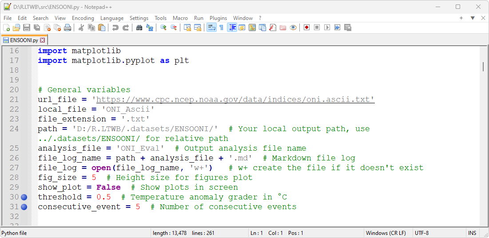
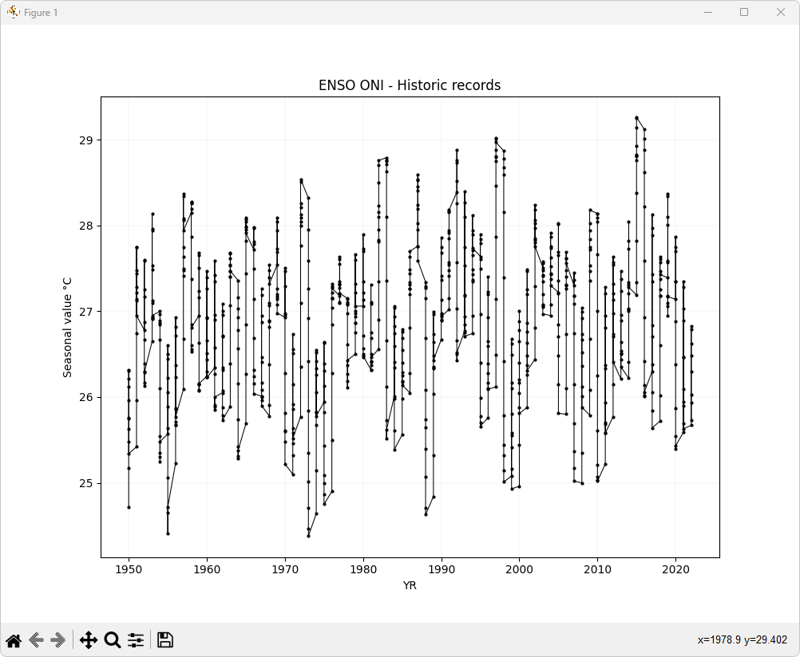
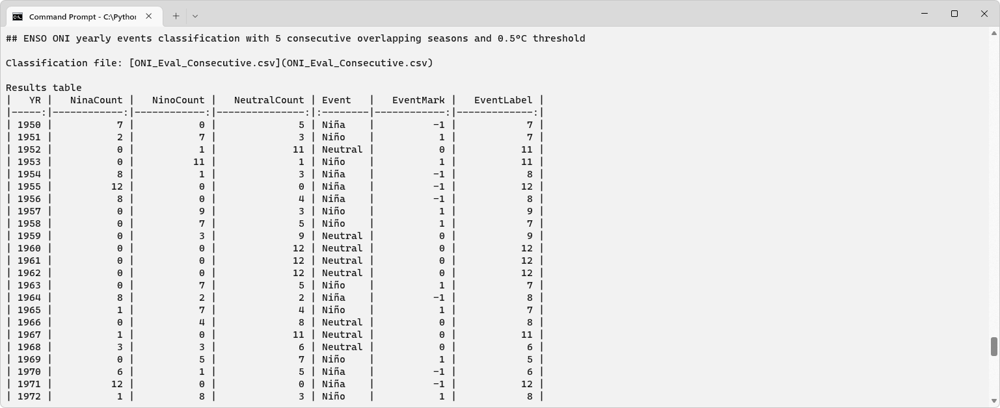
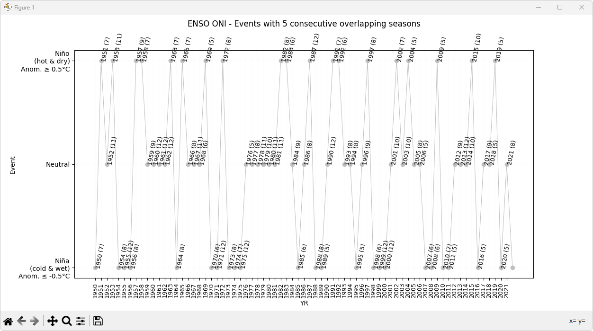
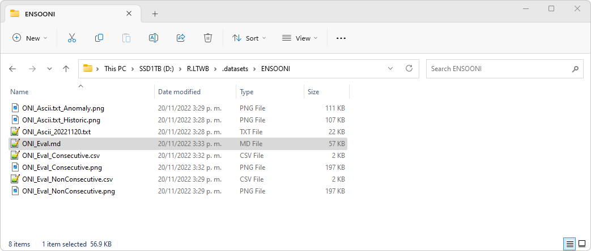
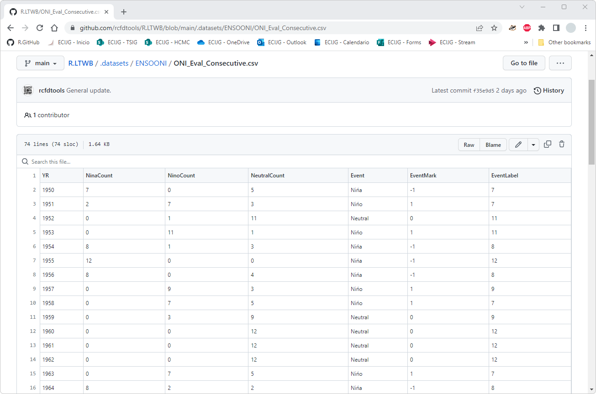

## Análisis de cambio climático para segmentación de series
Keywords: `ENSO` `ONI` `El Niño` `La Niña` `Neutro` `matplotlib` `pandas` `numpy` 

<div align="center"></div> 

En esta actividad se realiza la identificación de años asociados a fenómenos climatológicos de Niño, Niña y Neutro.

El Niño es un fenómeno climático relacionado con el calentamiento del Pacífico oriental ecuatorial, el cual se manifiesta erráticamente cíclico —Arthur Strahler habla de ciclos de entre tres y ocho años—, 1 que consiste en realidad en la fase cálida del patrón climático del Pacífico ecuatorial denominado El Niño-Oscilación del Sur (El Niño-Southern Oscillation, ENSO por sus siglas en inglés), 2 donde la fase de enfriamiento recibe el nombre de La Niña.3 4 Este fenómeno, en sus manifestaciones más intensas, provoca estragos en la zona intertropical y ecuatorial debido a las intensas lluvias, afectando principalmente a la región costera del Pacífico de América del Sur.[^1]

Para la clasificación de los años con eventos de Niño, Niña o Neutros, en esta actividad se utilizó el Índice Oceánico del Niño - ONI (Oceanic Nino Index). Este índice es calculado como la media móvil de tres puntos de la serie mensual de anomalías de la temperatura de la superficie del mar en la Región Niño 3-4. De acuerdo con este índice, en condiciones El Niño (La Niña), el ONI debe ser igual ó superior (igual o inferior) a medio grado Celsius de anomalía, se clasificó cada año desde 1950 para luego poder analizar separadamente los datos climatológicos recopilados de las estaciones de la zona de estudio. La zona usada para el estudio de las anomalías de temperatura corresponde a una franja alrededor de la línea del Ecuador, entre las latitudes 5º Norte a 5º Sur y entre las longitudes 170º a 120º al oeste.


### Objetivos

* Descargar y procesar automáticamente el archivo [oni_ascii.txt](http://www.cpc.ncep.noaa.gov/data/indices/oni.ascii.txt) de la [National Oceanic and Atmospheric Administration - NOAA](https://www.noaa.gov/) que contiene los registros de temperatura y anomalías.
* Graficar los registros históricos de temperatura y anomalías presentadas por mes en cada año.
* Realizar el conteo de eventos de Niña, Niño o Neutro a partir de las anomalías registradas y utilizando **5 o más periodos no consecutivos** de eventos con excedencia por encima de 0.5°C o por debajo de -0.5°C.
* Realizar el conteo de eventos de Niña, Niño o Neutro a partir de las anomalías registradas y utilizando **5 o más periodos consecutivos** de eventos con excedencia por encima de 0.5°C o por debajo de -0.5°C.
* Asociar cada año a un evento específico.
* Graficar los eventos identificados por año para observar sus patrones y conteo de anomalías. 


### Requerimientos

* [Python 3+](https://www.python.org/)
* [Pandas](https://pandas.pydata.org/docs/index.html) para Python
* [Tabulate](https://pypi.org/project/tabulate/) para Python, requerido para impresión de tablas en formato Markdown desde pandas.
* [numpy](https://numpy.org/) para python.
* [Notepad++](https://notepad-plus-plus.org/), editor de texto y código.


### Procedimiento general

<div align="center">
<br><br>
<sub>Convenciones generales en diagramas: clases de entidad en azul, dataset en gris oscuro, grillas en color verde, geo-procesos en rojo, procesos automáticos o semiautomáticos en guiones rojos y procesos manuales en amarillo. Líneas conectoras con guiones corresponden a procedimientos opcionales.</sub><br><br>
</div>

1. Para realizar la descarga, procesamiento y marcado de años por fenómeno climatológico, descargue el script [ENSOONI.py.py](../../.src/ENSOONI.py.py) y guárdelo en la carpeta local `D:\R.LTWB\.src` de su equipo.

**Funcionalidades del script**

* Descarga automática del archivo https://www.cpc.ncep.noaa.gov/data/indices/oni.ascii.txt.
* A través de la variable `consecutive_event`, el usuario puede definir el número consecutivo de eventos para calificar un año como Niño, Niña o Neutro. El valor predeterminado es 5 eventos.
* A través de la variable `threshold`, el usuario puede definir el valor límite de las anomalías para el conteo de eventos. El valor predeterminado es 0.5°C
* Generación de reporte detallado Markdown y tablas de marcado en formato de texto separado por comas .csv.

Contenido del script

```

```

2. Cree una nueva carpeta en blanco con el nombre `ENSOONI` en su directorio de proyecto local `D:\R.LTWB\.datasets`.

3. Desde el editor de texto [Notepad++](https://notepad-plus-plus.org/), abra el archivo [D:\R.LTWB\.src\ENSOONI.py](../../.src/ENSOONI.py), y verifique y defina las variables `consecutive_event = 5` y `threshold = 0.5`:



4. En Microsoft Windows, ejecute el _Command Prompt_ o _CMD_, ingrese `D:` y de <kbd>Enter</kbd> para cambiar a la unidad D:\ donde se encuentra el repositorio R.LTWB. Utilizando el comando  `CD D:\R.LTWB\.datasets\ENSOONI` ubíquese dentro de la carpeta IDEAM_Impute.


5. En él `CMD`, ejecute la instrucción `C:\Python3.10.5\python.exe "D:\R.LTWB\.src\ENSOONI.py"` que realizará el procesamiento de imputación de datos faltantes. Durante la ejecución, podrá observar que en la consola se presenta el detalle de los procesos ejecutados, además de la previsualización de diferentes tablas en formato Markdown.

> Para visualizar durante la ejecución las gráficas generales de análisis, establezca la variable `show_plot = True`.








Luego de la ejecución, podrá observar que en la carpeta local `D:\R.LTWB\.datasets\ENSOONI` se encuentra el archivo de texto ONI_Ascii_20221120.txt (cuyo contenido corresponde al archivo oni.ascii.txt obtenido directamente de la NOAA, renombrado incluyendo la fecha de descarga), dos archivos de resultados en formato .csv, diferentes gráficas de análisis y el reporte Markdown.



Una vez finalizado el proceso de ejecución, podrá sincronizar en la nube los resultados en su repositorio de proyectos de GitHub y podrá observar el reporte detallado en formato Markdown [ONI_Eval.md](../../.datasets/ENSOONI/ONI_Eval.md).





### Tablas de resultados y análisis generales

Durante el proceso de ejecución del script, se generan automáticamente para cada parámetro hidroclimatológico, un reporte integrado de resultados en formato Markdown (.md), gráficas de análisis y diferentes tablas en formato .csv.

| Reporte                                                                                                                                                                                                                                                                     | Descripción                      | Estaciones | Registros | Faltantes |   M1   |   M2   |   M3   |   M4   |   M5   |   M6   |   M7   |   M8   |
|-----------------------------------------------------------------------------------------------------------------------------------------------------------------------------------------------------------------------------------------------------------------------------|----------------------------------|:----------:|:---------:|:---------:|:------:|:------:|:------:|:------:|:------:|:------:|:------:|:------:|
| [Impute_Outlier_IQR_Cap_Pivot_PTPM_TT_M.csv.md](../../.datasets/IDEAM_Impute/Impute_Outlier_IQR_Cap_Pivot_PTPM_TT_M.csv.md)<br>[Impute_Station_Outlier_IQR_Cap_Pivot_PTPM_TT_M.csv.md](../../.datasets/IDEAM_Impute/Impute_Station_Outlier_IQR_Cap_Pivot_PTPM_TT_M.csv.md)  | Precipitación mensual total, mm. |    130     |    504    |   10157   | 10157  | 10157  |  8947  |  3143  |  8947  |  8947  | 10157  | 10157  |
| [Impute_Outlier_IQR_Cap_Pivot_Q_MEDIA_M.csv.md](../../.datasets/IDEAM_Impute/Impute_Outlier_IQR_Cap_Pivot_Q_MEDIA_M.csv.md)<br>[Impute_Station_Outlier_IQR_Cap_Pivot_Q_MEDIA_M.csv.md](../../.datasets/IDEAM_Impute/Impute_Station_Outlier_IQR_Cap_Pivot_Q_MEDIA_M.csv.md)  | Caudal medio mensual, m³/s.      |     46     |    504    |   6745    |  6745  |  6745  |  4682  |  4523  |  4682  |  4682  |  6745  |  6745  |
| [Impute_Outlier_IQR_Cap_Pivot_TMN_CON.csv.md](../../.datasets/IDEAM_Impute/Impute_Outlier_IQR_Cap_Pivot_TMN_CON.csv.md)<br>[Impute_Station_Outlier_IQR_Cap_Pivot_TMN_CON.csv.md](../../.datasets/IDEAM_Impute/Impute_Station_Outlier_IQR_Cap_Pivot_TMN_CON.csv.md)          | Temperatura diaria mínima, °C.   |     25     |   15341   |  173702   | 173702 | 173702 | 148100 | 86276  | 148100 | 148100 | 173702 | 173702 |
| [Impute_Outlier_IQR_Cap_Pivot_TMX_CON.csv.md](../../.datasets/IDEAM_Impute/Impute_Outlier_IQR_Cap_Pivot_TMX_CON.csv.md)<br>[Impute_Station_Outlier_IQR_Cap_Pivot_TMX_CON.csv.md](../../.datasets/IDEAM_Impute/Impute_Station_Outlier_IQR_Cap_Pivot_TMX_CON.csv.md)          | Temperatura diaria máxima, °C.   |     25     |   15341   |  197676   | 197676 | 197676 | 169785 | 108658 | 169785 | 169785 | 197676 | 197676 |

> En la tabla anterior, las columnas M1 a M8 contienen el número de datos imputados por cada método utilizado.
>
> Para todos los parámetros se han utilizado 5 vecinos naturales para la generación de datos sintéticos por los métodos KNN y MICE.
> 
> Dentro de cada reporte independiente por parámetro, se encuentran los enlaces a los archivos .csv generados por cada método.

Al revisar los estadísticos característicos, p. ej. de la estación 15015020, correspondiente a datos de precipitación total mensual en mmm, podrá observar los siguientes valores de media y desviación estándar:

<div align='center'>

| Método                                                                                                   | $\mu$, media | $\sigma$, std |
|:---------------------------------------------------------------------------------------------------------|:-------------|:--------------|
| Serie original                                                                                           | 59.7829      | 74.2829       |
| Serie con atípicos identificados con rango intercuartílico - IQR.<br>Reemplazo con $\mu$ +- K * $\sigma$ | 59.718       | 73.9846       |
| M1. Imputación con media, $\mu$                                                                          | 59.718       | 60.6479       |
| M2. Imputación con mediana                                                                               | 50.0217      | 62.2231       |
| M3. Imputación LOCF                                                                                      | 54.6675      | 68.6241       |
| M4. Imputación NOCB                                                                                      | 70.1873      | 73.8053       |
| M5. Imputación pir interpolación lineal                                                                  | 55.7429      | 70.1337       |
| M6. Media móvil - EWM                                                                                    | 64.0103      | 61.0386       |
| M7. Vecino natural - KNN                                                                                 | 56.6695      | 68.2329       |
| M8. Multivariante con ecuación de encadenamiento - MICE                                                  | 59.5799      | 71.8106       |

</div>

> Evalúe los datos sintéticos de precipitación generados en las estaciones 28010280 (489 meses faltantes de 504 definidos en la ventana de tiempo), 28040170 y 28010130.

Al revisar los estadísticos característicos, p. ej. de la estación 15067080, correspondiente a datos de caudal medio mensual en m³/s, podrá observar los siguientes valores de media y desviación estándar:


<div align='center'>

| Método                                                                                                   | $\mu$, media | $\sigma$, std |
|:---------------------------------------------------------------------------------------------------------|:-------------|:--------------|
| Serie original                                                                                           | 2.17867      | 3.43166       |
| Serie con atípicos identificados con rango intercuartílico - IQR.<br>Reemplazo con $\mu$ +- K * $\sigma$ | 2.10051      | 2.89856       |
| M1. Imputación con media, $\mu$                                                                          | 2.10051      | 2.20089       |
| M2. Imputación con mediana                                                                               | 1.62587      | 2.26987       |
| M3. Imputación LOCF                                                                                      | 1.63324      | 2.55661       |
| M4. Imputación NOCB                                                                                      | 2.10959      | 2.85675       |
| M5. Imputación pir interpolación lineal                                                                  | 1.88085      | 2.52606       |
| M6. Media móvil - EWM                                                                                    | 1.93414      | 2.39007       |
| M7. Vecino natural - KNN                                                                                 | 2.1734       | 2.59388       |
| M8. Multivariante con ecuación de encadenamiento - MICE                                                  | 2.14873      | 2.50686       |

</div>

> Evalúe los datos sintéticos de caudal generados en las estaciones 15067210 (476 meses faltantes de 504 definidos en la ventana de tiempo), 28017150 y 28047080.

Al revisar los estadísticos característicos, p. ej. de la estación 15015020, correspondiente a datos de temperatura mínima diaria en °C, podrá observar los siguientes valores de media y desviación estándar:


<div align='center'>

| Método                                                                                                   | $\mu$, media | $\sigma$, std |
|:---------------------------------------------------------------------------------------------------------|:-------------|:--------------|
| Serie original                                                                                           | 22.1888      | 1.60856       |
| Serie con atípicos identificados con rango intercuartílico - IQR.<br>Reemplazo con $\mu$ +- K * $\sigma$ | 22.1889      | 1.60836       |
| M1. Imputación con media, $\mu$                                                                          | 22.1889      | 1.29618       |
| M2. Imputación con mediana                                                                               | 22.2629      | 1.30009       |
| M3. Imputación LOCF                                                                                      | 21.8967      | 1.49166       |
| M4. Imputación NOCB                                                                                      | 22.4437      | 1.60576       |
| M5. Imputación pir interpolación lineal                                                                  | 22.1279      | 1.37931       |
| M6. Media móvil - EWM                                                                                    | 21.9331      | 1.50143       |
| M7. Vecino natural - KNN                                                                                 | 22.4928      | 1.50449       |
| M8. Multivariante con ecuación de encadenamiento - MICE                                                  | 22.3708      | 1.43403       |

</div>

> Evalúe los datos sintéticos de temperatura mínima generados en las estaciones 28035070 (15299 dias faltantes de 15341 definidos en la ventana de tiempo), 28045020 y 29065010.

Al revisar los estadísticos característicos, p. ej. de la estación 15015020, correspondiente a datos de temperatura máxima diaria en °C, podrá observar los siguientes valores de media y desviación estándar:


<div align='center'>

| Método                                                                                                   | $\mu$, media | $\sigma$, std |
|:---------------------------------------------------------------------------------------------------------|:-------------|:--------------|
| Serie original                                                                                           | 33.0729      | 1.48932       |
| Serie con atípicos identificados con rango intercuartílico - IQR.<br>Reemplazo con $\mu$ +- K * $\sigma$ | 33.0737      | 1.48617       |
| M1. Imputación con media, $\mu$                                                                          | 33.0737      | 1.12933       |
| M2. Imputación con mediana                                                                               | 33.1271      | 1.13106       |
| M3. Imputación LOCF                                                                                      | 32.8218      | 1.43228       |
| M4. Imputación NOCB                                                                                      | 31.9541      | 2.32025       |
| M5. Imputación pir interpolación lineal                                                                  | 32.316       | 1.62844       |
| M6. Media móvil - EWM                                                                                    | 32.6945      | 1.36275       |
| M7. Vecino natural - KNN                                                                                 | 33.1279      | 1.30787       |
| M8. Multivariante con ecuación de encadenamiento - MICE                                                  | 33.2334      | 1.28619       |

</div>

> Evalúe los datos sintéticos de temperatura máxima generados en las estaciones 28035070 (15299 dias faltantes de 15341 definidos en la ventana de tiempo), 28045040 y 29065010.

**Conclusión general**

Existen diferentes metodologías estadísticas para el completado y extendido de series, su aplicación en hidrología depende del tipo de parámetro hidroclimatológico a estudiar, del número de datos faltantes, del número de estaciones simultáneas evaluadas y de la ventana de tiempo definida para los análisis. Si bien existen metodologías geo-estadísticas en las que se evalúan las relaciones espaciales (basadas en distancia y/o proximidad, bandas de elevación y correlación con otros parámetros) entre las estaciones utilizadas, con los métodos estadísticos vecino natural - KNN o multivariante - MICE, se pueden obtener datos sintéticos que mantienen la tendencia general de la zona estudiada a partir de las estaciones definidas. Para el desarrollo de las actividades posteriores de este curso, usaremos las series de datos completadas y extendidas por el Método 8 - Multivariante con ecuación de encadenamiento - MICE, debido a que permite mantener la tendencia general de los datos zonales y valores similares de media y desviación estándar. 

En este momento, dispone de reportes detallados de completado y extendido de datos por cada parámetro hidroclimatológico y diferentes tablas en formato de texto separado por comas `.csv` para los diferentes métodos implementados.


### Actividades complementarias:pencil2:

En la siguiente tabla se listan las actividades complementarias que deben ser desarrolladas y documentadas por el estudiante en un único archivo de Adobe Acrobat .pdf. El documento debe incluir portada (mostrar nombre completo, código y enlace a su cuenta de GitHub), numeración de páginas, tabla de contenido, lista de tablas, lista de ilustraciones, introducción, objetivo general, capítulos por cada ítem solicitado, conclusiones y referencias bibliográficas.

| Actividad | Alcance                                                                                                                                                                                                                                                                                                                                                                                                                                                                       |
|:---------:|:------------------------------------------------------------------------------------------------------------------------------------------------------------------------------------------------------------------------------------------------------------------------------------------------------------------------------------------------------------------------------------------------------------------------------------------------------------------------------|
|     1     | A partir del script [Impute.py](../../.src/Impute.py), realice el completado y extendido de los parámetros climatológicos definidos como actividad complementaria en [descarga de datos hidroclimatológicos](../CNEStationDatasetDownload); correspondientes a brillo solar, radiación solar, humedad del aire cerca al suelo y parámetros relacionados con viento y nubosidad.                                                                                               |
|     2     | Para todas los parámetros climatológicos y a partir de las gráficas y tablas de análisis generadas mediante el script [Impute.py](../../.src/Impute.py), presente un análisis cualitativo e identifique en que estaciones no se han obtenido datos sintéticos consistentes para los métodos implementados.                                                                                                                                                                    | 
|     3     | A partir de los datos de precipitación media mensual, identifique una estación que contenga una serie continua cercana a 41 años, analice los estadísticos de 10 años consecutivos de datos, elimínelos de la serie y genere datos sintéticos por el método KNN y MICE. Luego, grafique la serie original y la serie sintética, obtenga los estadísticos y realice una análisis cualitativo de similitud y correlación, explicando que tan similares son los datos generados. |

### Referencias

* https://www.projectpro.io/recipes/deal-with-missing-values-in-timeseries-in-python
* https://towardsdatascience.com/8-methods-for-handling-missing-values-with-python-pandas-842544cdf891
* https://towardsdatascience.com/4-techniques-to-handle-missing-values-in-time-series-data-c3568589b5a8
* https://www.section.io/engineering-education/missing-values-in-time-series/
* https://www.kaggle.com/code/parulpandey/a-guide-to-handling-missing-values-in-python
* https://pandas.pydata.org/docs/reference/api/pandas.DataFrame.interpolate.html
* https://github.com/ResidentMario/missingno
* https://towardsdatascience.com/imputing-missing-data-with-simple-and-advanced-techniques-f5c7b157fb87#:~:text=Time%20Series%20Imputation&text=One%20way%20to%20impute%20missing,with%20the%20previously%20observed%20value
* https://scikit-learn.org/stable/modules/generated/sklearn.impute.KNNImputer.html
* https://scikit-learn.org/stable/modules/generated/sklearn.impute.IterativeImputer.html


### Control de versiones

| Versión    | Descripción                                                                                                                                                                                                                                                                                                                                                                                                                                                                                               | Autor                                       | Horas |
|------------|:----------------------------------------------------------------------------------------------------------------------------------------------------------------------------------------------------------------------------------------------------------------------------------------------------------------------------------------------------------------------------------------------------------------------------------------------------------------------------------------------------------|---------------------------------------------|:-----:|
| 2022.11.16 | Complementación documentación general con análisis descriptivos por parámetro. Ilustración cabecera y diagrama de procesos.                                                                                                                                                                                                                                                                                                                                                                               | [rcfdtools](https://github.com/rcfdtools)   |   4   |
| 2022.11.14 | Inicio documentación general.                                                                                                                                                                                                                                                                                                                                                                                                                                                                             | [rcfdtools](https://github.com/rcfdtools)   |   3   |
| 2022.11.12 | Generador de 8 gráficas individuales de series por estación. Reporte complementario para visualización de gráficas por estación. Exportación de imputaciones a archivos .csv para cada método.                                                                                                                                                                                                                                                                                                            | [rcfdtools](https://github.com/rcfdtools)   |   4   |
| 2022.11.11 | Method 7 - Impute missing values with Natural Neigborns - KNN = 5 Imputer from Scikit Learn. Method 8 - Impute missing values with Multivariate Imputation by Chained Equation - MICE from Scikit Learn.                                                                                                                                                                                                                                                                                                  | [rcfdtools](https://github.com/rcfdtools)   |   3   |
| 2022.11.10 | Script versión inicial. Method 1 - Imputing with mean values. Method 2 - Imputing with median values. Method 3 - Imputing with Last Observation Carried Forward (LOCF) values. Method 4 - Imputing with Next Observation Carried Backward (NOCB) values. Method 5 - Impute missing values with Linear Interpolation values. Method 6 - Impute missing values with Exponential (Weighted) Moving Average - EWM. Métodos con generación de reporte y gráficas sin exportación de datasets imputados a .csv. | [rcfdtools](https://github.com/rcfdtools)   |   5   |


_R.LTWB es de uso libre para fines académicos, conoce nuestra licencia, cláusulas, condiciones de uso y como referenciar los contenidos publicados en este repositorio, dando [clic aquí](https://github.com/rcfdtools/R.LTWB/wiki/License)._

_¡Encontraste útil este repositorio!, apoya su difusión marcando este repositorio con una ⭐ o síguenos dando clic en el botón Follow de [rcfdtools](https://github.com/rcfdtools) en GitHub._

| [Actividad anterior](../Outlier) | [Inicio](../../Readme.md) | [:beginner: Ayuda](https://github.com/rcfdtools/R.LTWB/discussions/25) | [Actividad siguiente]() |
|----------------------------------|---------------------------|------------------------------------------------------------------------|-------------------------|

[^1]: https://es.wikipedia.org/