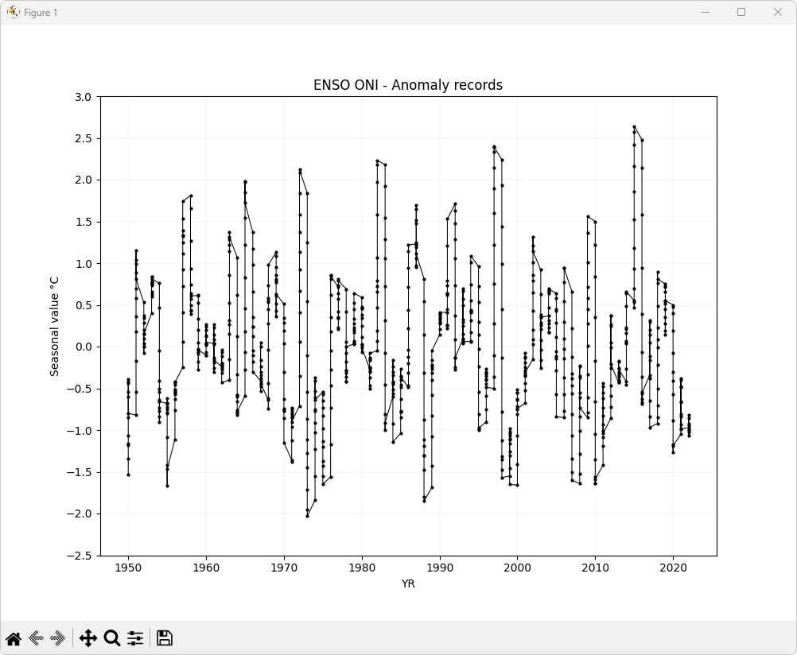
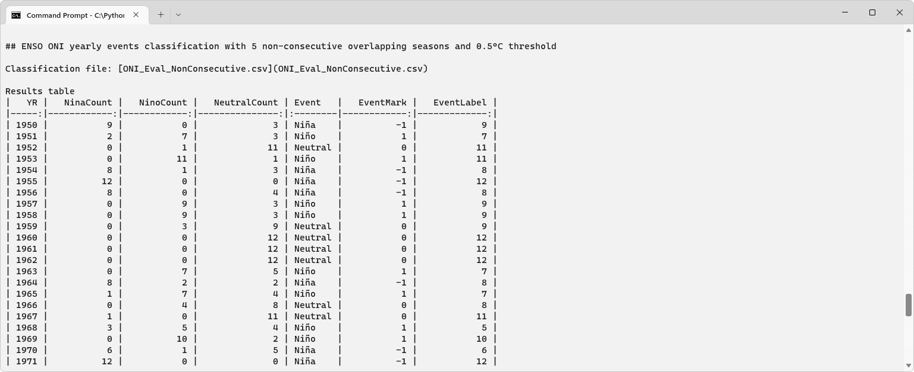
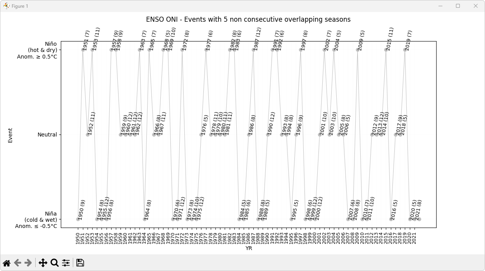
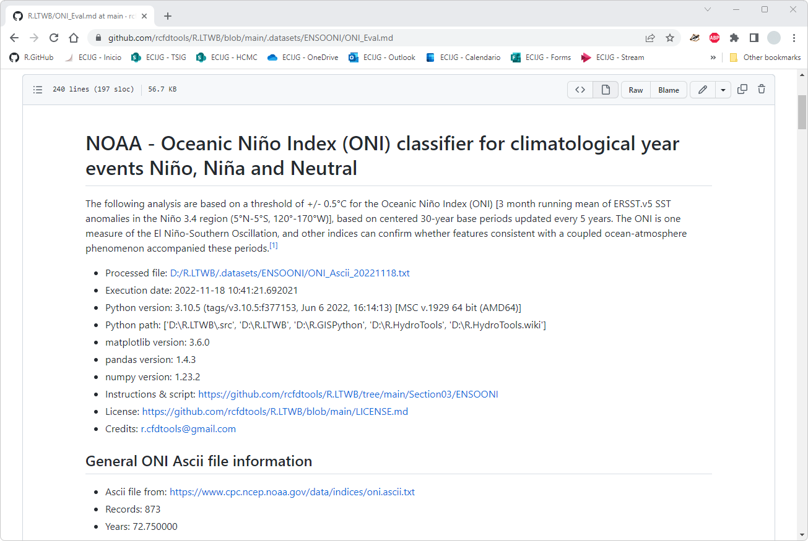
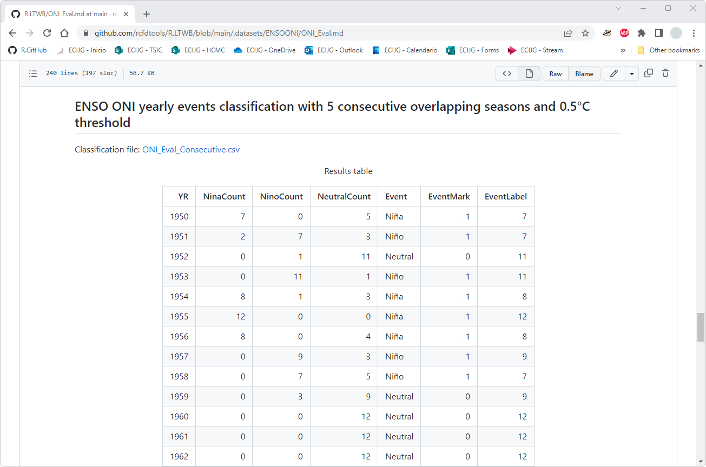

<div align="center"><a href="https://www.escuelaing.edu.co/es/investigacion-e-innovacion/centro-de-estudios-hidraulicos/" target="_blank"></a></div>

## Análisis de cambio climático para segmentación de series
Keywords: `ENSO` `ONI` `El-Niño` `La-Niña` `Neutro` `matplotlib` `pandas` `numpy` 

<div align="center">
  
  <br><b>Balance hidrológico de largo plazo para estimación de caudales medios usando SIG</b><br><br><b>Universidad Escuela Colombiana de Ingeniería Julio Garavito</b><br>William Ricardo Aguilar Piña<br>Profesor del Centro de Estudios Hidráulicos<br>william.aguilar@escuelaing.edu.co<br>
</div><br>

<div align="center"></div> 

En esta actividad se realiza la identificación de años asociados a fenómenos climatológicos de El Niño, La Niña y Neutro.

<div align="center"><br><a href="http://www.youtube.com/watch?feature=player_embedded&v=oO48u2LopqY" target="_blank"></a><sub><br>Playlist: https://www.youtube.com/playlist?list=PLneiG4vC_8YupZFL2DtUEdcgtXyWT7Apt</sub><br><br></div>

El Niño es un fenómeno climático relacionado con el calentamiento del Pacífico oriental ecuatorial, el cual se manifiesta erráticamente como cíclico —Arthur Strahler habla de ciclos de entre tres y ocho años—, y consiste en realidad en la fase cálida del patrón climático del Pacífico ecuatorial, denominado El Niño-Oscilación del Sur (El Niño-Southern Oscillation, ENSO por sus siglas en inglés), donde la fase de enfriamiento recibe el nombre de La Niña.3 4. Este fenómeno, en sus manifestaciones más intensas, provoca estragos en la zona intertropical y ecuatorial debido a las intensas lluvias, afectando principalmente a la región costera del Pacífico de América del Sur.[^1]

Para la clasificación de los años con eventos de Niño, Niña o Neutros, en esta actividad se utilizó el Índice Oceánico del Niño - ONI (Oceanic Nino Index). Este índice es calculado como la media móvil de tres puntos de la serie mensual de anomalías de la temperatura de la superficie del mar en la Región Niño 3-4. De acuerdo con este índice, en condiciones El Niño (La Niña), el ONI debe ser igual ó superior (igual o inferior) a medio grado Celsius de anomalía, se clasificó cada año desde 1950 para luego poder analizar separadamente los datos climatológicos recopilados de las estaciones terrestres de la zona de estudio. La zona usada para el estudio de las anomalías de temperatura corresponde a una franja alrededor de la línea del Ecuador, entre las latitudes 5º Norte a 5º Sur y entre las longitudes 170º a 120º al oeste.


### Objetivos

* Descargar y procesar automáticamente el archivo [oni_ascii.txt](http://www.cpc.ncep.noaa.gov/data/indices/oni.ascii.txt) de la [National Oceanic and Atmospheric Administration - NOAA](https://www.noaa.gov/) que contiene los registros de temperatura y anomalías.
* Graficar los registros históricos de temperatura y anomalías presentadas por mes en cada año.
* Realizar el conteo de eventos de Niña, Niño o Neutro a partir de las anomalías registradas y utilizando **5 o más periodos no consecutivos** de eventos con excedencia por encima de 0.5°C o por debajo de -0.5°C.
* Realizar el conteo de eventos de Niña, Niño o Neutro a partir de las anomalías registradas y utilizando **5 o más periodos consecutivos** de eventos con excedencia por encima de 0.5°C o por debajo de -0.5°C.
* Asociar cada año a un evento específico.
* Graficar los eventos identificados por año para observar sus patrones y conteo de anomalías. 


### Requerimientos

* [Python 3+](https://www.python.org/)
* [Pandas](https://pandas.pydata.org/docs/index.html) para Python
* [Tabulate](https://pypi.org/project/tabulate/) para Python, requerido para impresión de tablas en formato Markdown desde pandas.
* [numpy](https://numpy.org/) para python.
* [Notepad++](https://notepad-plus-plus.org/), editor de texto y código.


### Procedimiento general

<div align="center">
<br><br>
<sub>Convenciones generales en diagramas: clases de entidad en azul, dataset en gris oscuro, grillas en color verde, geo-procesos en rojo, procesos automáticos o semiautomáticos en guiones rojos y procesos manuales en amarillo. Líneas conectoras con guiones corresponden a procedimientos opcionales.</sub><br><br>
</div>

1. Para realizar la descarga, procesamiento y marcado de años por fenómeno climatológico, descargue el script [ENSOONI.py](../../.src/ENSOONI.py) y guárdelo en la carpeta local `D:\R.LTWB\.src` de su equipo.

**Funcionalidades del script**

* Descarga automática del archivo https://www.cpc.ncep.noaa.gov/data/indices/oni.ascii.txt.
* A través de la variable `consecutive_event`, el usuario puede definir el número consecutivo de eventos para calificar un año como Niño, Niña o Neutro. El valor predeterminado es 5 eventos.
* A través de la variable `threshold`, el usuario puede definir el valor límite de las anomalías para el conteo de eventos. El valor predeterminado es 0.5 °C.
* Generación de reporte detallado Markdown y tablas de marcado en formato de texto separado por comas .csv.

Contenido del script

```
# -*- coding: UTF-8 -*-
# Name: ENSOONI.py
# Description: get the NOAA oni.ascii.txt and classify the climatological events Niño, Niña and Neutral.
# Requirements: Python 3+, pandas, tabulate, numpy
# SEAS: season, YR: year, TOTAL: average temperature, ANOM: anomaly value.


# Libraries
from datetime import datetime
from datetime import date
import requests
import os.path
import sys
import pandas as pd
import numpy as np
import matplotlib
import matplotlib.pyplot as plt


# General variables
url_file = 'https://www.cpc.ncep.noaa.gov/data/indices/oni.ascii.txt'
local_file = 'ONI_Ascii'
file_extension = '.txt'
path = 'D:/R.LTWB/.datasets/ENSOONI/'  # Your local output path, use ../.datasets/ENSOONI/ for relative path
analysis_file = 'ONI_Eval'  # Output analysis file name
file_log_name = path + analysis_file + '.md'  # Markdown file log
file_log = open(file_log_name, 'w+')   # w+ create the file if it doesn't exist
fig_size = 5  # Height size for figures plot
show_plot = True  # Show plots in screen
threshold = 0.5  # Temperature anomaly grader in °C
consecutive_event = 5  # Number of consecutive events


# Function for print and show results in a file
def print_log(txt_print, on_screen=True, center_div=False):
    if on_screen:
        print(txt_print)
    if center_div:
        file_log.write('\n<div align="center">\n' + '\n')
    file_log.write(txt_print + '\n')
    if center_div:
        file_log.write('\n</div>\n' + '\n')


# Function for eval the count events
def enso_oni_tag(nina_count, nino_count, neutral_count, consecutive_event):
    if nina_count >= consecutive_event:
        event = 'Niña'
        event_val = -1
        event_label = nina_count
    else:
        if nino_count >= consecutive_event:
            event = 'Niño'
            event_val = 1
            event_label = nino_count
        else:
            event = 'Neutral'
            event_val = 0
            event_label = neutral_count
    return event, event_val, event_label


# Downloading and reading the file
file_download_text = 'File downloaded and updated = No (already exist)'
current_date = date.today()
current_date_txt = str(current_date.year).zfill(4)+str(current_date.month).zfill(2)+str(current_date.day).zfill(2)
file_request = requests.get(url_file)
file_save = path + local_file + '_' + current_date_txt + file_extension
if file_request:
    if os.path.isfile(file_save) == False:
        open(file_save, 'wb').write(file_request.content)
        file_download_text = 'File downloaded and updated = Yes'
df = pd.read_csv(file_save, sep='\s+')
print(file_download_text)
records = int(df.shape[0])


# Header
print_log('# NOAA - Oceanic Niño Index (ONI) classifier for climatological year events Niño, Niña and Neutral')
print_log('\nThe following analysis are based on a threshold of +/- 0.5°C for the Oceanic Niño Index (ONI) [3 month running mean of ERSST.v5 SST anomalies in the Niño 3.4 region (5°N-5°S, 120°-170°W)], based on centered 30-year base periods updated every 5 years.\nThe ONI is one measure of the El Niño-Southern Oscillation, and other indices can confirm whether features consistent with a coupled ocean-atmosphere phenomenon accompanied these periods.[^1]')
print_log('\n* Processed file: [%s](%s)' % (str(file_save), '../ENSOONI/' + local_file + '_' + current_date_txt + file_extension) +
          '\n* Execution date: ' + str(datetime.now()) +
          '\n* Python version: ' + str(sys.version) +
          '\n* Python path: ' + str(sys.path[0:5]) +
          '\n* matplotlib version: ' + str(matplotlib.__version__) +
          '\n* pandas version: ' + str(pd.__version__) +
          '\n* numpy version: ' + str(np.__version__) +
          '\n* Instructions & script: https://github.com/rcfdtools/R.LTWB/tree/main/Section03/ENSOONI'
          '\n* License: https://github.com/rcfdtools/R.LTWB/blob/main/LICENSE.md'
          '\n* Credits: r.cfdtools@gmail.com')


# General information
print_log('\n## General ONI Ascii file information')
print_log('\n* Ascii file from: %s' % url_file +
          '\n* Records: %d' % records +
          '\n* Years: %f\n' % (records/ 12))
print_log('\nTable records', center_div=True)
print_log(df.T.to_markdown(), center_div=True)  # .T for transpose the print
# Plot historic values
ax = df.plot(x='YR', y='TOTAL',  color='black', legend=False, figsize=(fig_size*2, fig_size*1.5), kind='line', grid=False, style='.-', ms=4, mfc='black', mec='black', linewidth=0.75)
plt.title('ENSO ONI - Historic records')
ax.set_ylabel('Seasonal value °C')
plt.grid(color='silver', linestyle='-', linewidth=0.25, alpha=0.5)
plt.savefig(path + local_file + file_extension + '_Historic.png', dpi=150)
if show_plot: plt.show()
plt.close('all')
print_log('\n' % (local_file + file_extension + '_Historic.png'), center_div=False)
# Plot anomaly values
ax = df.plot(x='YR', y='ANOM',  color='black', legend=False, figsize=(fig_size*2, fig_size*1.5), kind='line', grid=False, style='.-', ms=4, mfc='black', mec='black', linewidth=0.75)
plt.title('ENSO ONI - Anomaly records')
ax.set_ylabel('Seasonal value °C')
plt.grid(color='silver', linestyle='-', linewidth=0.25, alpha=0.5)
y_ticks = np.arange(-2.5, 3.5, 0.5)
plt.yticks(y_ticks)
plt.savefig(path + local_file + file_extension + '_Anomaly.png', dpi=150)
if show_plot: plt.show()
print_log('\n' % (local_file + file_extension + '_Anomaly.png'), center_div=False)
plt.close('all')


# Processing n non-consecutive overlapping seasons
print_log('\n\n## ENSO ONI yearly events classification with %s non-consecutive overlapping seasons and %s°C threshold' % (consecutive_event, str(threshold)))
print_log('\nClassification file: [%s](%s)' % (analysis_file + '_NonConsecutive.csv', analysis_file + '_NonConsecutive.csv'))
columns=['YR', 'NinaCount', 'NinoCount', 'NeutralCount', 'Event', 'EventMark', 'EventLabel']
df_out = pd.DataFrame(columns=columns)
start_year = df['YR'].min()
nina_count, nino_count = 0, 0
for i in range (records):
    start_year_aux = df['YR'][i]
    if start_year == start_year_aux:
        if df['ANOM'][i] <= -threshold:
            nina_count += 1
        if df['ANOM'][i] >= threshold:
            nino_count += 1
    else:
        neutral_count = 12 - nina_count - nino_count
        event = enso_oni_tag(nina_count, nino_count, neutral_count, consecutive_event)[0]
        event_val = enso_oni_tag(nina_count, nino_count, neutral_count, consecutive_event)[1]
        event_label = enso_oni_tag(nina_count, nino_count, neutral_count, consecutive_event)[2]
        df_eval = pd.DataFrame(np.array([[start_year, nina_count, nino_count, neutral_count, event, event_val, event_label]]), columns=columns)
        df_out = pd.concat([df_out, df_eval], ignore_index=True)
        start_year = df['YR'][i]
        nina_count = 0
        nino_count = 0
        if df['ANOM'][i] <= -threshold:
            nina_count += 1
        if df['ANOM'][i] >= threshold:
            nino_count += 1
neutral_count = 12 - nina_count - nino_count
event = enso_oni_tag(nina_count, nino_count, neutral_count, consecutive_event)[0]
event_val = enso_oni_tag(nina_count, nino_count, neutral_count, consecutive_event)[1]
event_label = enso_oni_tag(nina_count, nino_count, neutral_count, consecutive_event)[2]
df_eval = pd.DataFrame(np.array([[start_year, nina_count, nino_count, neutral_count, event, event_val, event_label]]), columns=columns)
df_out = pd.concat([df_out, df_eval], ignore_index=True)
df_out = df_out.set_index('YR')
convert_dict = {'NinaCount': int,
                'NinoCount': int,
                'NeutralCount': int,
                'EventMark': int,
                'EventLabel': int
                }
df_out = df_out.astype(convert_dict)
print_log('\nResults table', center_div=True)
print_log(df_out.to_markdown(), center_div=True)
df_out.to_csv(path + analysis_file + '_NonConsecutive.csv', encoding='latin-1')
# Plot event graph
x = np.arange(0, df_out.shape[0]-1, 1)
x_label = np.arange(int(df_out.index.values.min()), int(df_out.index.values.max()), 1)
ax = df_out.plot(y='EventMark',  color='silver', legend=False, figsize=(fig_size*2.5, fig_size*1.25), kind='line', grid=True, style='.-', ms=12, mfc='silver', mec='silver', linewidth=0.75)
plt.title('ENSO ONI - Events with %s non consecutive overlapping seasons\n\n' % consecutive_event)
plt.yticks([-1, 0, 1], ['Niña\n(cold & wet)\nAnom. ≤ -%s°C' % str(threshold), 'Neutral', 'Niño\n(hot & dry)\nAnom. ≥ %s°C' % str(threshold)])
plt.xticks(x, x_label, rotation=90, size=9)
ax.set_ylabel('Event')
plt.grid(color='silver', linestyle='-', linewidth=0.1, alpha=0.25)
for index in range(df_out.shape[0]-1):
    ax.text(x[index], df_out['EventMark'][index], str(x_label[index]) + ' (' + str(df_out['EventLabel'][index]) + ')', size=9, rotation=80)
plt.savefig(path + analysis_file + '_NonConsecutive.png', dpi=150)
if show_plot: plt.show()
plt.close('all')
print_log('\n' % (analysis_file + '_NonConsecutive.png'), center_div=False)


# Processing n consecutive overlapping seasons
print_log('\n\n## ENSO ONI yearly events classification with %s consecutive overlapping seasons and %s°C threshold' % (consecutive_event, str(threshold)))
print_log('\nClassification file: [%s](%s)' % (analysis_file + '_Consecutive.csv', analysis_file + '_Consecutive.csv'))
columns=['YR', 'NinaCount', 'NinoCount', 'NeutralCount', 'Event', 'EventMark', 'EventLabel']
df_out = pd.DataFrame(columns=columns)
start_year = df['YR'].min()
nina_count, nino_count, nina_max, nino_max = 0, 0, 0, 0
for i in range(records):
    start_year_aux = df['YR'][i]
    if start_year == start_year_aux:
        if df['ANOM'][i] <= -threshold and i < records - 1:
            nina_count += 1
            if nina_max < nina_count:
                nina_max = nina_count
        else:
            nina_count = 0
        if df['ANOM'][i] >= threshold and i < records - 1:
            nino_count += 1
            if nino_max < nino_count:
                nino_max = nino_count
        else:
            nino_count = 0
    else:
        neutral_count = 12 - nina_max - nino_max
        event = enso_oni_tag(nina_max, nino_max, neutral_count, consecutive_event)[0]
        event_val = enso_oni_tag(nina_max, nino_max, neutral_count, consecutive_event)[1]
        event_label = enso_oni_tag(nina_max, nino_max, neutral_count, consecutive_event)[2]
        df_eval = pd.DataFrame(np.array([[start_year, nina_max, nino_max, neutral_count, event, event_val, event_label]]), columns=columns)
        df_out = pd.concat([df_out, df_eval], ignore_index=True)
        start_year = df['YR'][i]
        #nina_max, nino_max = 0, 0
        nina_count, nino_count, nina_max, nino_max = 0, 0, 0, 0
        if df['ANOM'][i] <= -threshold and i < records - 1:
            nina_count += 1
            if nina_max < nina_count:
                nina_max = nina_count
        else:
            nina_count = 0
        if df['ANOM'][i] >= threshold and i < records - 1:
            nino_count += 1
            if nino_max < nino_count:
                nino_max = nino_count
        else:
            nino_count = 0
neutral_count = 12 - nina_max - nino_max
event = enso_oni_tag(nina_max, nino_max, neutral_count, consecutive_event)[0]
event_val = enso_oni_tag(nina_max, nino_max, neutral_count, consecutive_event)[1]
event_label = enso_oni_tag(nina_max, nino_max, neutral_count, consecutive_event)[2]
df_eval = pd.DataFrame(np.array([[start_year, nina_max, nino_max, neutral_count, event, event_val, event_label]]), columns=columns)
df_out = pd.concat([df_out, df_eval], ignore_index=True)
df_out = df_out.set_index('YR')
convert_dict = {'NinaCount': int,
                'NinoCount': int,
                'NeutralCount': int,
                'EventMark': int,
                'EventLabel': int
                }
df_out = df_out.astype(convert_dict)
print_log('\nResults table', center_div=True)
print_log(df_out.to_markdown(), center_div=True)
df_out.to_csv(path + analysis_file + '_Consecutive.csv', encoding='latin-1')
# Plot event graph
x = np.arange(0, df_out.shape[0]-1, 1)
x_label = np.arange(int(df_out.index.values.min()), int(df_out.index.values.max()), 1)
ax = df_out.plot(y='EventMark',  color='silver', legend=False, figsize=(fig_size*2.5, fig_size*1.25), kind='line', grid=True, style='.-', ms=12, mfc='silver', mec='silver', linewidth=0.75)
plt.title('ENSO ONI - Events with %s consecutive overlapping seasons\n\n' % consecutive_event)
plt.yticks([-1, 0, 1], ['Niña\n(cold & wet)\nAnom. ≤ -%s°C' % str(threshold), 'Neutral', 'Niño\n(hot & dry)\nAnom. ≥ %s°C' % str(threshold)])
plt.xticks(x, x_label, rotation=90, size=9)
ax.set_ylabel('Event')
plt.grid(color='silver', linestyle='-', linewidth=0.1, alpha=0.25)
for index in range(df_out.shape[0]-1):
    ax.text(x[index], df_out['EventMark'][index], str(x_label[index]) + ' (' + str(df_out['EventLabel'][index]) + ')', size=9, rotation=80)
plt.savefig(path + analysis_file + '_Consecutive.png', dpi=150)
if show_plot: plt.show()
plt.close('all')
print_log('\n' % (analysis_file + '_Consecutive.png'), center_div=False)

print_log('\n[^1]: https://origin.cpc.ncep.noaa.gov/products/analysis_monitoring/ensostuff/ONI_v5.php')
```

2. Cree una nueva carpeta en blanco con el nombre `ENSOONI` en su directorio de proyecto local `D:\R.LTWB\.datasets`.

3. Desde el editor de texto [Notepad++](https://notepad-plus-plus.org/), abra el archivo [D:\R.LTWB\.src\ENSOONI.py](../../.src/ENSOONI.py), y verifique y defina las variables `consecutive_event = 5` y `threshold = 0.5`:


4. En Microsoft Windows, ejecute el _Command Prompt_ o _CMD_, ingrese `D:` y de <kbd>Enter</kbd> para cambiar a la unidad D:\ donde se encuentra el repositorio R.LTWB. Utilizando el comando  `CD D:\R.LTWB\.datasets\ENSOONI` ubíquese dentro de la carpeta IDEAM_Impute.


5. En él `CMD`, ejecute la instrucción `C:\Python3.10.5\python.exe "D:\R.LTWB\.src\ENSOONI.py"` que realizará el procesamiento y marcado de años por evento. Durante la ejecución, podrá observar que en la consola se presenta el detalle de los procesos ejecutados, además de la previsualización de diferentes tablas en formato Markdown.

> Para visualizar durante la ejecución, las gráficas generales de análisis, establezca la variable `show_plot = True`.

El archivo oni.ascii.txt de la NOAA utiliza la siguiente estructura:

| Atributo | Tipo   | Descripción                                                                                                                                                                              |
|----------|--------|:-----------------------------------------------------------------------------------------------------------------------------------------------------------------------------------------|
| SEAS     | object | Periodo correspondiente a la media móvil de 3 meses, p.ej. DJF corresponde a diciembre, enero y febrero                                                                                  |
| YR       | int64  | Año asociado al periodo                                                                                                                                                                  |
| TOTAL    | int64  | Temperatura en °C                                                                                                                                                                        |
| ANOM     | int64  | Anomalía de temperatura en °C correspondiente a la diferencia entre la temperatura registrada y la media de temperatura centrada de 30 años basada en periodos actualizados cada 5 años. |







Luego de la ejecución, podrá observar que en la carpeta local `D:\R.LTWB\.datasets\ENSOONI` se encuentra el archivo de texto ONI_Ascii_20221120.txt (cuyo contenido corresponde al archivo oni.ascii.txt obtenido directamente de la NOAA, renombrado incluyendo la fecha de descarga), dos archivos de resultados en formato .csv, diferentes gráficas de análisis y el reporte Markdown.


Una vez finalizado el proceso de ejecución, podrá sincronizar en la nube los resultados en su repositorio de proyectos de GitHub y podrá observar el reporte detallado en formato Markdown [ONI_Eval.md](../../.datasets/ENSOONI/ONI_Eval.md).







### Tablas de resultados y análisis generales

Durante el proceso de ejecución del script, se generan automáticamente dos tablas en formato .csv con el marcado de años por evento para periodos no consecutivos y consecutivos.

| Tabla .csv :open_file_folder:                                                      | Descripción                                                                                                   |
|------------------------------------------------------------------------------------|---------------------------------------------------------------------------------------------------------------|
| [ONI_Eval_NonConsecutive.csv](../../.datasets/ENSOONI/ONI_Eval_NonConsecutive.csv) | Tabla de resultados con marcado de evento por año a partir de 5 o más periodos no consecutivos identificados. |
| [ONI_Eval_Consecutive.csv](../../.datasets/ENSOONI/ONI_Eval_Consecutive.csv)       | Tabla de resultados con marcado de evento por año a partir de 5 o más periodos consecutivos identificados.    |

Los archivos de resultados .csv generados por el script utilizan la siguiente estructura:

| Atributo     | Tipo   | Descripción                                                               |
|--------------|--------|---------------------------------------------------------------------------|
| YR           | int64  | Año                                                                       |
| NinaCount    | int64  | Conteo de eventos Niño (años calientes y secos)                           |
| NinoCount    | int64  | Conteo de eventos Niña (años fríos y húmedos)                             |
| NeutralCount | int64  | Conteo de eventos Neutro                                                  |
| Event        | object | Nombre del evento                                                         |
| EventMark    | int64  | Marcación para gráfica: -1 para Niñas, 0 para Neutros, 1 para Niño        |
| EventLabel   | int64  | Conteo de eventos del fenómeno asociado a utilizar como rótulo en gráfica |

> En la tabla anterior, el campo `Tipo` es asociado a los tipos obtenidos en el dataframe procesado por Pandas en Python.  

En este momento, dispone del reporte detallado de marcación de años por evento climatológico [ONI_Eval.md](../../.datasets/ENSOONI/ONI_Eval.md) y dos tablas en formato de texto separado por comas `.csv` para la posterior segmentación de las series de parámetros hidroclimatológicos.


### Actividades complementarias:pencil2:

En la siguiente tabla se listan las actividades complementarias que deben ser desarrolladas y documentadas por el estudiante en un único archivo de Adobe Acrobat .pdf. El documento debe incluir portada (mostrar nombre completo, código y enlace a su cuenta de GitHub), numeración de páginas, tabla de contenido, lista de tablas, lista de ilustraciones, introducción, objetivo general, capítulos por cada ítem solicitado, conclusiones y referencias bibliográficas.

| Actividad | Alcance                                                                                                                                                                                                                                                                                                                                                                                                                                                                       |
|:---------:|:------------------------------------------------------------------------------------------------------------------------------------------------------------------------------------------------------------------------------------------------------------------------------------------------------------------------------------------------------------------------------------------------------------------------------------------------------------------------------|
|     1     | Investigue y documente otros indicadores de la NOAA aplicables a regiones diferentes de zonas inter-tropicales y tropicales.                                                                                                                                                                                                                                                                                                                                                  |
|     2     | Cree un script que permita procesar uno de los indicadores investigados y que realice la marcación o asociación de eventos climatológicos para cada año.                                                                                                                                                                                                                                                                                                                      | 


### Referencias

* http://www.cpc.ncep.noaa.gov/data/indices/oni.ascii.txt
* https://www.climate.gov/maps-data/dataset/el-ni%C3%B1o-southern-oscillation-indicators
* http://www.cpc.ncep.noaa.gov/data/indices/
* https://origin.cpc.ncep.noaa.gov/products/analysis_monitoring/ensostuff/ONI_v5.php
* https://stackoverflow.com/questions/33509627/using-pandas-to-read-in-txt-file-using-delimiters-creates-nans-columns
* https://stackoverflow.com/questions/43941245/line-plot-with-data-points-in-pandas
* https://towardsdatascience.com/how-to-label-the-values-plots-with-matplotlib-c9b7db0fd2e1
* https://matplotlib.org/stable/gallery/color/named_colors.html


### Control de versiones

| Versión    | Descripción                                                                                                                                                                           | Autor                                     | Horas |
|------------|:--------------------------------------------------------------------------------------------------------------------------------------------------------------------------------------|-------------------------------------------|:-----:|
| 2023.02.10 | Guión, audio, video, edición y publicación.                                                                                                                                           | [rcfdtools](https://github.com/rcfdtools) |   2   |
| 2022.11.20 | Finalización documentación. Ilustración cabecera y diagrama de procesos.                                                                                                              | [rcfdtools](https://github.com/rcfdtools) |   4   |
| 2022.11.18 | Optimización de script. Inicio documentación.                                                                                                                                         | [rcfdtools](https://github.com/rcfdtools) |   4   |
| 2022.11.17 | Marcación de eventos por temporadas no consecutivas. Gráfica de análisis. Marcación de eventos por temporadas consecutivas. Gráfica de análisis. Generación de tablas en formato .csv | [rcfdtools](https://github.com/rcfdtools) |   8   |
| 2022.11.16 | Script versión inicial para marcación de eventos por temporadas no consecutivas.                                                                                                      | [rcfdtools](https://github.com/rcfdtools) |   4   |

_R.LTWB es de uso libre para fines académicos, conoce nuestra licencia, cláusulas, condiciones de uso y como referenciar los contenidos publicados en este repositorio, dando [clic aquí](https://github.com/rcfdtools/R.LTWB/wiki/License)._

_¡Encontraste útil este repositorio!, apoya su difusión marcando este repositorio con una ⭐ o síguenos dando clic en el botón Follow de [rcfdtools](https://github.com/rcfdtools) en GitHub._

| [Actividad anterior](../Impute) | [Inicio](../../Readme.md) | [:beginner: Ayuda](https://github.com/rcfdtools/R.LTWB/discussions/26) | [Actividad siguiente](../Agg) |
|---------------------------------|---------------------------|------------------------------------------------------------------------|-------------------------------|

[^1]: https://es.wikipedia.org/

<div align="center"><a href="https://enlace-academico.escuelaing.edu.co/psc/FORMULARIO/EMPLOYEE/SA/c/EC_LOCALIZACION_RE.LC_FRM_ADMEDCO_FL.GBL" target="_blank"></a></div>


##

<div align="center"><a href="http://www.escuelaing.edu.co" target="_blank"></a><sub><br>Este curso guía ha sido desarrollado con el apoyo de la Escuela Colombiana de Ingeniería - Julio Garavito. Encuentra más contenidos en https://github.com/uescuelaing</sub><br><br></div>