## Identificación y procesamiento de datos atípicos - Outliers
Keywords: `Outlier` `matplotlib` `pandas` `tabulate` `dtypes` `isnull` `describe` `Drop` `Capped` `Impute` `Interquartile-range` `Empirical-rule` `Z-score`

<div align="center"></div> 

En esta actividad se obtienen los parámetros estadísticos de cada parámetro hidroclimatológico en cada estación y se identifican, excluyen y completan los datos atípicos a través de métodos estadísticos.


### Objetivos

* Obtener estadísticas generales de cada estación para cada parámetro hidroclimatológico.
* Identificar valores atípicos a través de diferentes métodos estadísticos (Rango intercuartil - IQR, regla empírica - ER y núcleo estándar Z-score).
* Representar gráficamente las series de cada parámetro visualizando también los datos atípicos identificados.
* Excluir valores atípicos de la matriz de estaciones para cada parámetro.
* Reemplazar valores atípicos por valores límite definidos a partir de un rango de confianza ( $\mu$ +- K * $\sigma$ ).
* Imputar valores atípicos con el valor de la media de cada estación.


### Requerimientos

* [Python 3+](https://www.python.org/)
* [Pandas](https://pandas.pydata.org/docs/index.html) para Python
* [Tabulate](https://pypi.org/project/tabulate/) para Python, requerido para impresión de tablas en formato Markdown desde pandas.
* [numpy](https://numpy.org/) para python.
* [Notepad++](https://notepad-plus-plus.org/), editor de texto y código.
* Tablas dinámicas (pivot tables) con series de datos discretos de estaciones terrestres del IDEAM por parámetro hidroclimatológico. [:mortar_board:Aprender.](../EDA)


### Procedimiento general

<div align="center">
<br><br>
<sub>Convenciones generales en diagramas: clases de entidad en azul, dataset en gris oscuro, grillas en color verde, geo-procesos en rojo, procesos automáticos o semiautomáticos en guiones rojos y procesos manuales en amarillo. Líneas conectoras con guiones corresponden a procedimientos opcionales.</sub><br><br>
</div>

1. Para realizar la identificación y procesamiento de datos atípicos, descargue el script [Outlier.py](../../.src/Outlier.py) y guárdelo en la carpeta local `D:\R.LTWB\.src` de su equipo.

Funcionalidades del script

* Identificación de atípicos por 3 métodos estadísticos (Método 1 - Rango intercuartil - IQR, Método 2 - Regla empírica - ER y Método 3 - núcleo estándar Z-score).
* Permite definir la tabla dinámica (pivot table) del parámetro hidroclimatológico a evaluar.
* El usuario puede excluir estaciones del análisis a través de la variable `station_exclude`.
* Definición del cuartil inferior `q1_val` y superior `q3_val` que define el rango de exclusión en el método de rango interquartil - IQR.
* Definición manual del multiplicador `cap_multiplier` o K-sigma que permite definir los valores de reemplazo ( $\mu$ +- %s * $\sigma$ ).  
* Definición manual del límite de exclusión `zscore_threshold` en el método de exclusión por núcleo estándar.
* Análisis masivo de estaciones por parámetro hidroclimatológico con estadísticos, parámetros de evaluación y gráficas con marcado de atípicos.
* Generación de reportes detallados Markdown por cada parámetro hidroclimatológico evaluado. [IDEAM_Outlier](../../.datasets/IDEAM_Outlier).
* Para cada método y cada parámetro hidroclimatológico analizado, crea las siguientes tablas: datos atípicos identificados, datos de entrada sin datos atípicos (drop), datos de entrada con datos atípicos reemplazados (cap) y datos de entrada con datos atípicos imputados (impute). 

> En el Método 3 ó núcleo estándar Z-score, se genera una tabla adicional para cada parámetro hidroclimatológico que contiene los puntajes a partir de los cuales se realiza la identificación de valores atípicos.   
> 
> Para el ejemplo, se han excluido diferentes estaciones con registros de caudal sobre el Río Magdalena y otros ríos con caudales altos.

Contenido del script

```

```

2. Cree una nueva carpeta en blanco con el nombre `IDEAM_Outlier` en su directorio de proyecto local `D:\R.LTWB\.datasets`. Verifique que la carpeta `D:\R.LTWB\.datasets\IDEAM_EDA`, contenga los archivos de las tablas dinámicas de cada parámetro hicroclimatológico [IDEAM_EDA](../../.datasets/IDEAM_EDA) que fueron obtenidas en la actividad denominada [EDA](../EDA).

> Para la identificación de valores atípicos no son requeridas las tablas de datos de correlaciones identificadas con nombre terminado en _correlation.csv.

3. Desde el editor de texto [Notepad++](https://notepad-plus-plus.org/), abra el archivo [D:\R.LTWB\.src\Outlier.py](../../.src/Outlier.py), y defina las siguientes variables:

* pivot_table_name = 'Pivot_PTPM_TT_M.csv': corresponde a la tabla dinámica (pivot table) a procesar, p.ej., Pivot_PTPM_TT_M.csv corresponde a datos de precipitación mensual total, Pivot_EV_TT_D.csv corresponde a datos de evaporación diaria total, Pivot_Q_MEDIA_M.csv corresponde a datos de caudal medio mensual, Pivot_TMN_CON.csv corresponde a datos de temperatura mínima diaria y Pivot_TMX_CON.csv corresponde a datos de temperatura máxima diaria.

* q1_val = 0.1: cuartil inferior, el valor por defecto es 0.25 en el Método 1 de rango intercuartílico. Para este ejemplo utilizaremos 0.1 para excluir precipitaciones totales altas atípicas.

* q3_val = 0.9: cuartil inferior, el valor por defecto es 0.75 en el Método 1 de rango intercuartílico. Para este ejemplo utilizaremos 0.9 para excluir precipitaciones totales bajas atípicas.

* cap_multiplier = 4.5: multiplicado K-sigma, el valor por defecto es 3. En el método 1 este valor es usado para definir el límite de reemplazo de valores y en el método 2 para identificación de valores atípicos.

* zscore_threshold = 4.5: límite de exclusión en Z-score del método 3, el valor por defecto es 3.  

> Para los datos ejemplo de precipitación mensual total, la identificación de valores atípicos en el rango intercuartílico 0.1 a 0.9 es similar a la obtenida en los métodos 2 y 3 definiendo K-sigma y el Z-score en 4.5.
> 
> Los métodos 2 y 3 permiten identificar los mismos valores atípicos cuando el valor de K-sigma y Z-score es idéntico. Utilice estos métodos para comparar gráficamente exclusión de valores atípicos con diferentes posiciones en la distribución normal.


4. En Microsoft Windows, ejecute el _Command Prompt_ o _CMD_, ingrese `D:` y de <kbd>Enter</kbd> para cambiar a la unidad D:\ donde se encuentra el repositorio R.LTWB. Utilizando el comando  `CD D:\R.LTWB\.datasets\IDEAM_Outlier` ubíquese dentro de la carpeta IDEAM_Outlier.


5. En él `CMD`, ejecute la instrucción `C:\Python3.10.5\python.exe "D:\R.LTWB\.src\Outlier.py"` que realizará el procesamiento y análisis de los datos. Durante la ejecución, podrá observar que en la consola se presenta el detalle de los procesos ejecutados para cada método, además de la previsualización de diferentes tablas en formato Markdown y gráficas.

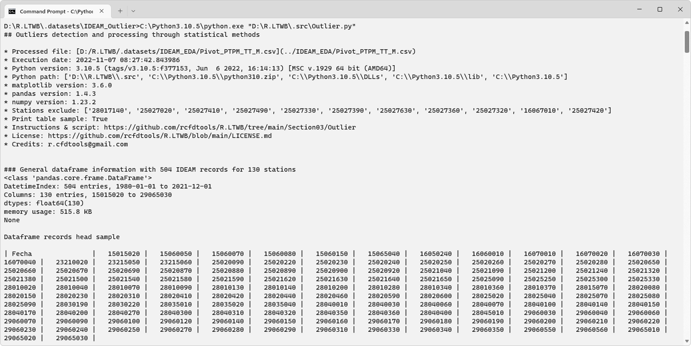
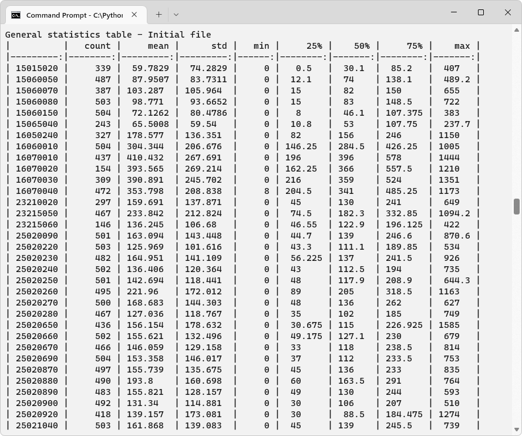
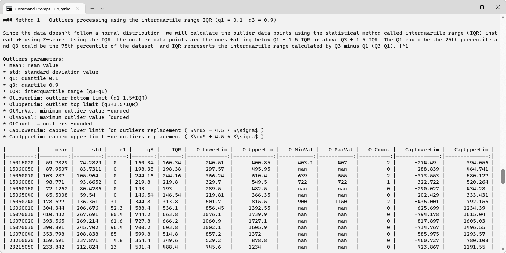
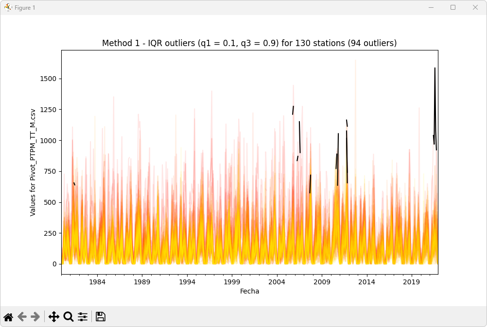
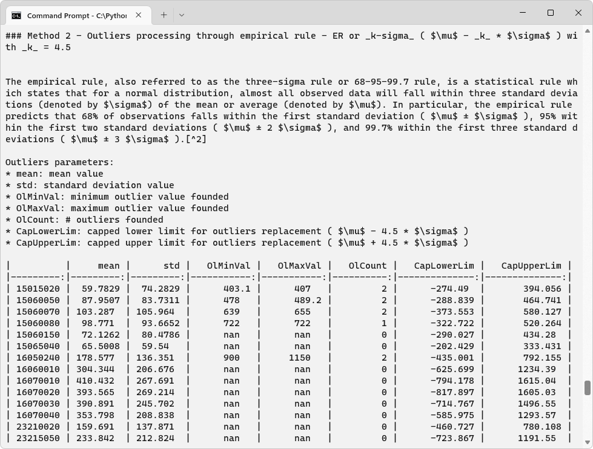
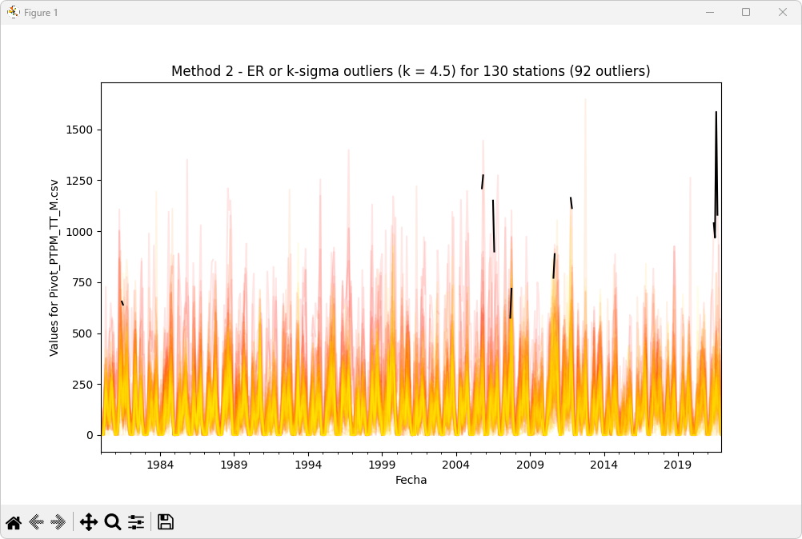
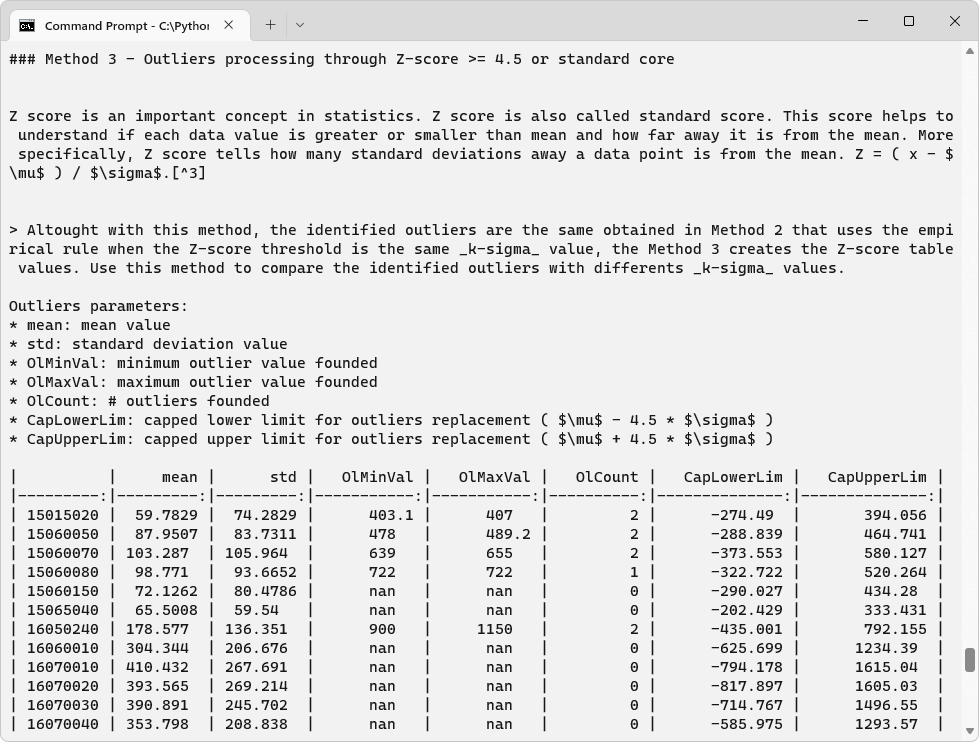


Luego de la ejecución, podrá observar que en la carpeta local `D:\R.LTWB\.datasets\IDEAM_Outlier` se han generado diferentes archivos de resultados por cada método para la tabla de datos de precipitación mensual total Pivot_PTPM_TT_M.csv.

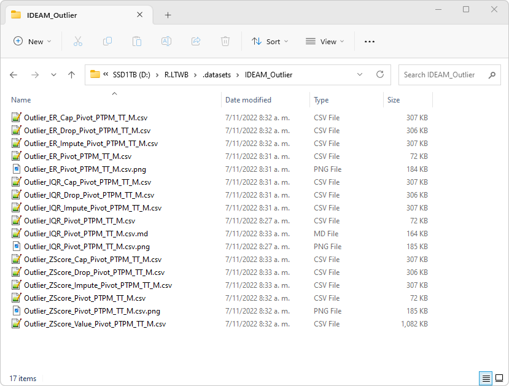

Una vez finalizado el proceso de ejecución, podrá sincronizar en la nube los resultados en su repositorio de proyectos de GitHub y podrá observar el reporte detallado en formato Markdown [Outlier_IQR_Pivot_PTPM_TT_M.csv.md](../../.datasets/IDEAM_Outlier/Outlier_IQR_Pivot_PTPM_TT_M.csv.md).

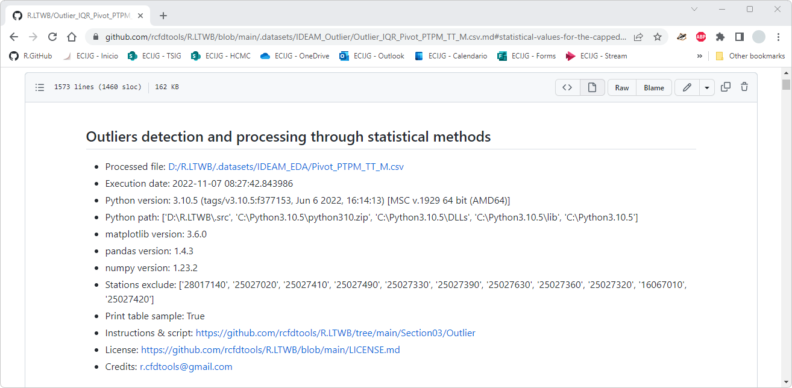


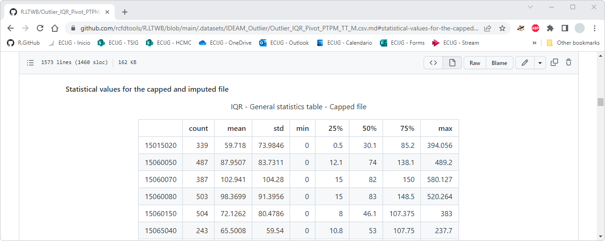
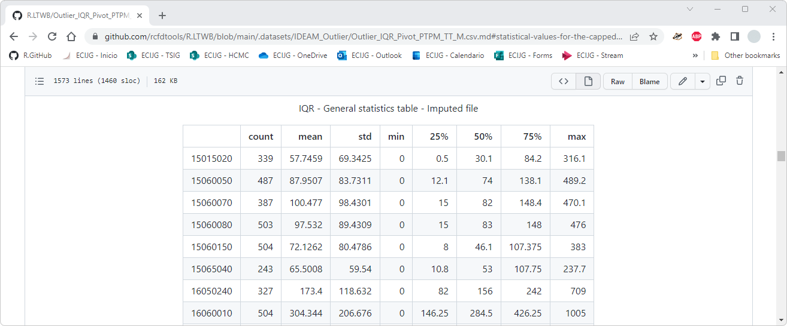
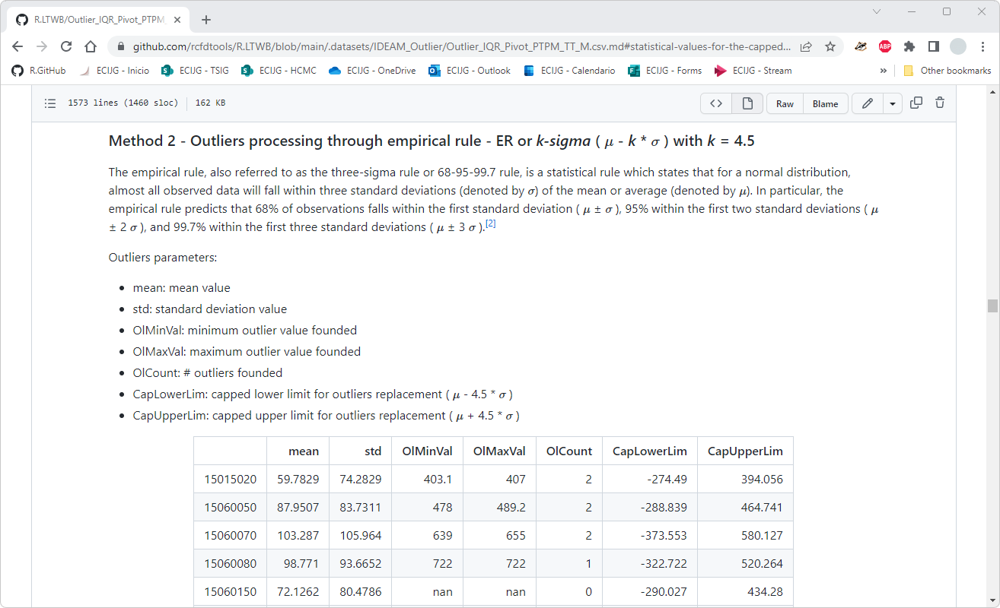


6. Repita el procedimiento anterior para los datos de evaporación, caudal, temperatura mínima y máxima.

Durante el proceso de ejecución del script, se genera automáticamente para cada parámetro hidroclimatológico, un reporte integrado de resultados en formato Markdown (.md), gráficas de análisis y diferentes tablas en formato .csv.

| Reporte                                                                                                | Descripción                                                                  | Estaciones | Registros | 1.IQR | 1.ER | 3.Z-Score | 
|--------------------------------------------------------------------------------------------------------|------------------------------------------------------------------------------|:----------:|:---------:|:-----:|:----:|:---------:|
| [Outlier_IQR_Pivot_PTPM_TT_M.csv.md](../../.datasets/IDEAM_Outlier/Outlier_IQR_Pivot_PTPM_TT_M.csv.md) | Precipitación mensual total, mm. q1=0.1, q3=0.9, k-sigma=4.5, Z-score=4.5    |    130     |    504    |  94   |  92  |    92     |
| [Outlier_IQR_Pivot_EV_TT_D.csv.md](../../.datasets/IDEAM_Outlier/Outlier_IQR_Pivot_EV_TT_D.csv.md)     | Evaporación diaria total, mm. q1=0.25, q3=0.75, k-sigma=0.45, Z-score=0.25   |     1      |   4821    |  781  | 706  |    714    |
| [Outlier_IQR_Pivot_Q_MEDIA_M.csv.md](../../.datasets/IDEAM_Outlier/Outlier_IQR_Pivot_Q_MEDIA_M.csv.md) | Caudal medio mensual, m³/s. q1=0.1, q3=0.9, k-sigma=3.85, Z-score=3.85       |     46     |    504    |  126  | 123  |    123    |
| [Outlier_IQR_Pivot_TMN_CON.csv.md](../../.datasets/IDEAM_Outlier/Outlier_IQR_Pivot_TMN_CON.csv.md)     | Temperatura diaria mínima, °C. q1=0.175, q3=0.825, k-sigma=3.5, Z-score=2.5  |     25     |   15341   |  403  | 410  |    396    |
| [Outlier_IQR_Pivot_TMX_CON.csv.md](../../.datasets/IDEAM_Outlier/Outlier_IQR_Pivot_TMX_CON.csv.md)     | Temperatura diaria máxima, °C. q1=0.175, q3=0.825, k-sigma=3.6, Z-score=2.95 |     25     |   15341   |  225  | 216  |    221    |

> En la gráfica: 1.IQR: número de valores atípicos identificados en Método 1 - Rango interquartílico, 2.ER: número de valores atípicos identificados en Método 2 - Regla empírica y 3.Z-score: número de valores atípicos identificados en Método 3 - Z-score.
> 
> Nótese que para datos de temperatura mínima, los métodos 1-IQR y 2-ER identifican mayoritariamente valores atípicos en la zona inferior de la gráfica, y para el método de 3-Z-score los valores identificados se localizan en la parte superior de la gráfica. Lo anterior debido a las tendencias de distribución de los datos.
> 
> Nótese que para datos de temperatura máxima, los métodos 1-IQR y 2-ER identifican mayoritariamente valores atípicos en la zona inferior y superior de la gráfica, y para el método de 3-Z-score los valores identificados se localizan en la parte superior de la gráfica. Lo anterior debido a las tendencias de distribución de los datos.

En este momento, dispone de reportes detallados de análisis por cada parámetro hidroclimatológico y diferentes tablas con el procesamiento de datos atípicos.


### Actividades complementarias:pencil2:

En la siguiente tabla se listan las actividades complementarias que deben ser desarrolladas y documentadas por el estudiante en un único archivo de Adobe Acrobat .pdf. El documento debe incluir portada (mostrar nombre completo, código y enlace a su cuenta de GitHub), numeración de páginas, tabla de contenido, lista de tablas, lista de ilustraciones, introducción, objetivo general, capítulos por cada ítem solicitado, conclusiones y referencias bibliográficas.

| Actividad | Alcance                                                                                                                                                                                                                                                                                                                                                                                                                                  |
|:---------:|:-----------------------------------------------------------------------------------------------------------------------------------------------------------------------------------------------------------------------------------------------------------------------------------------------------------------------------------------------------------------------------------------------------------------------------------------|
|     1     | A partir del conteo de registros por estación obtenido para cada grupo de parámetros dentro de la ventana de tiempo establecida, calcule la longitud del registro obtenido y compare con la longitud de registro hipotética de la estación. En la actividad https://github.com/rcfdtools/R.LTWB/tree/main/Section03/CNEStation se realizó el análisis de longitud hipotética.                                                            | 
|     2     | Utilizando el script [EDA.py](../../.src/EDA.py), realice el análisis de los parámetros climatológicos definidos como actividad complementaria en la actividad https://github.com/rcfdtools/R.LTWB/tree/main/Section03/CNEStationDatasetDownload correspondientes a brillo solar, radiación solar, humedad del aire cerca al suelo y parámetros relacionados con viento y nubosidad.                                                     |
|     3     | Para todas los parámetros climatológicos y a partir de las gráficas y tablas de análisis generadas mediante el script [EDA.py](../../.src/EDA.py), presente un análisis cualitativo identificando y explicando posibles datos atípicos, datos fuera de rango y estaciones que deberían ser excluidas del arreglo geográfico de estaciones definido para la zona de estudio por no tener correspondencia espacial o estacional similares. | 


### Referencias

* https://careerfoundry.com/en/blog/data-analytics/how-to-find-outliers/
* https://datasciencesphere.com/analytics/5-easy-ways-to-detect-outliers-in-python/
* https://realpython.com/pandas-merge-join-and-concat/
* https://www.geeksforgeeks.org/pandas-plot-multiple-time-series-dataframe-into-a-single-plot/
* https://www.tutorialspoint.com/plotting-multiple-dataframes-using-pandas-functionality
* https://sparkbyexamples.com/pandas/pandas-get-column-names
* https://www.statology.org/pandas-index-to-list/
* https://www.statology.org/pandas-exclude-column/
* https://www.investopedia.com/terms/e/empirical-rule.asp
* https://latex-tutorial.com/symbols/greek-alphabet/


### Control de versiones

| Versión    | Descripción                                                                                                                                                                                                                                                                                                                                                                                                                                          | Autor                                      | Horas |
|------------|:-----------------------------------------------------------------------------------------------------------------------------------------------------------------------------------------------------------------------------------------------------------------------------------------------------------------------------------------------------------------------------------------------------------------------------------------------------|--------------------------------------------|:-----:|
| 2022.10.31 | Ilustración cabecera y diagrama de procesos.                                                                                                                                                                                                                                                                                                                                                                                                         | [rcfdtools](https://github.com/rcfdtools)  |   1   |

_R.LTWB es de uso libre para fines académicos, conoce nuestra licencia, cláusulas, condiciones de uso y como referenciar los contenidos publicados en este repositorio, dando [clic aquí](https://github.com/rcfdtools/R.LTWB/wiki/License)._

_¡Encontraste útil este repositorio!, apoya su difusión marcando este repositorio con una ⭐ o síguenos dando clic en el botón Follow de [rcfdtools](https://github.com/rcfdtools) en GitHub._

| [Actividad anterior](../RemoteSensing) | [Inicio](../../Readme.md) | [:beginner: Ayuda](https://github.com/rcfdtools/R.LTWB/discussions/9999) | [Actividad siguiente]() |
|----------------------------------------|---------------------------|--------------------------------------------------------------------------|-------------------------|

[^1]: Adapted from: https://careerfoundry.com/en/blog/data-analytics/how-to-find-outliers/
[^2]: https://www.investopedia.com/terms/e/empirical-rule.asp
[^3]: Adapted from: https://www.geeksforgeeks.org/z-score-for-outlier-detection-python/
