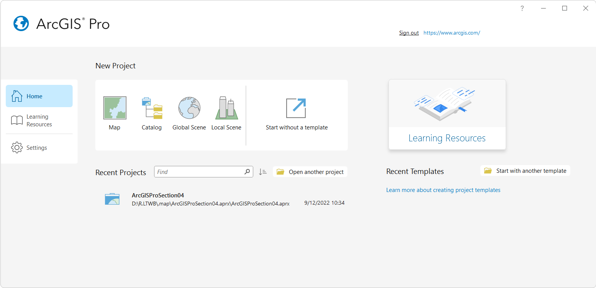
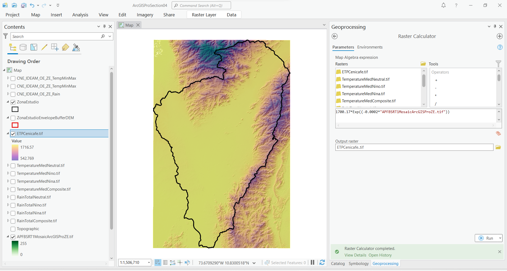

## Mapa de evapotranspiración potencial - ETP
Keywords: `ETP` `Cenicafé` `Raster-calculator`

El [Centro Nacional de Investigaciones de Café - Cenicafé](https://www.cenicafe.org/) de Colombia - Suramérica, ha realizado diferentes estudios relacionados con variables climatológicas, obteniendo ecuaciones que describen el comportamiento de la evapotranspiración potencial en función de la altitud. La ecuación propuesta, permite calcular la evapotranspiración potencial (ETP) de forma sencilla, pues en dicha ecuación la ETP solo depende de la elevación sobre el nivel del mar. La ecuación obtenida fue producto de una regresión entre los valores de evapotranspiración y la altura sobre el nivel del mar. Las estimaciones de ETP fueron obtenidas al aplicar el método de Penman a los datos de las estaciones climáticas de Colombia (Jaramillo, 1989)[^1]

ETP = 1017.17 exp(-0,0002 h)

Donde, 
* ETP: evapotranspiración potencial, mm/año
* h: elevación, m 

> Durante el proceso de recolección y análisis de información a partir de estaciones terrestres del IDEAM, se obtuvo la serie de evapotranspiración potencial solo en una estación, la cual no es suficiente para generar un mapa que cubra la totalidad de la zona de estudio. Por tal motivo se recurre a la expresión propuesta por Cenicafé para Colombia.

### Objetivos

* A partir de la ecuación de Cenicafé y el modelo digital de elevación - DEM ALOS PALSAR, crear el mapa de evapotranspiración potencial de la zona de estudio.

### Requerimientos

* [ArcGIS Pro 2+](https://pro.arcgis.com/en/pro-app/latest/get-started/download-arcgis-pro.htm)
* [ArcGIS for Desktop 10+](https://desktop.arcgis.com/es/desktop/) (opcional)
* [QGIS 3+](https://qgis.org/) (opcional)
* Modelo digital de elevación ALOS PALSAR. [:mortar_board:Aprender.](../../Section02/DEMAlos)

### Procedimiento general

  
Convenciones generales en diagramas: clases de entidad en azul, dataset en gris oscuro, grillas en color verde, geo-procesos en rojo, procesos automáticos o semiautomáticos en guiones rojos y procesos manuales en amarillo. Líneas conectoras con guiones corresponden a procedimientos opcionales.  

1. En ArcGIS Pro, abra el proyecto _ArcGISProSection04.aprx_ que se encuentra en la ruta _D:\R.LTWB\\.map_ y que fué creado en la primera actividad de la sección 4 de este curso.

> Tenga en cuenta que previamente asignamos al mapa el sistema de coordenadas 9377 de Colombia, correspondiente a MAGNA-SIRGAS Origen-Nacional y que en la actividad anterior agregamos al proyecto el modelo digital de elevación ALOS PALSAR que ha sido referenciado con este mismo sistema.

2. Utilizando la herramienta _Geoprocessing / Raster Calculator_, cree el mapa de evapotranspiración potencial a partir del modelo digital de elevación ALOS PALSAR, utilice la siguiente expresión y nombre de archivo de salida dentro de la carpeta `D:\R.LTWB\.grid`:

* Expresión Raster Calculator: `1700.17*Exp((-0.0002*"APFBSRT1MosaicArcGISProZE.tif"))`
* Mapa: ETPCenicafe.tif
* Grilla: [Part1](../../.grid/ETPCenicafe.part01.rar), [Part2](../../.grid/ETPCenicafe.part02.rar), [Part3](../../.grid/ETPCenicafe.part03.rar)  

> Debido al tamaño del archivo generado (aproximadamente 1.1 GB), la grilla ha sido comprimida en archivos .rar en partes de 95 MB.

Luego de creados los mapas, modifique la simbología de representación utilizando el esquema de color _Plasma_ y establezca transparencia en 50%.

En el mapa creado, podrá observar que los valores de evapotranspiración obtenidos se encuentran entre 542.69 y 1715.57 mm/año.

> Es importante tener en cuenta que el mapa obtenido corresponde a estimaciones compuestas que no han sido segmentadas por fenómeno climatológico (El Niño, La Niña, Neutro).

En este momento dispone de la grilla de evapotranspiración potencial, requerida para la generación de los mapas de evapotranspiración real.

### Actividades complementarias:pencil2:

En la siguiente tabla se listan las actividades complementarias que deben ser desarrolladas y documentadas por el estudiante en un único archivo de Adobe Acrobat .pdf. El documento debe incluir portada (mostrar nombre completo, código y enlace a su cuenta de GitHub), numeración de páginas, tabla de contenido, lista de tablas, lista de ilustraciones, introducción, objetivo general, capítulos por cada ítem solicitado, conclusiones y referencias bibliográficas.

| Actividad | Alcance                                                                                                                                                                                                                                                                                                       |
|:---------:|:--------------------------------------------------------------------------------------------------------------------------------------------------------------------------------------------------------------------------------------------------------------------------------------------------------------|
|     1     | Investigue y documente otras ecuaciones regionales a partir de las cuales se puedan construir mapas de evapotranspiración potencial.                                                                                                                                                                          |
|     2     | A partir de las ecuaciones regionales investigadas, cree los mapas de evapotranspiración potencial y con algebra de mapas realice el análisis de diferencias respecto a los mapas obtenidos en esta actividad. Evalúe e implemente en su caso de estudio, los mapas que mejor representen su zona de estudio. |

### Referencias

* https://biblioteca.cenicafe.org/bitstream/10778/859/10/8.%20Evaporaci%C3%B3n%20evapotranspiraci%C3%B3n.pdf
* https://www.cenicafe.org/es/publications/arc057(04)288-298.pdf
* http://www.ideam.gov.co/documents/21021/21147/Evapotranspiracion+de+Referencia+ETo+para+Colombia.pdf/12700c18-c492-40cc-8971-46f48f144824
* http://www.ideam.gov.co/documents/21021/21147/NotaT%C3%A9cnica+Evapotranspiracion+de+Referencia+en+Colombia/9f938590-ef96-4e6f-99dd-861ff6355b84
* http://julianrojo.weebly.com/uploads/1/2/0/0/12008328/metodos_estimacion_de_et.pdf

### Compatibilidad

* Esta actividad puede ser desarrollada con cualquier software SIG que disponga de herramientas de algebra de mapas.

### Control de versiones

| Versión    | Descripción                                                         | Autor                                     | Horas |
|------------|:--------------------------------------------------------------------|-------------------------------------------|:-----:|
| 2022.12.10 | Documentación general. Ilustración cabecera y diagrama de procesos. | [rcfdtools](https://github.com/rcfdtools) |   2   |

_R.LTWB es de uso libre para fines académicos, conoce nuestra licencia, cláusulas, condiciones de uso y como referenciar los contenidos publicados en este repositorio, dando [clic aquí](https://github.com/rcfdtools/R.LTWB/wiki/License)._

_¡Encontraste útil este repositorio!, apoya su difusión marcando este repositorio con una ⭐ o síguenos dando clic en el botón Follow de [rcfdtools](https://github.com/rcfdtools) en GitHub._

| [Actividad anterior](../Temperature) | [Inicio](../../Readme.md) | [:beginner: Ayuda](https://github.com/rcfdtools/R.LTWB/discussions/30) | [Actividad siguiente]()  |
|--------------------------------------|---------------------------|------------------------------------------------------------------------|--------------------------|

[^1]: http://julianrojo.weebly.com/uploads/1/2/0/0/12008328/metodos_estimacion_de_et.pdf