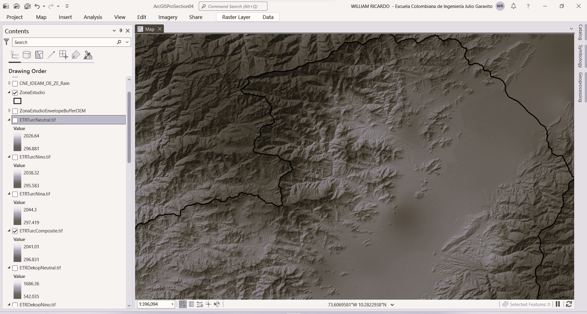
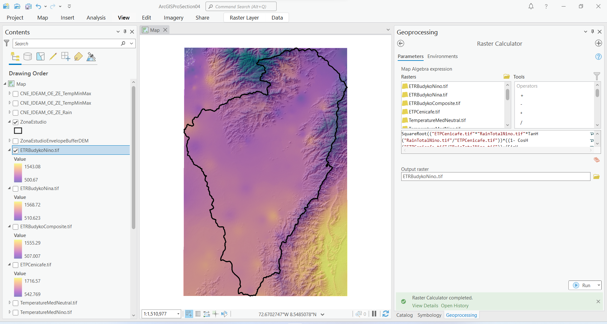
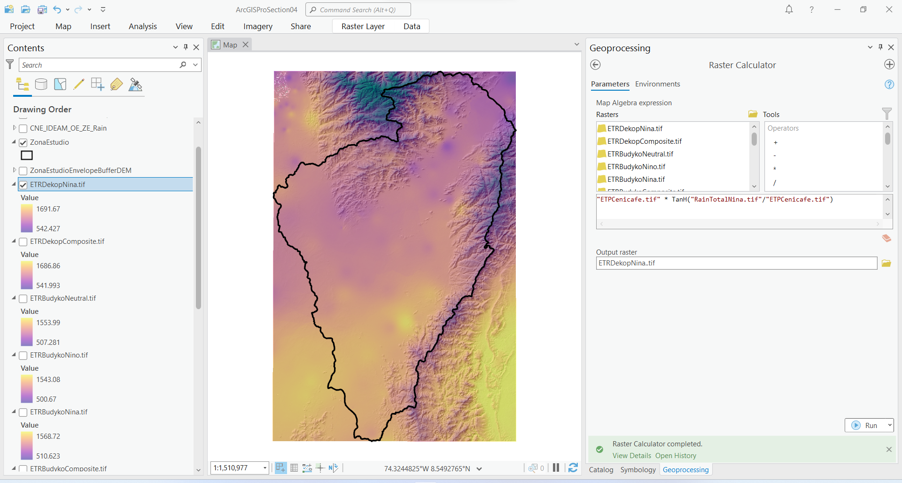
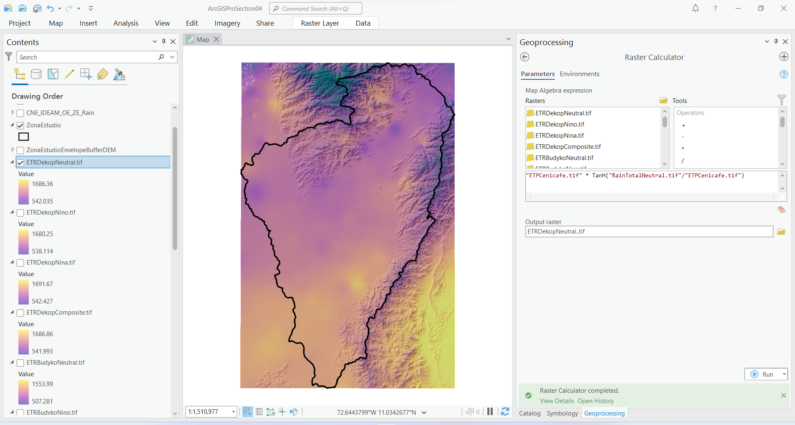
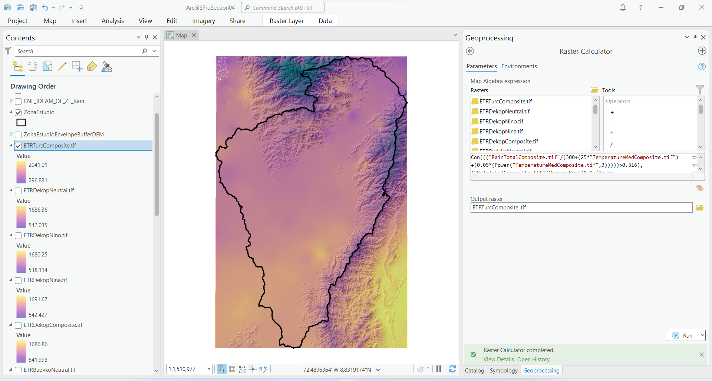
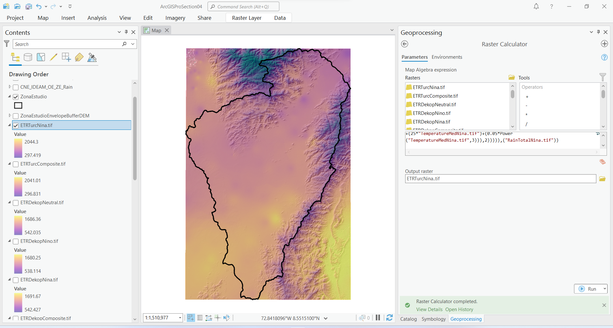

## Mapa de evapotranspiración real - ETR
Keywords: `ETR` `Cenicafé` `Budyco` `Turc` `Dekop` `Raster-calculator`

En esta actividad y a partir de los mapas de precipitación total, temperatura y evapotranspiración potencial, generamos los mapas de evapotranspiración real utilizando las ecuaciones de Budyco, Turc y Dekop.

### Objetivos

* Utilizando la expresión de Budyko y a partir del mapa de evapotranspiración potencial obtenido con la ecuación de Cenicafé y de los mapas de precipitación compuesta y por fenómeno climatológico, crear el mapa de evapotranspiración real de la zona de estudio.
* Utilizando la expresión de Dekop y a partir del mapa de evapotranspiración potencial obtenido con la ecuación de Cenicafé y de los mapas de precipitación compuesta y por fenómeno climatológico, crear el mapa de evapotranspiración real de la zona de estudio.
* Utilizando la expresión de Turc y a partir del mapa de temperatura media obtenido con la ecuación de Cenicafé y de los mapas de precipitación compuesta y por fenómeno climatológico, crear el mapa de evapotranspiración real de la zona de estudio.

### Requerimientos

* [ArcGIS Pro 2+](https://pro.arcgis.com/en/pro-app/latest/get-started/download-arcgis-pro.htm)
* [ArcGIS for Desktop 10+](https://desktop.arcgis.com/es/desktop/) (opcional)
* [QGIS 3+](https://qgis.org/) (opcional)
* Mapas de precipitación total. [:mortar_board:Aprender.](../../Section04/Rain)
* Mapas de temperatura media. [:mortar_board:Aprender.](../../Section04/Rain)
* Mapa de evapotranspiración potencial. [:mortar_board:Aprender.](../../Section04/ETP)

### Procedimiento general ETR Budyko

  
Convenciones generales en diagramas: clases de entidad en azul, dataset en gris oscuro, grillas en color verde, geo-procesos en rojo, procesos automáticos o semiautomáticos en guiones rojos y procesos manuales en amarillo. Líneas conectoras con guiones corresponden a procedimientos opcionales.  

La expresión de Budyko (1974), permite transformar la evapotranspiración potencial en evapotranspiración real con la siguiente expresión:

   

Donde,
* ETP: evapotranspiración potencial, mm/año
* P: precipitación total, mm/año 

En ArcGIS Pro, abra el proyecto _ArcGISProSection04.aprx_ que se encuentra en la ruta _D:\R.LTWB\\.map_ y que fué creado en la primera actividad de la sección 4 de este curso.

> Tenga en cuenta que previamente asignamos al mapa el sistema de coordenadas 9377 de Colombia, correspondiente a MAGNA-SIRGAS Origen-Nacional y que en actividades anteriores generamos los mapas de temperatura y precipitación que han sido referenciados con este mismo sistema.

Utilizando la herramienta _Geoprocessing / Raster Calculator_, cree los mapas de evapotranspiración real, utilice las siguientes expresiones y nombres de archivo de salida dentro de la carpeta `D:\R.LTWB\.grid`:

| Mapa                   | Expresión Raster Calculator                                                                                                                                                                                               | Rango mm/año     | Grilla                                                                                                                                                                                                         |
|:-----------------------|:--------------------------------------------------------------------------------------------------------------------------------------------------------------------------------------------------------------------------|------------------|----------------------------------------------------------------------------------------------------------------------------------------------------------------------------------------------------------------|
| ETRBudykoComposite.tif | `SquareRoot(("ETPCenicafe.tif"*"RainTotalComposite.tif"* TanH("RainTotalComposite.tif"/"ETPCenicafe.tif"))* ((1- CosH("ETPCenicafe.tif"/"RainTotalComposite.tif")) +(SinH("ETPCenicafe.tif"/"RainTotalComposite.tif"))))` | 507.01 - 1555.29 | [Part1](../../.grid/ETRBudykoComposite.part01.rar), [Part2](../../.grid/ETRBudykoComposite.part02.rar), [Part3](../../.grid/ETRBudykoComposite.part03.rar), [Part4](../../.grid/ETRBudykoComposite.part04.rar) |
| ETRBudykoNina.tif      | `SquareRoot(("ETPCenicafe.tif"*"RainTotalNina.tif"* TanH("RainTotalNina.tif"/"ETPCenicafe.tif"))* ((1- CosH("ETPCenicafe.tif"/"RainTotalNina.tif")) +(SinH("ETPCenicafe.tif"/"RainTotalNina.tif"))))`                     | 510.62 - 1568.72 | [Part1](../../.grid/ETRBudykoNina.part01.rar), [Part2](../../.grid/ETRBudykoNina.part02.rar), [Part3](../../.grid/ETRBudykoNina.part03.rar), [Part4](../../.grid/ETRBudykoNina.part04.rar)                     |
| ETRBudykoNino.tif      | `SquareRoot(("ETPCenicafe.tif"*"RainTotalNino.tif"* TanH("RainTotalNino.tif"/"ETPCenicafe.tif"))* ((1- CosH("ETPCenicafe.tif"/"RainTotalNino.tif")) +(SinH("ETPCenicafe.tif"/"RainTotalNino.tif"))))`                     | 500.67 - 1543.08 | [Part1](../../.grid/ETRBudykoNino.part01.rar), [Part2](../../.grid/ETRBudykoNino.part02.rar), [Part3](../../.grid/ETRBudykoNino.part03.rar), [Part4](../../.grid/ETRBudykoNino.part04.rar)                     |
| ETRBudykoNeutral.tif   | `SquareRoot(("ETPCenicafe.tif"*"RainTotalNeutral.tif"* TanH("RainTotalNeutral.tif"/"ETPCenicafe.tif"))* ((1- CosH("ETPCenicafe.tif"/"RainTotalNeutral.tif")) +(SinH("ETPCenicafe.tif"/"RainTotalNeutral.tif"))))`         | 507.28 - 1553.99 | [Part1](../../.grid/ETRBudykoNeutral.part01.rar), [Part2](../../.grid/ETRBudykoNeutral.part02.rar), [Part3](../../.grid/ETRBudykoNeutral.part03.rar), [Part4](../../.grid/ETRBudykoNeutral.part04.rar)         |

> Debido al tamaño de los archivos generados (aproximadamente 1.1 GB por cada grilla), las grillas han sido comprimidas en archivos .rar en partes de 95 MB.

Luego de creados los mapas, modifique la simbología de representación utilizando el esquema de color _Plasma_ y establezca transparencia en 50%.

ETR Budyko Compuesto

ETR Budyko La Niña

ETR Budyko El Niño

ETR Budyko Neutro

### Procedimiento general ETR Dekop

  
Convenciones generales en diagramas: clases de entidad en azul, dataset en gris oscuro, grillas en color verde, geo-procesos en rojo, procesos automáticos o semiautomáticos en guiones rojos y procesos manuales en amarillo. Líneas conectoras con guiones corresponden a procedimientos opcionales.  

La expresión de Dekop es una simplificación de la ecuación de Budyko (1974) que no tiene en cuenta condiciones extremas de las variables consideradas y permite transformar la evapotranspiración potencial en evapotranspiración real con la siguiente expresión: 

ETR = ETP * tanh(P / ETP)

Donde,
* ETP: evapotranspiración potencial, mm/año
* P: precipitación total, mm/año 

Utilizando la herramienta _Geoprocessing / Raster Calculator_, cree los mapas de evapotranspiración real, utilice las siguientes expresiones y nombres de archivo de salida dentro de la carpeta `D:\R.LTWB\.grid`:

| Mapa                  | Expresión Raster Calculator                                            | Rango mm/año     | Grilla                                                                                                                                                                                                         |
|:----------------------|:-----------------------------------------------------------------------|------------------|----------------------------------------------------------------------------------------------------------------------------------------------------------------------------------------------------------------|
| ETRDekopComposite.tif | `"ETPCenicafe.tif" * TanH("RainTotalComposite.tif"/"ETPCenicafe.tif")` | 541.99 - 1686.86 | [Part1](../../.grid/ETRDekopComposite.part01.rar), [Part2](../../.grid/ETRDekopComposite.part02.rar), [Part3](../../.grid/ETRDekopComposite.part03.rar), [Part4](../../.grid/ETRDekopComposite.part04.rar) |
| ETRDekopNina.tif      | `"ETPCenicafe.tif" * TanH("RainTotalNina.tif"/"ETPCenicafe.tif")`      | 542.43 - 1691.67 | [Part1](../../.grid/ETRDekopNina.part01.rar), [Part2](../../.grid/ETRDekopNina.part02.rar), [Part3](../../.grid/ETRDekopNina.part03.rar), [Part4](../../.grid/ETRDekopNina.part04.rar)                     |
| ETRDekopNino.tif      | `"ETPCenicafe.tif" * TanH("RainTotalNino.tif"/"ETPCenicafe.tif")`      | 538.11 - 1680.25 | [Part1](../../.grid/ETRDekopNino.part01.rar), [Part2](../../.grid/ETRDekopNino.part02.rar), [Part3](../../.grid/ETRDekopNino.part03.rar), [Part4](../../.grid/ETRDekopNino.part04.rar)                     |
| ETRDekopNeutral.tif   | `"ETPCenicafe.tif" * TanH("RainTotalNeutral.tif"/"ETPCenicafe.tif")`   | 542.04 - 1686.36 | [Part1](../../.grid/ETRDekopNeutral.part01.rar), [Part2](../../.grid/ETRDekopNeutral.part02.rar), [Part3](../../.grid/ETRDekopNeutral.part03.rar), [Part4](../../.grid/ETRDekopNeutral.part04.rar)         |

> Debido al tamaño de los archivos generados (aproximadamente 1.1 GB por cada grilla), las grillas han sido comprimidas en archivos .rar en partes de 95 MB.

Luego de creados los mapas, modifique la simbología de representación utilizando el esquema de color _Plasma_ y establezca transparencia en 50%.

ETR Dekop Compuesto

ETR Dekop La Niña

ETR Dekop El Niño

ETR Dekop Neutro

### Procedimiento general ETR Turc

  
Convenciones generales en diagramas: clases de entidad en azul, dataset en gris oscuro, grillas en color verde, geo-procesos en rojo, procesos automáticos o semiautomáticos en guiones rojos y procesos manuales en amarillo. Líneas conectoras con guiones corresponden a procedimientos opcionales.  

La expresión de Turc permite transformar la evapotranspiración potencial en evapotranspiración real a partir de los valores de la temperatura media y la precipitación media anual con la siguiente expresión:  

   

Donde,
* P: precipitación total, mm/año
* L: es una variable que está en función de la temperatura media T, °C

L = 300 + 25T + 0.05T³

y consecuentemente,

P/L= P / (300 + 25T + 0.05T³)

Para esta fórmula, el cálculo está condicionado de acuerdo con:

Sí, P/L > 0.316 

   

Sí, P/L <= 0.316

ETR = P

Utilizando la herramienta _Geoprocessing / Raster Calculator_, cree los mapas de evapotranspiración real, utilice las siguientes expresiones y nombres de archivo de salida dentro de la carpeta `D:\R.LTWB\.grid`:

| Mapa                 | Expresión Raster Calculator                                                                                                                                                                                                                                                                                                                         | Rango mm/año     | Grilla                                                                                                                                                                                                 |
|:---------------------|:----------------------------------------------------------------------------------------------------------------------------------------------------------------------------------------------------------------------------------------------------------------------------------------------------------------------------------------------------|------------------|--------------------------------------------------------------------------------------------------------------------------------------------------------------------------------------------------------|
| ETRTurcComposite.tif | `Con((("RainTotalComposite.tif"/(300+(25*"TemperatureMedComposite.tif") +(0.05*(Power("TemperatureMedComposite.tif",3)))))>0.316), ("RainTotalComposite.tif"/(SquareRoot(0.9+(Power ("RainTotalComposite.tif",2)/Power((300+(25* "TemperatureMedComposite.tif")+(0.05*Power("TemperatureMedComposite.tif" ,3))),2))))),("RainTotalComposite.tif"))` | 296.83 - 2041.01 | [Part1](../../.grid/ETRTurcComposite.part01.rar), [Part2](../../.grid/ETRTurcComposite.part02.rar), [Part3](../../.grid/ETRTurcComposite.part03.rar), [Part4](../../.grid/ETRTurcComposite.part04.rar) |
| ETRTurcNina.tif      | `Con((("RainTotalNina.tif"/(300+(25*"TemperatureMedNina.tif") +(0.05*(Power("TemperatureMedNina.tif",3)))))>0.316), ("RainTotalNina.tif"/(SquareRoot(0.9+(Power ("RainTotalNina.tif",2)/Power((300+(25* "TemperatureMedNina.tif ")+(0.05*Power("TemperatureMedNina.tif" ,3))),2))))),("RainTotalNina.tif"))`                                        | 297.42 - 2044.30 | [Part1](../../.grid/ETRTurcNina.part01.rar), [Part2](../../.grid/ETRTurcNina.part02.rar), [Part3](../../.grid/ETRTurcNina.part03.rar), [Part4](../../.grid/ETRTurcNina.part04.rar)                     |
| ETRTurcNino.tif      | `Con((("RainTotalNino.tif"/(300+(25*"TemperatureMedNino.tif") +(0.05*(Power("TemperatureMedNino.tif",3)))))>0.316), ("RainTotalNino.tif"/(SquareRoot(0.9+(Power ("RainTotalNino.tif",2)/Power((300+(25* "TemperatureMedNino.tif ")+(0.05*Power("TemperatureMedNino.tif" ,3))),2))))),("RainTotalNino.tif"))`                                        | 295.58 - 2038.32 | [Part1](../../.grid/ETRTurcNino.part01.rar), [Part2](../../.grid/ETRTurcNino.part02.rar), [Part3](../../.grid/ETRTurcNino.part03.rar), [Part4](../../.grid/ETRTurcNino.part04.rar)                     |
| ETRTurcNeutral.tif   | `Con((("RainTotalNeutral.tif"/(300+(25*"TemperatureMedNeutral.tif") +(0.05*(Power("TemperatureMedNeutral.tif",3)))))>0.316), ("RainTotalNeutral.tif"/(SquareRoot(0.9+(Power ("RainTotalNeutral.tif",2)/Power((300+(25* "TemperatureMedNeutral.tif ")+(0.05*Power("TemperatureMedNeutral.tif" ,3))),2))))),("RainTotalNeutral.tif"))`                | 296.88 - 2026.64 | [Part1](../../.grid/ETRTurcNeutral.part01.rar), [Part2](../../.grid/ETRTurcNeutral.part02.rar), [Part3](../../.grid/ETRTurcNeutral.part03.rar), [Part4](../../.grid/ETRTurcNeutral.part04.rar)         |

> Debido al tamaño de los archivos generados (aproximadamente 1.1 GB por cada grilla), las grillas han sido comprimidas en archivos .rar en partes de 95 MB.

Luego de creados los mapas, modifique la simbología de representación utilizando el esquema de color _Plasma_ y establezca transparencia en 50%.

ETR Turc Compuesto

ETR Turc La Niña

ETR Turc El Niño

ETR Turc Neutro

> Es importante tener en cuenta que los mapas obtenidos corresponden a estimaciones segmentadas por fenómeno climatológico (El Niño, La Niña, Neutro), sin embargo, el mapa de ETR potencial utilizado corresponde a valores compuestos.

En este momento dispone de grillas de evapotranspiración potencial, requeridas para el balance hidrológico de largo plazo.

### Actividades complementarias:pencil2:

En la siguiente tabla se listan las actividades complementarias que deben ser desarrolladas y documentadas por el estudiante en un único archivo de Adobe Acrobat .pdf. El documento debe incluir portada (mostrar nombre completo, código y enlace a su cuenta de GitHub), numeración de páginas, tabla de contenido, lista de tablas, lista de ilustraciones, introducción, objetivo general, capítulos por cada ítem solicitado, conclusiones y referencias bibliográficas.

| Actividad | Alcance                                                                                                                                                                                                                                                                                       |
|:---------:|:----------------------------------------------------------------------------------------------------------------------------------------------------------------------------------------------------------------------------------------------------------------------------------------------|
|     1     | Investigue y documente otras ecuaciones a partir de las cuales se puedan construir mapas de evapotranspiración real, p.ej, Factor regional, Countagne, Thornthwaite, García y López.                                                                                                          |
|     2     | A partir de las ecuaciones investigadas, cree los mapas de evapotranspiración real y con algebra de mapas realice el análisis de diferencias respecto a los mapas obtenidos en esta actividad. Evalúe e implemente en su caso de estudio, los mapas que mejor representen su zona de estudio. |

### Referencias

* http://julianrojo.weebly.com/uploads/1/2/0/0/12008328/metodos_estimacion_de_et.pdf
* https://hess.copernicus.org/articles/23/4983/2019/

### Compatibilidad

* Esta actividad puede ser desarrollada con cualquier software SIG que disponga de herramientas de algebra de mapas.

### Control de versiones

| Versión    | Descripción                                                                            | Autor                                     | Horas |
|------------|:---------------------------------------------------------------------------------------|-------------------------------------------|:-----:|
| 2022.12.10 | Revisión general de ecuaciones y definición de expresiones para la calculadora ráster. | [rcfdtools](https://github.com/rcfdtools) |   1   |

_R.LTWB es de uso libre para fines académicos, conoce nuestra licencia, cláusulas, condiciones de uso y como referenciar los contenidos publicados en este repositorio, dando [clic aquí](https://github.com/rcfdtools/R.LTWB/wiki/License)._

_¡Encontraste útil este repositorio!, apoya su difusión marcando este repositorio con una ⭐ o síguenos dando clic en el botón Follow de [rcfdtools](https://github.com/rcfdtools) en GitHub._

| [Actividad anterior](../ETP) | [Inicio](../../Readme.md) | [:beginner: Ayuda](https://github.com/rcfdtools/R.LTWB/discussions/9999) | [Actividad siguiente]()  |
|------------------------------|---------------------------|--------------------------------------------------------------------------|--------------------------|
