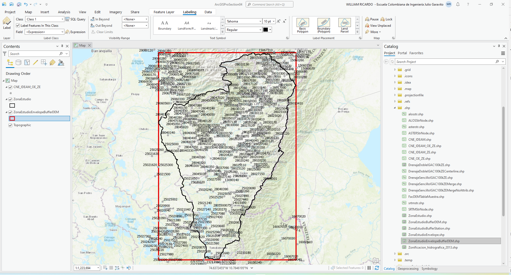
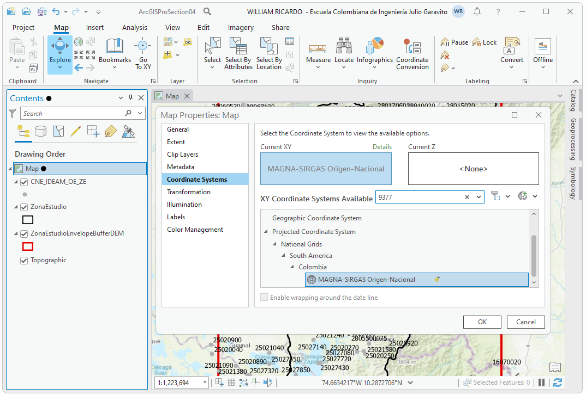
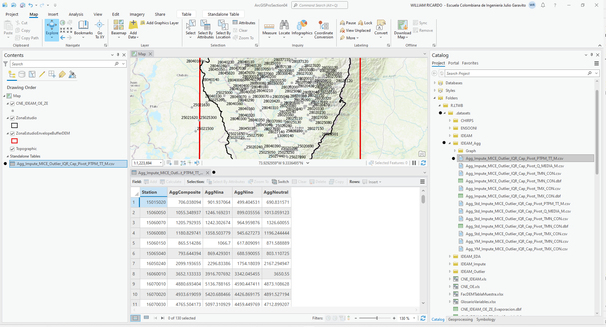

## Interpolación espacial de variables climatológicas
Keywords: `DEM` `IDW`

En los procesos de interpolación de variables climatológicas y partir de la localización de estaciones terrestres para los fenómenos asociados a cambio climático, se generan diferentes mapas continuos que permitirán obtener caudales medios de datos compuestos, neutros y para fenómenos extremos de Niña y Niño.

### Objetivos

* Crear mapas interpolados de precipitación mensual total a partir de agregaciones compuestas por estación y por fenómeno climatológico. 

### Requerimientos

* [ArcGIS Pro 2+](https://pro.arcgis.com/en/pro-app/latest/get-started/download-arcgis-pro.htm)
* [ArcGIS for Desktop 10+](https://desktop.arcgis.com/es/desktop/) (opcional)
* [QGIS 3+](https://qgis.org/) (opcional)
* Estaciones hidroclimatológicas de la zona de estudio con validación de altitud a partir de información satelital. [:mortar_board:Aprender.](../../Section03/CNEStationElevation)
* Tablas de valores agregados promedio multianual por parámetro hidroclimatológico. [:mortar_board:Aprender.](../../Section03/Agg)

### Procedimiento general para interpolación de precipitación

  
Convenciones generales en diagramas: clases de entidad en azul, dataset en gris oscuro, grillas en color verde, geo-procesos en rojo, procesos automáticos o semiautomáticos en guiones rojos y procesos manuales en amarillo. Líneas conectoras con guiones corresponden a procedimientos opcionales.  

1. En ArcGIS Pro, cree un proyecto nuevo en blanco en la ruta _D:\R.LTWB\\.map_ y nómbrelo como _ArcGISProSection04.aprx_. Automáticamente, serán generados el mapa de proyecto, la base de datos geográfica en formato .gdb, la carpeta para volcado de informes de registro de importación _ImportLog_ y la carpeta _Index_. Utilizando el Panel de catálogo y desde la sección Folders, realice la conexión a la carpeta D:\R.LTWB. 

2. Desde la carpeta _.shp_ disponible en el catálogo, agregue al mapa el archivo shapefile [CNE_IDEAM_OE_ZE.shp](../../.shp/CNE_IDEAM_OE_ZE.zip), [ZonaEstudio.shp](../../.shp/ZonaEstudio.zip) y [ZonaEstudioEnvelopeBufferDEM.shp](../../.shp/ZonaEstudioEnvelopeBufferDEM.zip). Modifique la simbología de representación de _ZonaEstudioEnvelopeBufferDEM_ sin relleno - línea contorno rojo - grosor 3 y _ZonaEstudio_ sin relleno - línea contorno negro - grosor 2. Simbolice las estaciones con puntos color gris 30% - sin contorno - tamaño 6, rotular por el campo `CODIGO` y acercar a la zona de estudio. 

> Tenga en cuenca que automáticamente ha sido asignado el sistema de coordenadas geográficas MAGNA al proyecto debido a que el Shapefile del CNE contiene integrado este sistema. En cuanto al número de estaciones, en actividades anteriores se seleccionaron 440 estaciones para la zona de estudio.

3. Desde las propiedades del mapa (clic derecho en Contents / Map), busque y asigne el sistema de coordenadas 9377 de Colombia, correspondiente a MAGNA-SIRGAS Origen-Nacional.

> Para la correcta interpolación espacial de los parámetros climatológicos, es necesario disponer de un sistema proyectado con unidades lineales en metros.

4. Desde la carpeta _.datasets/IDEAM_Agg_ disponible en el catálogo, agregue al mapa actual (botón derecho sobre el archivo / Add To Current Map) el archivo [Agg_Impute_MICE_Outlier_IQR_Cap_Pivot_PTPM_TT_M.csv](../../.datasets/IDEAM_Agg/Agg_Impute_MICE_Outlier_IQR_Cap_Pivot_PTPM_TT_M.csv) correspondiente a la tabla de agregaciones multianuales de precipitación total por estación. Luego desde la tabla de contenido o Contents, abra el archivo, podrá observar que se compone de 130 registros o estaciones y que contiene datos de precipitación total compuesta y por fenómeno climatológico.

5. Dando clic derecho sobre la tabla desde la tabla de contenido, y mediante la opción _Data / Export Table_, exporte el archivo a un archivo DBase .dbf en la misma ruta original y con el nombre [Agg_Impute_MICE_Outlier_IQR_Cap_Pivot_PTPM_TT_M.dbf](../../.datasets/IDEAM_Agg/Agg_Impute_MICE_Outlier_IQR_Cap_Pivot_PTPM_TT_M.dbf)

> El proceso de conversión es requerido debido a que es necesario modificar la estructura de la tabla agregando un campo de atributos tipo texto que contendrá el código de la estación, lo anterior debido a que el campo Station es interpretado como un campo numérico entero y el código de las estaciones del catálogo del IDEAM utiliza texto.

Luego del proceso de exportación, será cargada la tabla .dbf al mapa. Remover el archivo .csv de la tabla de contenido y abrir el archivo .dbf.

6. Modifique la estructura de la tabla agregando un nuevo campo de atributos tipo texto de 255 caracteres con el nombre `CODIGO`.

7. Desde la cabecera del campo `CODIGO` y utilizando la herramienta _Calculate Field_, asigne a este campo los valores contenidos en el campo Station.

8. 

En este momento ya dispone de la grilla de terreno reacondicionada requerida para el relleno de sumideros.

### Actividades complementarias:pencil2:

En la siguiente tabla se listan las actividades complementarias que deben ser desarrolladas y documentadas por el estudiante en un único archivo de Adobe Acrobat .pdf. El documento debe incluir portada (mostrar nombre completo, código y enlace a su cuenta de GitHub), numeración de páginas, tabla de contenido, lista de tablas, lista de ilustraciones, introducción, objetivo general, capítulos por cada ítem solicitado, conclusiones y referencias bibliográficas.

| Actividad | Alcance |
|:---------:|:--------|
|     1     | ....    | 

### Referencias

* 

### Compatibilidad

* Esta actividad puede ser desarrollada con cualquier software SIG que disponga de herramientas para de digitalización con opciones de encajado o snapping.
* 

### Control de versiones

| Versión    | Descripción     | Autor                                      | Horas |
|------------|:----------------|--------------------------------------------|:-----:|
| 2022.07.20 | Versión inicial | [rcfdtools](https://github.com/rcfdtools)  |   0   |

_R.LTWB es de uso libre para fines académicos, conoce nuestra licencia, cláusulas, condiciones de uso y como referenciar los contenidos publicados en este repositorio, dando [clic aquí](https://github.com/rcfdtools/R.LTWB/wiki/License)._

_¡Encontraste útil este repositorio!, apoya su difusión marcando este repositorio con una ⭐ o síguenos dando clic en el botón Follow de [rcfdtools](https://github.com/rcfdtools) en GitHub._

| [Actividad anterior](../) | [Inicio](../../Readme.md) | [:beginner: Ayuda](https://github.com/rcfdtools/R.LTWB/discussions/99999) | [Actividad siguiente]()  |
|---------------------------|---------------------------|---------------------------------------------------------------------------|--------------------------|

[^1]: 