## Mapa de precipitación total
Keywords: `DEM` `IDW` `Rain` `Interpolate`

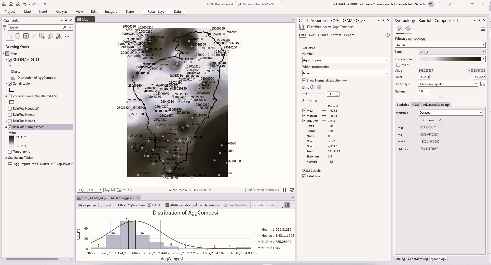

A partir de la localización espacial de estaciones terrestres y de los valores obtenidos, validados, imputados y extendidos de las series de datos recopiladas, se generan los mapas continuos interpolados para series compuestas y por fenómeno climatológico, requeridos para el balance hidrológico de largo plazo.

### Objetivos

* Crear mapas interpolados de precipitación mensual total a partir de agregaciones compuestas por estación y por fenómeno climatológico.
* Proyectar las grillas utilizando el sistema de coordenadas 9733, correspondiente a MAGNA-SIRGAS Origen-Nacional
* Comparar el rango de los valores obtenidos de las grillas interpoladas, con los rangos de valores discretos de las estaciones. 

### Requerimientos

* [ArcGIS Pro 2+](https://pro.arcgis.com/en/pro-app/latest/get-started/download-arcgis-pro.htm)
* [ArcGIS for Desktop 10+](https://desktop.arcgis.com/es/desktop/) (opcional)
* [QGIS 3+](https://qgis.org/) (opcional)
* Estaciones hidroclimatológicas de la zona de estudio con validación de altitud a partir de información satelital. [:mortar_board:Aprender.](../../Section03/CNEStationElevation)
* Tablas de valores agregados promedio multianual por parámetro hidroclimatológico. [:mortar_board:Aprender.](../../Section03/Agg)

### Procedimiento general para interpolación de precipitación total

  
Convenciones generales en diagramas: clases de entidad en azul, dataset en gris oscuro, grillas en color verde, geo-procesos en rojo, procesos automáticos o semiautomáticos en guiones rojos y procesos manuales en amarillo. Líneas conectoras con guiones corresponden a procedimientos opcionales.  

1. En ArcGIS Pro, cree un proyecto nuevo en blanco en la ruta _D:\R.LTWB\\.map_ y nómbrelo como _ArcGISProSection04.aprx_. Automáticamente, serán generados el mapa de proyecto, la base de datos geográfica en formato .gdb, la carpeta para volcado de informes de registro de importación _ImportLog_ y la carpeta _Index_. Utilizando el Panel de catálogo y desde la sección Folders, realice la conexión a la carpeta D:\R.LTWB. 

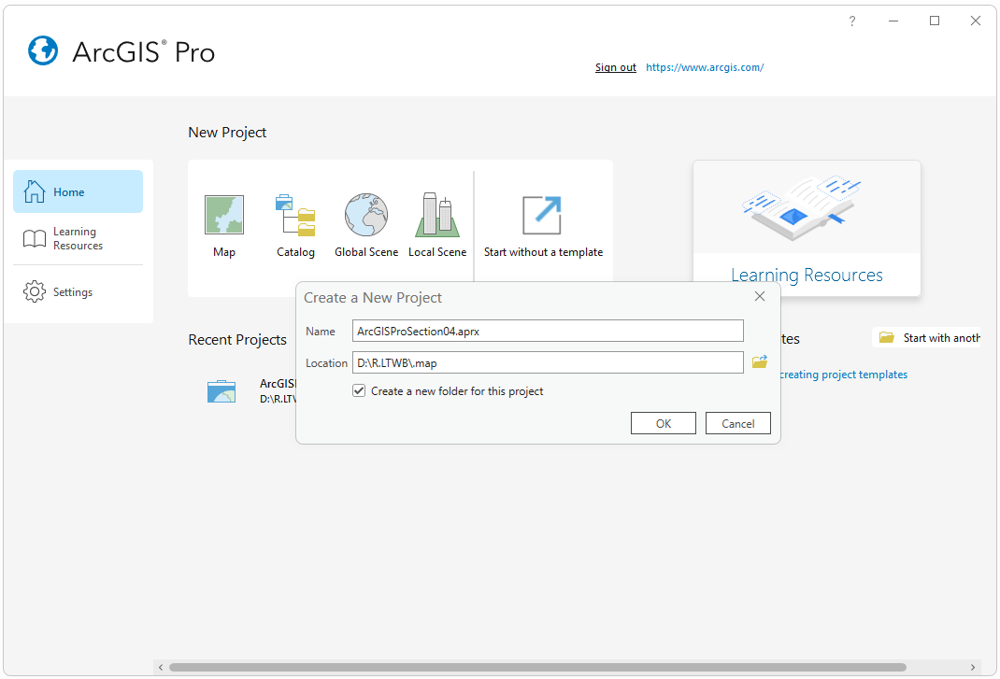

2. Desde la carpeta _.shp_ disponible en el catálogo, agregue al mapa el archivo shapefile [CNE_IDEAM_OE_ZE.shp](../../.shp/CNE_IDEAM_OE_ZE.zip), [ZonaEstudio.shp](../../.shp/ZonaEstudio.zip) y [ZonaEstudioEnvelopeBufferDEM.shp](../../.shp/ZonaEstudioEnvelopeBufferDEM.zip). Modifique la simbología de representación de _ZonaEstudioEnvelopeBufferDEM_ sin relleno - línea contorno rojo - grosor 3 y _ZonaEstudio_ sin relleno - línea contorno negro - grosor 2. Simbolice las estaciones con puntos color gris 30% - sin contorno - tamaño 6, rotular por el campo `CODIGO` y acercar a la zona de estudio. 

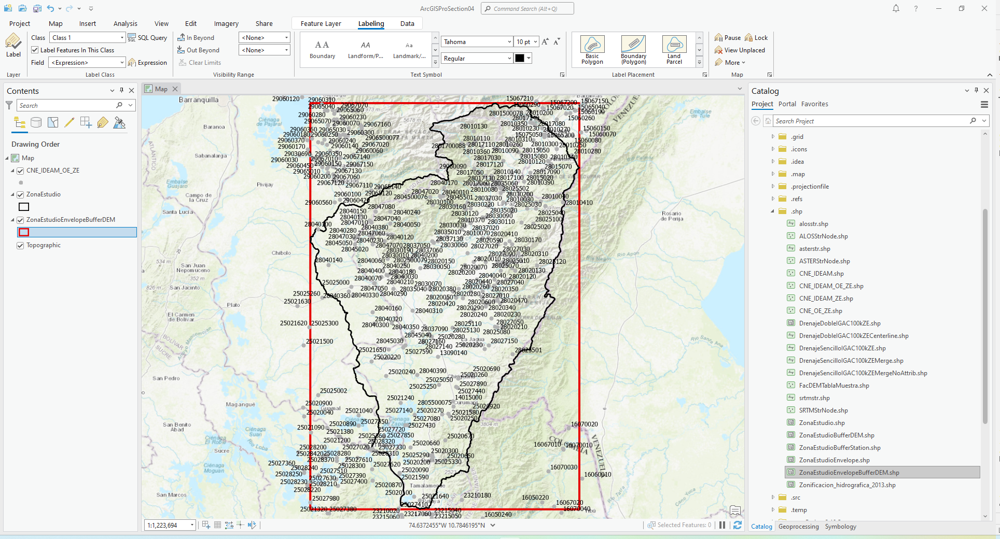

> Tenga en cuenta que automáticamente ha sido asignado el sistema de coordenadas geográficas MAGNA al proyecto debido a que el Shapefile del CNE contiene integrado este sistema. En cuanto al número de estaciones, en actividades anteriores se seleccionaron 440 estaciones para la zona de estudio.

3. Desde las propiedades del mapa (clic derecho en Contents / Map), busque y asigne el sistema de coordenadas 9377 de Colombia, correspondiente a MAGNA-SIRGAS Origen-Nacional.

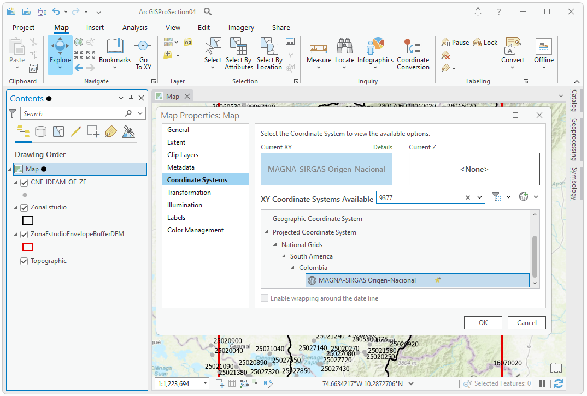

> Para la correcta interpolación espacial de los parámetros climatológicos, es necesario disponer de un sistema proyectado con unidades lineales en metros.

4. Desde la carpeta _.datasets/IDEAM_Agg_ disponible en el catálogo, agregue al mapa actual (botón derecho sobre el archivo / Add To Current Map) el archivo [Agg_Impute_MICE_Outlier_IQR_Cap_Pivot_PTPM_TT_M.csv](../../.datasets/IDEAM_Agg/Agg_Impute_MICE_Outlier_IQR_Cap_Pivot_PTPM_TT_M.csv) correspondiente a la tabla de agregaciones multianuales de precipitación total por estación. Luego desde la tabla de contenido o Contents, abra el archivo; podrá observar que se compone de 130 registros o estaciones y que contiene datos de precipitación total compuesta y por fenómeno climatológico.

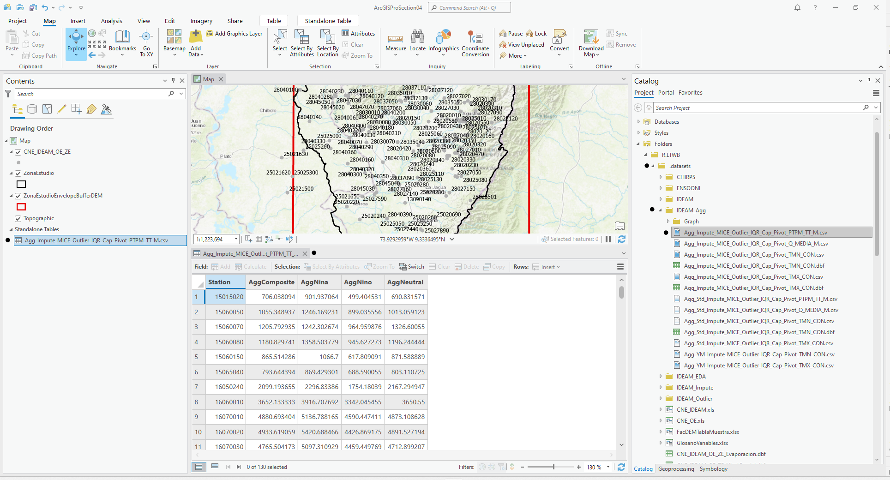

5. Dando clic derecho sobre la tabla desde la tabla de contenido, y mediante la opción _Data / Export Table_, exporte el archivo a un archivo dBase .dbf en la misma ruta original y con el nombre [Agg_Impute_MICE_Outlier_IQR_Cap_Pivot_PTPM_TT_M.dbf](../../.datasets/IDEAM_Agg/Agg_Impute_MICE_Outlier_IQR_Cap_Pivot_PTPM_TT_M.dbf)

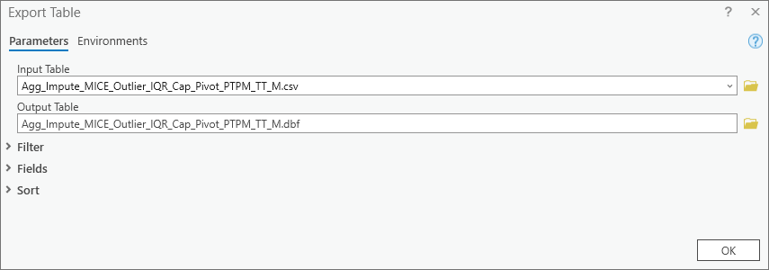

> El proceso de conversión es requerido debido a que es necesario modificar la estructura de la tabla agregando un campo de atributos tipo texto que contendrá el código de la estación, lo anterior debido a que el campo Station es interpretado como un campo numérico entero y el código de las estaciones del catálogo del IDEAM ha sido definido como cadena de texto.

Luego del proceso de exportación, será cargada la tabla .dbf al mapa. Remover el archivo .csv de la tabla de contenido y abrir el archivo .dbf.

6. Modifique la estructura de la tabla agregando un nuevo campo de atributos tipo texto de 255 caracteres con el nombre `CODIGO`.

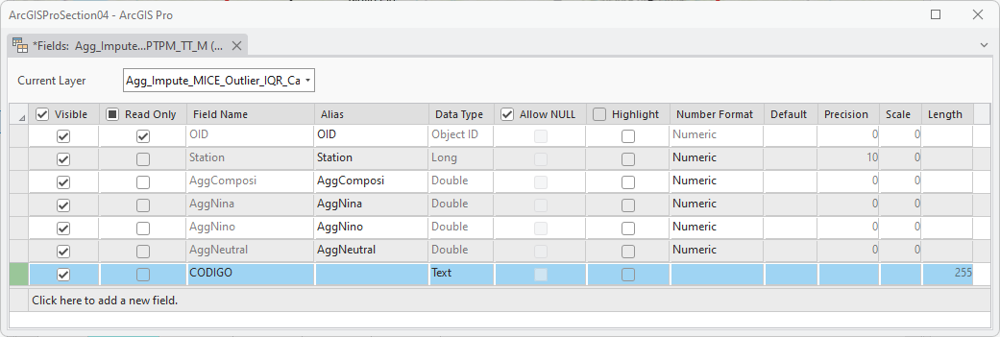

7. Desde la cabecera del campo `CODIGO` y utilizando la herramienta _Calculate Field_, asigne a este campo los valores contenidos en el campo Station.

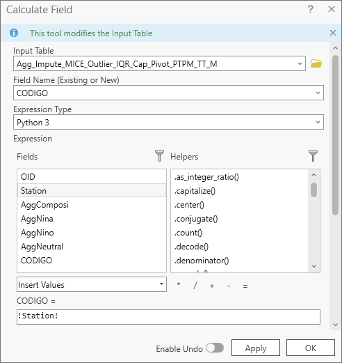

8. En la capa de estaciones CNE_IDEAM_OE_ZE.shp, realice una unión (clic derecho sobre la capa geográfica / Join) con los datos de la tabla de agregación Agg_Impute_MICE_Outlier_IQR_Cap_Pivot_PTPM_TT_M.dbf, utilice como llave de unión el campo `CODIGO`.

9. Abra la tabla de atributos de la capa CNE_IDEAM_OE_ZE.shp y verifique los datos asociados mediante la unión, podrá observar que existen datos de precipitación en 130 de las 440 estaciones seleccionadas para la zona de estudio.

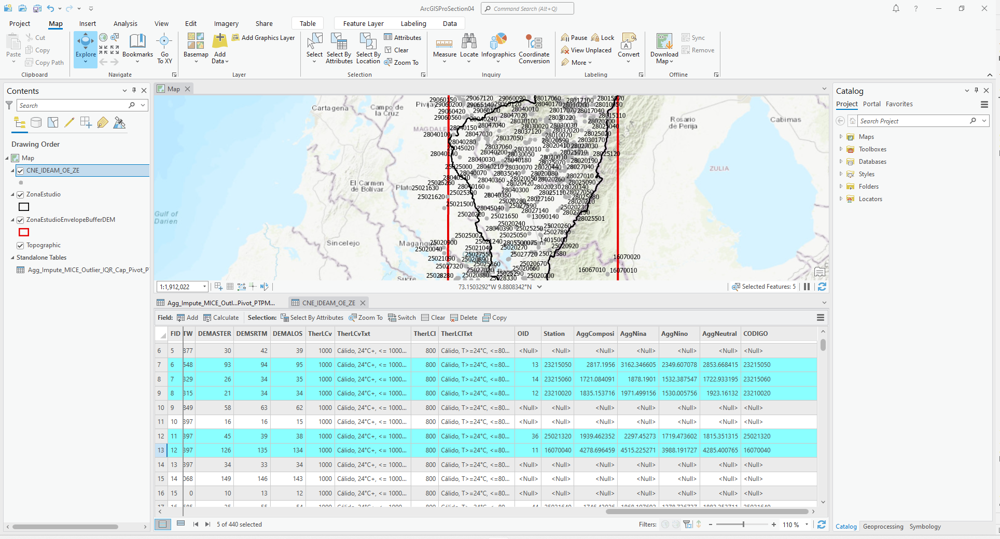

10. Desde las propiedades de la capa CNE_IDEAM_OE_ZE.shp, realice un filtro (Definition Query con `Agg_Impute_MICE_Outlier_IQR_Cap_Pivot_PTPM_TT_M.OID >= 0`) para códigos OID mayores o iguales a cero correspondientes a los identificadores de ordenamiento de la tabla .dbf de agregaciones. Luego de dar clic en _Ok_ podrá observar en pantalla la localización de las estaciones con datos de precipitación y los registros correspondientes en la tabla de atributos.

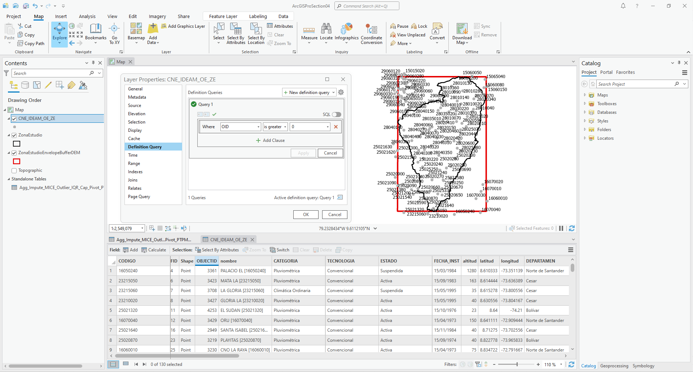

11. Utilizando el método del valor inverso de la distancia o IDW, realice la interpolación espacial de la precipitación para los valores agregados compuestos y por fenómeno climatológico. Geoprocessing / Spatial Analys Tools / Interpolation / IDW, con los siguientes parámetros:

* Z value field: AggComposi, AggNina, AggNino, AggNeutral
* Output raster: RainTotalComposite.tif, RainTotalNino.tif, RainTotalNina.tif, RainTotalNeutral.tif
* Output cell size: 12.5 metros (correspondiente a la resolución del modelo de terreno ALOS Palsar.)
* Power: 2
* Search radius: Variable
* Number of points: 12
* En la pestaña Environments, definir el sistema de proyección de coordenadas 9377, correspondiente a MAGNA-SIRGAS_Origen-Nacional de Colombia.

> En el repositorio de datos, crear la carpeta `D:\R.LTWB\.grid` para el volcado de las grillas generadas.

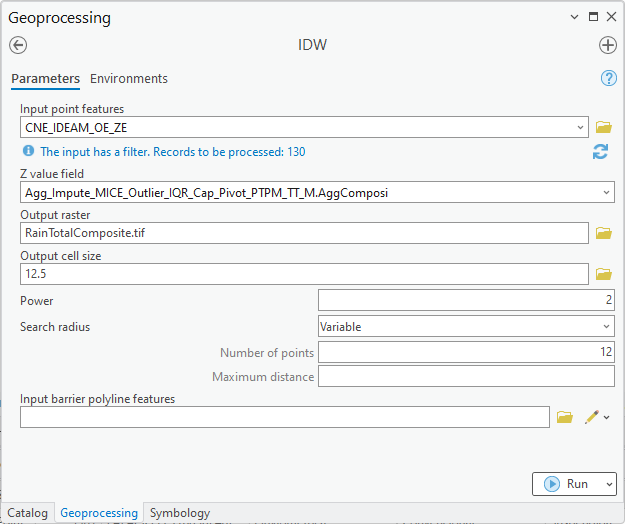
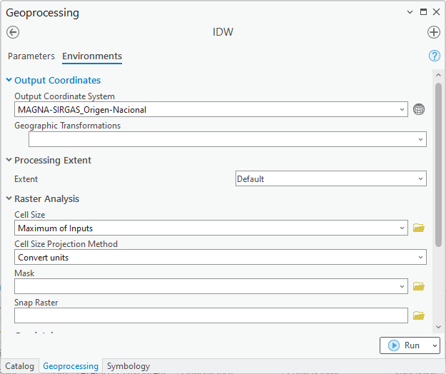

Luego de terminada la ejecución de los mapas interpolados, estos serán cargados automáticamente al proyecto. Como puede observar, los mapas creados cubren la totalidad de la zona de estudio.

12. Desde la tabla de atributos y utilizando estadísticas de campo, verifique los valores obtenidos en las diferentes grillas y compare con los valores mínimos y máximos de las estaciones.

Resultados para valores compuestos

Resultados para valores asociados al fenómeno de El Niño
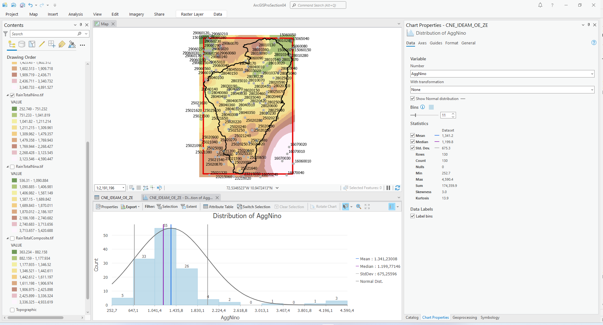

Resultados para valores asociados al fenómeno de La Niña

Resultados para valores neutros

Tabla de grillas obtenidas y de comparación de resultados
| Fenómeno  | Mínimo en estación | Máximo en estación | Mínimo en grilla | Máximo en grilla | Grilla                                                                                                 | Tamaño sin compresión |
|-----------|:---------------:|:---------------:|:------------------:|:------------------:|:--------------------------------------------------------------------------------------------------------:|:-----------------------:|
| Compuesto | 363.2           | 4933.6             | 363.234          | 4933.619         | [Part1](../../.grid/RainTotalComposite.part01.rar), [Part2](../../.grid/RainTotalComposite.part02.rar) | 1.2 GB                |
| Niño      | 252.7              | 4590.4             | 252.749          | 4590.447         | [Part1](../../.grid/RainTotalNino.part01.rar), [Part2](../../.grid/RainTotalNino.part02.rar)           | 1.2 GB                |
| Niña      | 536.3              | 5420.7             | 536.31           | 5420.688         | [Part1](../../.grid/RainTotalNina.part01.rar), [Part2](../../.grid/RainTotalNina.part02.rar)           | 1.2 GB                |
| Neutro    | 305.8              | 4891.5             | 305.754          | 4891.527         | [Part1](../../.grid/RainTotalNeutral.part01.rar), [Part2](../../.grid/RainTotalNeutral.part02.rar)     | 1.2 GB                |

> Debido al tamaño de los archivos generados, cada grilla ha sido comprimida en archivos .rar en partes de 95 MB.
>
> Si bien el método IDW no permite generar isoyetas con apariencia suavizada como el método de líneas espirales, permite obtener valores interpolados próximos al rango de valores de las estaciones utilizadas.

En este momento dispone de grillas interpoladas de precipitación total, requeridas para el balance hidrológico de largo plazo.

### Actividades complementarias:pencil2:

En la siguiente tabla se listan las actividades complementarias que deben ser desarrolladas y documentadas por el estudiante en un único archivo de Adobe Acrobat .pdf. El documento debe incluir portada (mostrar nombre completo, código y enlace a su cuenta de GitHub), numeración de páginas, tabla de contenido, lista de tablas, lista de ilustraciones, introducción, objetivo general, capítulos por cada ítem solicitado, conclusiones y referencias bibliográficas.

| Actividad | Alcance                                                                                                                                                                                    |
|:---------:|:-------------------------------------------------------------------------------------------------------------------------------------------------------------------------------------------|
|     1     | Realice la interpolación de la precipitación total en ArcGIS for Desktop y en QGIS, compare con los valores obtenidos en ArcGIS Pro.                                                     |
|     2     | Investigue e interpole la precipitación total compuesta por 3 métodos diferentes (p.ej., Spline, Natural Neghbor, Kriging, Tred) y compare los resultados con los obtenidos en ArcGIS Pro. |

### Referencias

* https://pro.arcgis.com/en/pro-app/latest/tool-reference/spatial-analyst/idw.htm
* https://desktop.arcgis.com/en/arcmap/latest/tools/spatial-analyst-toolbox/idw.htm
* https://docs.qgis.org/3.22/en/docs/gentle_gis_introduction/spatial_analysis_interpolation.html

### Compatibilidad

* Esta actividad puede ser desarrollada con cualquier software SIG que disponga de herramientas de interpolación espacial.

### Control de versiones

| Versión    | Descripción                                                                                                                    | Autor                                      | Horas |
|------------|:-------------------------------------------------------------------------------------------------------------------------------|--------------------------------------------|:-----:|
| 2022.12.03 | Comparación de rangos con valores mínimos y máximos de series de datos discretos. Ilustración cabecera y diagrama de procesos. | [rcfdtools](https://github.com/rcfdtools)  |  2.5  |
| 2022.12.01 | Versión inicial interpolación de precipitación total.                                                                          | [rcfdtools](https://github.com/rcfdtools)  |   4   |

_R.LTWB es de uso libre para fines académicos, conoce nuestra licencia, cláusulas, condiciones de uso y como referenciar los contenidos publicados en este repositorio, dando [clic aquí](https://github.com/rcfdtools/R.LTWB/wiki/License)._

_¡Encontraste útil este repositorio!, apoya su difusión marcando este repositorio con una ⭐ o síguenos dando clic en el botón Follow de [rcfdtools](https://github.com/rcfdtools) en GitHub._

| [Actividad anterior](../../Section04) | [Inicio](../../Readme.md) | [:beginner: Ayuda](https://github.com/rcfdtools/R.LTWB/discussions/28) | [Actividad siguiente](../Temperature) |
|---------------------------------------|---------------------------|------------------------------------------------------------------------|---------------------------------------|
