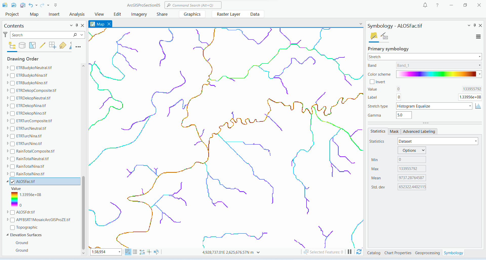
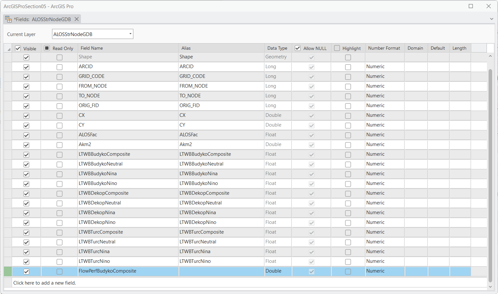
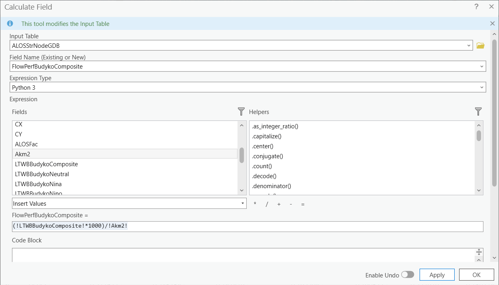
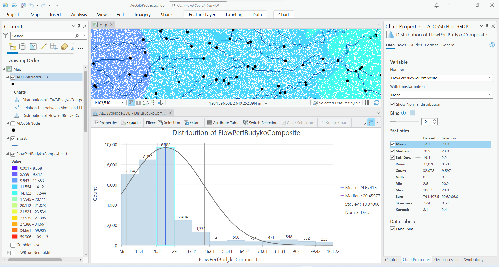
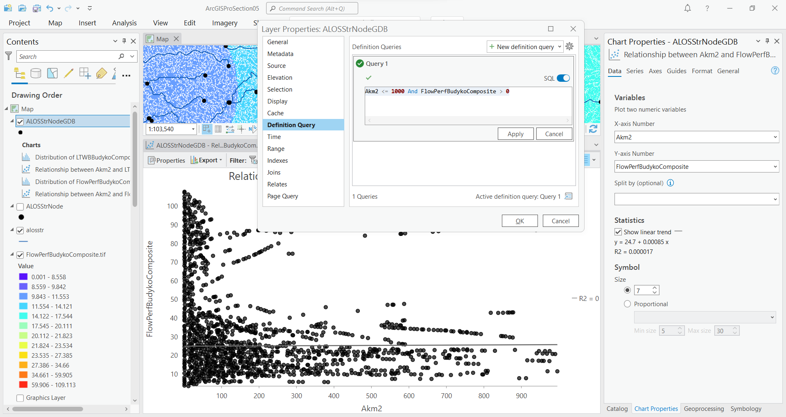

## Mapa de isorendimiento medio
Keywords: `LTWB` `Flow` `Flow-performance` `Raster-calculator`

Utilizando los valores de caudal medio, número de celdas y área de aportación en las diferentes localizaciones de la red de drenaje, se construye el mapa de isorendimientos medios y se obtienen ecuaciones características que permiten estimar rendimientos en función del área de aportación.

 https://www.youtube.com/watch?v=cPdVN_7Hha0 Playlist: https://youtube.com/playlist?list=PLZGvAjHkhphDKXvnhkp0oQb22EHWVd0W8  

### Objetivos

* Utilizando algebra de mapas, generar el mapa de isorendimientos a partir de la grilla de acumulación de flujo y los mapas de caudal medio.
* En cada punto característico y a partir de los valores previamente obtenidos de área y caudal medio, calcular el isorendimiento y a partir de matrices de dispersión, obtener ecuaciones características.

### Requerimientos

* [ArcGIS Pro 2+](https://pro.arcgis.com/en/pro-app/latest/get-started/download-arcgis-pro.htm)
* [ArcGIS for Desktop 10+](https://desktop.arcgis.com/es/desktop/) (opcional)
* [QGIS 3+](https://qgis.org/) (opcional)
* Nodos característicos con valores de caudal. [:mortar_board:Aprender.](../../Section05/FlowPoint)
* Grilla de acumulación de flujo - FAC. [:mortar_board:Aprender.](../../Section02/FacDEM)
* Mapas de caudal medio obtenidos del balance hidrológico de largo plazo. [:mortar_board:Aprender.](../../Section05/LTWB)

### Procedimiento general

  
Convenciones generales en diagramas: clases de entidad en azul, dataset en gris oscuro, grillas en color verde, geo-procesos en rojo, procesos automáticos o semiautomáticos en guiones rojos y procesos manuales en amarillo. Líneas conectoras con guiones corresponden a procedimientos opcionales.  

1. En ArcGIS Pro, abra el proyecto _ArcGISProSection05.aprx_ creado en la primera actividad de esta sección y almacenado en la ruta _D:\R.LTWB\\.map_.

> Tenga en cuenta que automáticamente fué asignado al proyecto, el sistema de coordenadas geográficas 9377 de Colombia, correspondiente a MAGNA-SIRGAS Origen-Nacional.

2. Desde la carpeta _D:\R.LTWB\HECGeoHMS\Layers_ disponible en el catálogo, agregue al proyecto la grilla de acumulación de flujo denominada ALOSFac.tif. Modifique la simbología de representación a _Stretch_ utilizando la paleta de color _Temperature_ y _Stretch type: Histogram Equalize_

3. Utilizando la herramienta _Geoprocessing / Spatial Analyst Tools / Map Algebra / Raster Calculator_, cree mapas de isorendimiento y almacénelos dentro de la carpeta `D:\R.LTWB\.grid`. 

> Para este ejemplo, generaremos el mapa de isorendimiento a partir de los caudales medios obtenidos con el mapa de evapotranspiración real compuesta de Budyko utilizando la siguiente expresión:

Im = Qm / A

Donde,

* Im: isorendimiento medio, lps/km²
* Qm: caudal medio, lps
* A: área de aportación,km²

Expresión algebra de mapas: `FlowPerfBudykoComposite.tif = "LTWBBudykoComposite.tif"*1000/("ALOSFac.tif"*12.5*12.5/1000000)`

Una vez obtenido elmapa, modifique la simbología de representación a _Classify_ utilizando la paleta de color _Spectrum by Wavelength - Fullbright_ y _Method: Quantile_ en 12 clases

Matriz de isorendimiento Budyko Compuesto

Como observa en la ilustración, se han obtenido valores de hasta 109.113 lps/km² y los rendimientos cercanos a este valor se encuentran localizados en la zona norte sobre la Sierra Nevada de Santa Marta y al sur-este en la zona de la cordillera oriental.

4. Abra la tabla de atributos de la clase de entidad _ALOSStrNodeGDB_ contenida en la Geodatabase del proyecto, creado en ArcGIS Pro para la sección 5, podrá observar que contiene el número de celdas acumuladas, los valores de área de aportación calculados a partir de la resolución de la grilla y los valores leídos de las diferentes grillas de caudal.

5. En la tabla de atributos de la clase de entidad _ALOSStrNodeGDB_, cree un campo de atributos numérico doble con el nombre `FlowPerfBudykoComposite`

6. Utilizando el calculador de campo, calcule en el campo `FlowPerfBudykoComposite`, el isorendimiento medio de cada nodo característicos de la red de drenaje, utilice la expresión `(!LTWBBudykoComposite!*1000)/!Akm2!`

7. A partir de los valores obtenidos en el campo `FlowPerfBudykoComposite`, cree un histograma con 12 bandas y analice los resultados obtenidos. Podrá observar que, de 32078 nodos, 9697 presentan valores cercanos a la media en la banda comprendida entre 20.2 y 29 lps/km².

8. Utilizando los valores contenidos en la tabla, cree un gráfico de dispersión relacionando el área de aportación `Akm2` con los valores de isorendimientos medios obtenidos. Obtenga los parámetros de la tendencia lineal y el valor del coeficiente de determinación R². Filtre los valores de área inferiores o iguales a 1000 km² e isorendimientos medios mayores a cero, utilice la expresión SQL `Akm2 <= 1000 And FlowPerfBudykoComposite > 0`

Como puede observar en la gráfica, no existe una correlación general que permita establecer que la ecuación `y = 24.7 + 0.00085 x` con coeficiente de determinación `R² = 0.000017`, describe el cambio en el isorendimiento en función del área de aportación. Lo anterior debido a que esta relación depende de múltiples factores, tales como el régimen hidrológico de la zona y su distribución espacial, el tipo de geomorfometría de la red de drenaje, la inclinación del terreno y el tipo de regionalización empleada para la estimación de los mapas de temperatura, evapotranspiración potencial y real.

En este momento dispone para la zona de estudio, de un mapa de isorendimientos que permite entender la relación entre las acumulaciones de flujo y los valores obtenidos de caudal medio.

### Actividades complementarias:pencil2:

En la siguiente tabla se listan las actividades complementarias que deben ser desarrolladas y documentadas por el estudiante en un único archivo de Adobe Acrobat .pdf. El documento debe incluir portada (mostrar nombre completo, código y enlace a su cuenta de GitHub), numeración de páginas, tabla de contenido, lista de tablas, lista de ilustraciones, introducción, objetivo general, capítulos por cada ítem solicitado, conclusiones y referencias bibliográficas.

| Actividad | Alcance                                                                                                                                                                                                                         |
|:---------:|:--------------------------------------------------------------------------------------------------------------------------------------------------------------------------------------------------------------------------------|
|     1     | Utilizando los valores obtenidos de caudal medio por fenómeno climatológico a partir de la ecuación de Budyko, cree mapas de isorendimientos y analice las diferencias obtenidas respecto al mapa de isorendimientos compuesto. |
|     2     | Investigue y documente la utilidad y aplicabilidad de los mapas de isorendimientos medios.                                                                                                                                      |

### Compatibilidad

* Esta actividad puede ser desarrollada con cualquier software SIG que disponga de herramientas de algebra de mapas.

### Referencias

* https://pro.arcgis.com/en/pro-app/latest/tool-reference/spatial-analyst/raster-calculator.htm

### Control de versiones

| Versión    | Descripción                                                                                                                                                                                                     | Autor                                     | Horas  |
|------------|:----------------------------------------------------------------------------------------------------------------------------------------------------------------------------------------------------------------|-------------------------------------------|:------:|
| 2023.02.22 | Guión, audio, video, edición y publicación.                                                                                                                                                                     | [rcfdtools](https://github.com/rcfdtools) |  1.75  |
| 2022.12.19 | Documentación. Generación mapa isorendimiento. Cálculo isorendimientos en puntos característicos. Histograma. Matriz de dispersión, ecuación de tendencia lineal.  Ilustración cabecera y diagrama de procesos. | [rcfdtools](https://github.com/rcfdtools) |   3    |

_R.LTWB es de uso libre para fines académicos, conoce nuestra licencia, cláusulas, condiciones de uso y como referenciar los contenidos publicados en este repositorio, dando [clic aquí](https://github.com/rcfdtools/R.LTWB/wiki/License)._

_¡Encontraste útil este repositorio!, apoya su difusión marcando este repositorio con una ⭐ o síguenos dando clic en el botón Follow de [rcfdtools](https://github.com/rcfdtools) en GitHub._

| [Actividad anterior](../FlowPoint) | [Inicio](../../Readme.md) | [:beginner: Ayuda](https://github.com/rcfdtools/R.LTWB/discussions/35) | [Actividad siguiente](../LTWBBasin) |
|------------------------------------|---------------------------|------------------------------------------------------------------------|-------------------------------------|

